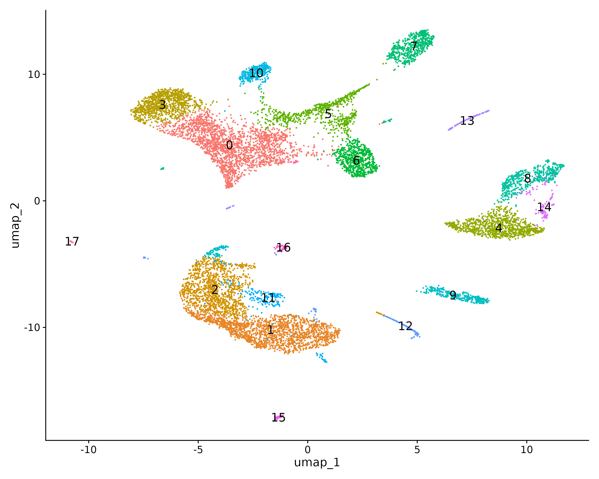
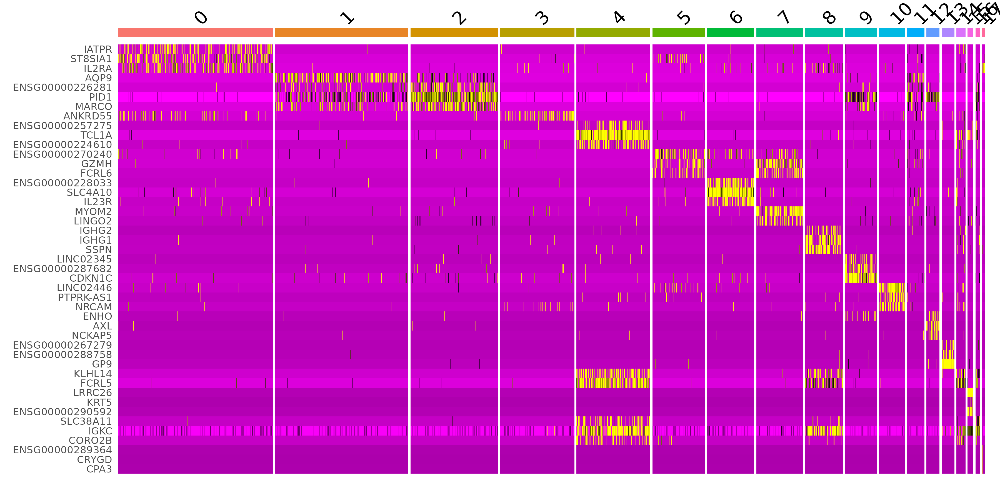
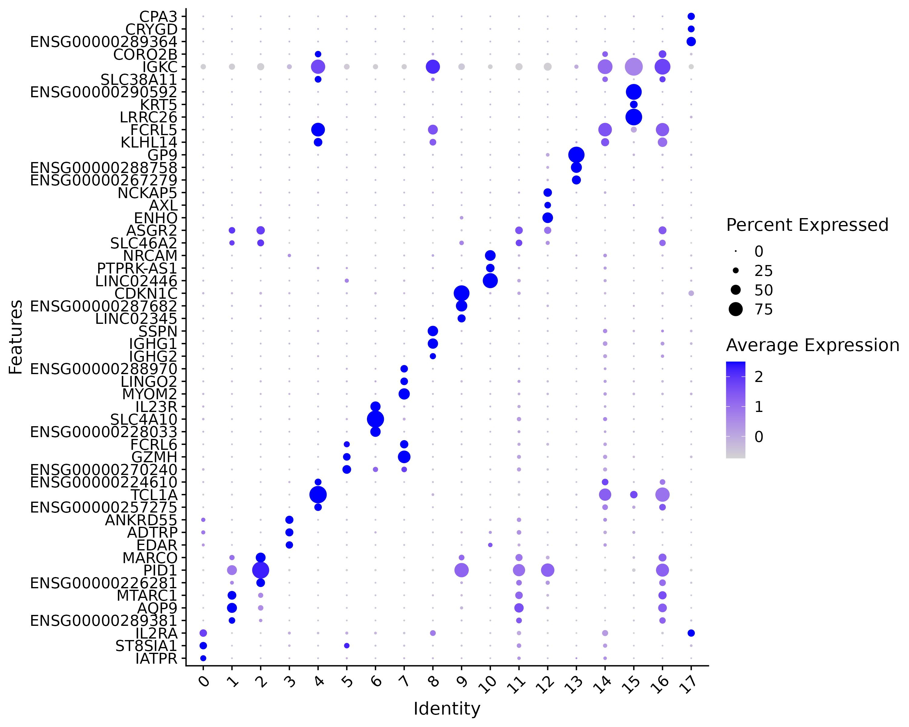
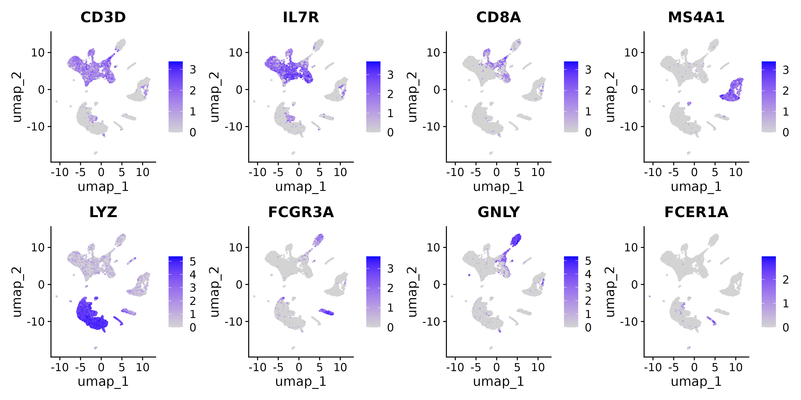
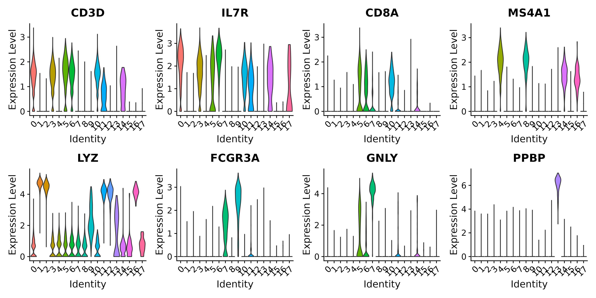
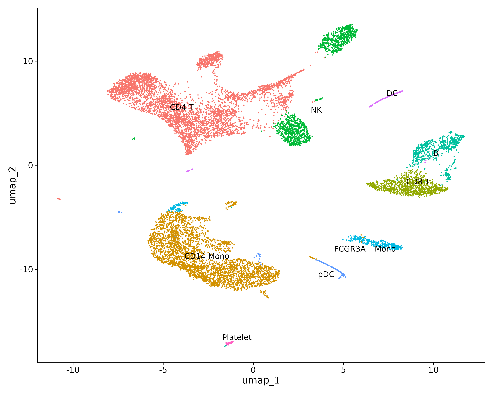
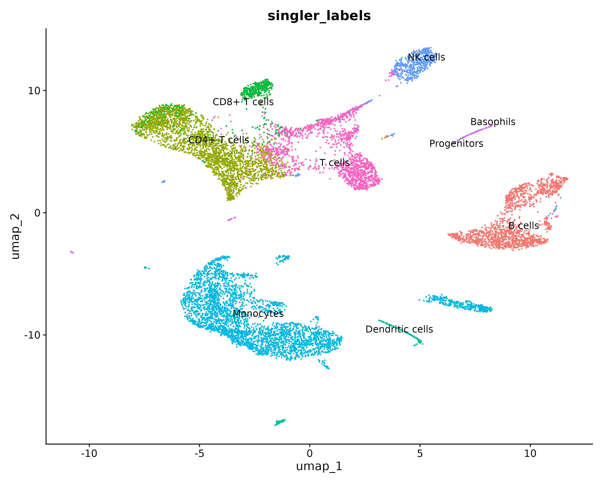
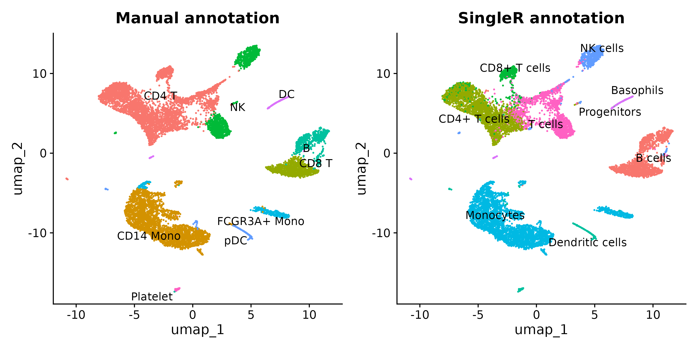

:::::::::::::::::::::::::::::::::::::: questions

- How do we systematically find the genes that define each cluster?
- How do we assign cell type labels using known marker genes?
- How does automated annotation with SingleR work?
- When do manual and automated annotations disagree and what should we do?
- What are best practices for confident, reproducible annotation?

::::::::::::::::::::::::::::::::::::::::::::::::

::::::::::::::::::::::::::::::::::::: objectives

- Run FindAllMarkers to identify differentially expressed genes for every cluster
- Interpret marker gene statistics: avg_log2FC, pct.1, pct.2, and p_val_adj
- Manually annotate clusters using known PBMC marker genes
- Use SingleR with the Monaco Immune reference for automated cell type annotation
- Compare manual and automated annotations and resolve discrepancies

::::::::::::::::::::::::::::::::::::::::::::::::

## Setup


``` r
library(Seurat)
library(ggplot2)
library(patchwork)
library(SingleR)
library(celldex)
```

## Loading the Clustered Data

We start from the clustered Seurat object saved at the end of the previous
episode. Make sure the active identity is set to the resolution 0.5 clusters.

Set up the working directory to match the previous episodes:


``` r
work_dir <- paste0(
    "/scratch/negishi/", Sys.getenv("USER"),
    "/scrna_workshop/"
)
setwd(work_dir)
```


``` r
pbmc <- readRDS(paste0(work_dir, "pbmc_clustered.rds"))
Idents(pbmc) <- "RNA_snn_res.0.5"
DimPlot(pbmc, reduction = "umap", label = TRUE, label.size = 5) + NoLegend()
```


:::::::::::::::::::::::::::::::::::::::::: spoiler

## Expected output

{alt="UMAP plot with 18 clusters labeled 0 through 17 at resolution 0.5, matching the clustering results from the previous episode."}

You should see the UMAP with 18 clusters labeled by number (0 to 17), matching the clustering results from the previous episode.

::::::::::::::::::::::::::::::::::::::::::::::::::


## Finding Marker Genes

Up to now, our clusters are just numbers. To give them biological meaning, we
need to find the genes that distinguish each cluster from all other clusters.
These are called **marker genes** -- genes that are significantly upregulated
in one cluster compared to the rest.

`FindAllMarkers()` runs a differential expression test for every cluster,
comparing cells in that cluster against all other cells:


``` r
pbmc.markers <- FindAllMarkers(pbmc,
                               only.pos = TRUE,
                               min.pct = 0.25,
                               logfc.threshold = 0.25)
```

| Parameter | Value | Description |
|-----------|-------|-------------|
| `only.pos` | `TRUE` | Only return genes that are **upregulated** in the cluster (positive log fold change). We are interested in markers that define a cluster, not genes that are absent from it. |
| `min.pct` | `0.25` | Only test genes detected in at least 25% of cells in either the cluster or the rest. This speeds up the computation by skipping very rare genes that cannot be reliable markers. |
| `logfc.threshold` | `0.25` | Only test genes with at least a 0.25 log2 fold change between the cluster and the rest. This pre-filters out genes with trivially small differences. |

This step may take 5 minutes. 

:::::::::::::::::::::::::::::::::::::::::: spoiler

## Expected output

```output
Calculating cluster 0
Calculating cluster 1
Calculating cluster 2
Calculating cluster 3
Calculating cluster 4
Calculating cluster 5
Calculating cluster 6
Calculating cluster 7
Calculating cluster 8
Calculating cluster 9
Calculating cluster 10
Calculating cluster 11
Calculating cluster 12
Calculating cluster 13
Calculating cluster 14
Calculating cluster 15
Calculating cluster 16
Calculating cluster 17
```

::::::::::::::::::::::::::::::::::::::::::::::::::


The result is a data frame with one row per
gene per cluster. Let's look at the key columns:


``` r
head(pbmc.markers)
```

:::::::::::::::::::::::::::::::::::::::::: spoiler

## Expected output

```output
       p_val avg_log2FC pct.1 pct.2 p_val_adj cluster   gene
INPP4B     0   2.607036 0.972 0.345         0       0 INPP4B
CAMK4      0   1.653160 0.950 0.324         0       0  CAMK4
IL7R       0   2.067086 0.935 0.336         0       0   IL7R
CD3D       0   1.523352 0.923 0.334         0       0   CD3D
ITK        0   1.775408 0.920 0.338         0       0    ITK
BCL11B     0   1.586310 0.991 0.413         0       0 BCL11B
```

::::::::::::::::::::::::::::::::::::::::::::::::::

The columns mean:

| Column | Meaning |
|--------|:--------|
| `p_val` | Raw p-value from the Wilcoxon rank-sum test (default test). |
| `avg_log2FC` | Average log2 fold change between the cluster and all other cells. A value of 1.0 means the gene is on average 2x higher in this cluster. |
| `pct.1` | Fraction of cells **in the cluster** where the gene is detected. |
| `pct.2` | Fraction of cells **outside the cluster** where the gene is detected. |
| `p_val_adj` | Bonferroni-adjusted p-value. Use this for significance filtering (typically < 0.05). |
| `cluster` | Which cluster this gene is a marker for. |
| `gene` | The gene symbol. |

A good marker gene has a high `avg_log2FC`, high `pct.1` (expressed in most
cells of the cluster), low `pct.2` (not expressed in other clusters), and a
significant `p_val_adj`.

### Top markers per cluster

Let's extract the top 5 markers per cluster ranked by fold change:


``` r
top5 <- pbmc.markers %>%
    dplyr::group_by(cluster) %>%
    dplyr::slice_max(n = 5, order_by = avg_log2FC)
top5
```

:::::::::::::::::::::::::::::::::::::::::: spoiler

## Expected output


``` output
# A tibble: 90 × 7
# Groups:   cluster [18]
   p_val avg_log2FC pct.1 pct.2 p_val_adj cluster gene           
   <dbl>      <dbl> <dbl> <dbl>     <dbl> <fct>   <chr>          
 1     0       5.23 0.258 0.011         0 0       IATPR          
 2     0       3.69 0.345 0.036         0 0       ST8SIA1        
 3     0       3.17 0.346 0.052         0 0       IL2RA          
 4     0       2.88 0.414 0.072         0 0       ICOS           
 5     0       2.75 0.521 0.103         0 0       FAAH2          
 6     0       4.46 0.29  0.023         0 1       ENSG00000289381
 7     0       4.28 0.5   0.05          0 1       AQP9           
 8     0       4.13 0.423 0.043         0 1       MTARC1         
 9     0       4.09 1     0.549         0 1       S100A8         
10     0       3.98 0.996 0.248         0 1       S100A12   
```

::::::::::::::::::::::::::::::::::::::::::::::::::

### Visualizing markers with a heatmap

A heatmap of top marker genes across all clusters shows the expression patterns
at a glance. Each column is a cell (grouped by cluster), each row is a gene,
and color intensity represents scaled expression:


``` r
top3 <- pbmc.markers %>%
    dplyr::group_by(cluster) %>%
    dplyr::slice_max(n = 3, order_by = avg_log2FC)

DoHeatmap(pbmc, features = top3$gene) + NoLegend()
```
{alt="Heatmap showing expression of the top 3 marker genes per cluster across all 18 clusters. Each cluster shows a distinct block of upregulated genes, confirming distinct transcriptional identities."}


Each cluster should show a distinct block of highly expressed genes (bright
yellow/white) that are low in other clusters (dark purple). Clusters with very
similar heatmap profiles may represent subtypes of the same cell type.

### Dot plot summary

A dot plot provides a compact summary of marker expression across clusters.
The dot size encodes the percentage of cells expressing the gene, and the
color intensity encodes the average expression level:


``` r
DotPlot(pbmc, features = unique(top3$gene)) + coord_flip() +
    theme(axis.text.x = element_text(angle = 45, hjust = 1))
```

{alt="Dot plot showing expression of top 3 marker genes across all 18 clusters. Dot size indicates the percentage of cells expressing each gene; dot shading indicates average expression level."}


## Manual Annotation with Known Markers

Now we match the marker gene patterns to known PBMC cell types. The table below
lists the canonical markers for each expected cell type:

| Cell type | Key markers | Expected % |
|-----------|:-----------|:-----------|
| CD4+ T cells | CD3D, IL7R, CCR7 | ~35% |
| CD8+ T cells | CD3D, CD8A, CD8B | ~10% |
| B cells | MS4A1, CD79A | ~10% |
| CD14+ Monocytes | LYZ, CD14, S100A9 | ~20% |
| FCGR3A+ Monocytes | FCGR3A, MS4A7 | ~5% |
| NK cells | GNLY, NKG7, KLRD1 | ~10% |
| Dendritic cells | FCER1A, CST3 | ~3% |
| Platelets | PPBP, PF4 | ~2% |

Let's visualize these markers on the UMAP to see which clusters they map to:


``` r
FeaturePlot(pbmc,
            features = c("CD3D", "IL7R", "CD8A", "MS4A1",
                         "LYZ", "FCGR3A", "GNLY", "FCER1A"),
            ncol = 4)
```

{alt="Grid of 8 UMAP panels showing expression of CD3D, IL7R, CD8A, MS4A1, LYZ, FCGR3A, GNLY, and FCER1A. Each marker highlights a distinct UMAP region: CD3D and IL7R in the upper-left T cell area, CD8A in a small cluster on the right, MS4A1 in B cells on the right, LYZ in monocytes at the lower-left, FCGR3A in a small cluster at the lower-right, GNLY in NK cells at the upper-center, and FCER1A in a small dendritic cell group."}

And as violin plots to see expression across clusters:


``` r
VlnPlot(pbmc,
        features = c("CD3D", "IL7R", "CD8A", "MS4A1",
                     "LYZ", "FCGR3A", "GNLY", "PPBP"),
        ncol = 4,
        pt.size = 0)
```

{alt="Violin plots of CD3D, IL7R, CD8A, MS4A1, LYZ, FCGR3A, GNLY, and PPBP across all 18 clusters. Each marker shows high expression in the clusters corresponding to its known cell type and low expression elsewhere."}


Based on these plots and the `FindAllMarkers` results, we can build a mapping
from cluster numbers to cell type names. Your exact cluster numbers will depend
on the random seed, but the logic is the same: find which clusters express each
set of markers.


``` r
# Build the cluster-to-cell-type mapping
# Adjust cluster IDs to match YOUR results
new.cluster.ids <- c(
    "CD4 T",           # 0: CD3D+, IL7R+, large central cluster
    "CD14 Mono",       # 1: LYZ+ high, large bottom cluster
    "CD14 Mono",       # 2: LYZ+ high, adjacent to cluster 1
    "CD4 T",           # 3: CD3D+, IL7R+, upper-left
    "CD8 T",           # 4: CD8A+, right side
    "CD4 T",           # 5: CD3D+, IL7R+, upper-center
    "NK",              # 6: GNLY+ high, center-right
    "NK",              # 7: GNLY+, upper-right island
    "B",               # 8: MS4A1+, right side
    "FCGR3A+ Mono",   # 9: FCGR3A+ high, lower-right
    "CD4 T",           # 10: CD3D+, IL7R+, small upper cluster
    "CD14 Mono",       # 11: LYZ+, between mono clusters
    "pDC",             # 12: small isolated, low expression of all major markers
    "DC",              # 13: FCER1A+, small upper-right
    "B",               # 14: MS4A1+, adjacent to cluster 8
    "Platelet",        # 15: PPBP+ high, small isolated bottom
    "CD14 Mono",       # 16: LYZ+, near mono territory
    "CD4 T"            # 17: CD3D+, small isolated far-left
)
names(new.cluster.ids) <- levels(pbmc)
pbmc <- RenameIdents(pbmc, new.cluster.ids)
```

:::::::::::::::::::::::::::::::::::::::::: callout

## Annotation is iterative

Your first-pass annotation will not always be correct. This is normal. After
assigning labels, go back and check:

- Do the labels make biological sense? Is the proportion of each cell type
  reasonable for PBMCs?
- Are there clusters where multiple marker sets overlap? This may indicate
  a mixed cluster that should be sub-clustered at higher resolution.
- Are there clusters with no clear markers? These may be low-quality cells
  that slipped through QC, or a rare cell type you didn't expect.

Annotation is an iterative process: assign labels, verify with markers,
revise, and repeat until you are confident in the assignments.

:::::::::::::::::::::::::::::::::::::::::::::::::::

Visualize the final annotated UMAP:


``` r
DimPlot(pbmc, reduction = "umap", label = TRUE, repel = TRUE) + NoLegend()
```

{alt="UMAP plot with cells labeled by manually assigned cell type names: CD4 T, CD14 Mono, NK, B, CD8 T, FCGR3A+ Mono, DC, pDC, and Platelet."}


Store the annotation in the metadata so it persists after saving:


``` r
pbmc$manual_annotation <- Idents(pbmc)
```


## Automated Annotation with SingleR

Manual annotation requires expert knowledge of marker genes for every expected
cell type. **SingleR** offers an automated alternative: it compares the
expression profile of each cell to a labeled reference dataset and assigns the
label of the most similar reference sample.

### Download the reference

We use the **Monaco Immune Data** reference from the `celldex` package. This
reference contains bulk RNA-seq profiles of sorted human immune cell
populations, making it well-suited for PBMC annotation.


``` r
ref <- celldex::MonacoImmuneData()
ref
```

:::::::::::::::::::::::::::::::::::::::::: spoiler

## Expected output

```output
class: SummarizedExperiment 
dim: 46077 114 
metadata(0):
assays(1): logcounts
rownames(46077): A1BG A1BG-AS1 ... ZYX ZZEF1
rowData names(0):
colnames(114): DZQV_CD8_naive DZQV_CD8_CM ... G4YW_Neutrophils G4YW_Basophils
colData names(3): label.main label.fine label.ont
```

The reference has 114 samples across multiple immune cell types. The
`label.main` column has broad cell type labels (e.g., "Monocytes", "CD4+ T
cells") that match well with our expected PBMC types.

::::::::::::::::::::::::::::::::::::::::::::::::::

### Run SingleR

SingleR works on a `SingleCellExperiment` object. We convert our Seurat object
and then run the annotation:


``` r
# Convert to SingleCellExperiment
sce <- as.SingleCellExperiment(DietSeurat(pbmc))

# Run SingleR with Monaco Immune reference
results <- SingleR(test = sce,
                   ref = ref,
                   labels = ref$label.main)
```

| Parameter | Value | Description |
|-----------|-------|-------------|
| `test` | `sce` | The query dataset as a SingleCellExperiment. SingleR uses the log-normalized expression values. |
| `ref` | `ref` | The reference dataset with known labels. |
| `labels` | `ref$label.main` | Which column of the reference metadata to use as cell type labels. `label.main` gives broad categories; `label.fine` gives more specific subtypes. |

This runs for 1--2 minutes. SingleR assigns a label to **every individual
cell**, not to clusters. Let's transfer the labels to our Seurat object:


``` r
pbmc$singler_labels <- results$labels
```

Visualize the SingleR annotations on the UMAP:


``` r
DimPlot(pbmc, group.by = "singler_labels", reduction = "umap",
        label = TRUE, repel = TRUE) + NoLegend()
```

{alt="UMAP plot with cells colored by SingleR automated annotation labels from the Monaco Immune reference, showing CD4+ T cells, CD8+ T cells, T cells, Monocytes, B cells, NK cells, Dendritic cells, Progenitors, and Basophils."}

### Comparing manual and automated annotations

The real power of annotation comes from comparing multiple approaches. Let's
create a cross-tabulation of our manual labels versus SingleR labels:


``` r
table(Manual = pbmc$manual_annotation, SingleR = pbmc$singler_labels)
```

:::::::::::::::::::::::::::::::::::::::::: spoiler

## Expected output


``` output
              SingleR
Manual         B cells Basophils CD4+ T cells CD8+ T cells Dendritic cells Monocytes NK cells Progenitors
  CD4 T              3         0         2596          583               0         5       43          22
  CD14 Mono          3         0            0            0              32      3259        1           0
  CD8 T           1006         0            0            0               0         0        0           0
  NK                 0         0            3            1               0         0      607           0
  B                608         0            0            0               5         0       15           0
  FCGR3A+ Mono       0         0            0            0               1       428        0           0
  pDC                0         0            0            0             157        19        0           0
  DC                 4         2            3            2               1         6        0         154
  Platelet           0         0            0            0              78         0        0           0
              SingleR
Manual         T cells
  CD4 T            987
  CD14 Mono          0
  CD8 T              0
  NK               662
  B                 11
  FCGR3A+ Mono       0
  pDC                0
  DC                 3
  Platelet           0
```

The table reveals a mix of strong agreement and instructive disagreements:

- **Strong agreement**: CD14+ Monocytes are overwhelmingly called "Monocytes"
  by SingleR (3,259 of 3,295). B cells agree well (608 of 639). FCGR3A+
  Monocytes are correctly called "Monocytes" (428 of 429). These cell types
  have distinctive transcriptional profiles that both methods recognize.
- **CD4 T cell splitting**: SingleR splits our CD4 T cells across "CD4+ T
  cells" (2,596), generic "T cells" (987), and "CD8+ T cells" (583). The
  generic "T cells" label reflects SingleR's uncertainty about subtype when
  activation or memory signatures blur the CD4/CD8 boundary. The 583 cells
  called "CD8+ T" may be misclassified by SingleR or represent a subset where
  our manual annotation was too broad.
- **CD8 T mislabeled as B cells**: this is the largest disagreement. All 1,006
  cells we labeled "CD8 T" are called "B cells" by SingleR. This likely means
  our manual annotation of cluster 4 as CD8 T is wrong and should be
  reconsidered -- check the MS4A1 and CD8A expression in that cluster
  (visible in the VlnPlot) to determine whether SingleR's B cell call is
  more appropriate. **Go back and verify marker expression in this cluster.**
- **NK split with T cells**: SingleR calls 607 of our NK cells as "NK cells"
  but labels 662 as "T cells." This likely reflects NKT cells or cytotoxic
  CD8+ T cells that share expression of GNLY and NKG7 with NK cells. Our
  manual annotation grouped them based on GNLY expression alone, which is
  insufficient to distinguish NK from NKT populations.
- **DC and pDC**: SingleR calls our pDC cluster "Dendritic cells" (157), which
  is correct at a coarser level. However, it calls our DC cluster
  "Progenitors" (154), suggesting the reference dataset's progenitor signature
  overlaps with the markers in that small cluster. This is a case where manual
  annotation with known markers (FCER1A, CST3) is more trustworthy.
- **Platelets misclassified**: SingleR calls all 78 platelets "Dendritic
  cells." Platelets are often absent from SingleR reference datasets (Monaco
  Immune Data does not include them), so the classifier assigns the nearest
  available label. This is a known limitation -- always verify rare or
  non-standard cell types manually.

The key takeaway: neither method is always right. SingleR caught a likely
error in our manual CD8 T annotation but failed on platelets and DCs. The
best practice is to use both methods and investigate every disagreement.

::::::::::::::::::::::::::::::::::::::::::::::::::

Visualize both annotations side by side:


``` r
p1 <- DimPlot(pbmc, group.by = "manual_annotation", label = TRUE, repel = TRUE) +
    NoLegend() + ggtitle("Manual annotation")
p2 <- DimPlot(pbmc, group.by = "singler_labels", label = TRUE, repel = TRUE) +
    NoLegend() + ggtitle("SingleR annotation")
p1 + p2
```


{alt="Two UMAP plots side by side. Left panel shows manual annotation with CD4 T, CD14 Mono, NK, B, CD8 T, FCGR3A+ Mono, DC, pDC, and Platelet labels. Right panel shows SingleR annotation with CD4+ T cells, CD8+ T cells, T cells, Monocytes, B cells, NK cells, Dendritic cells, Progenitors, and Basophils. Most cell groups receive consistent labels between the two methods."}

When the two methods **agree**, you can be very confident in the label. When
they **disagree**, check the marker gene expression for the disputed cluster
and decide which label fits better. In general:

- Trust **manual annotation** when the markers are clear and well-established
  for the tissue type you are studying
- Trust **SingleR** when you are unfamiliar with the tissue or when the
  reference provides finer subtypes than you would identify manually

Save the final annotated object:


``` r
saveRDS(pbmc, file = "pbmc_annotated.rds")
```


## Annotation Best Practices

:::::::::::::::::::::::::::::::::::::::::: callout

## Guidelines for confident annotation

1. **Use multiple references.** No single reference is perfect. The `celldex`
   package provides several options for human immune cells:
   - `MonacoImmuneData()` -- sorted immune populations, best for PBMCs
   - `HumanPrimaryCellAtlasData()` (HPCA) -- broader coverage including
     non-immune cell types, but less specific for immune subtypes
   - `DatabaseImmuneCellExpressionData()` (DICE) -- another immune-focused
     reference with different experimental conditions

   Running SingleR with multiple references and checking for agreement
   increases confidence.

2. **Cross-validate automated labels with marker genes.** Never accept
   automated labels blindly. Always check that the assigned label is consistent
   with the expression of established markers for that cell type.

3. **Document your decisions.** Record which markers you used, which reference
   datasets, and any ambiguous cases you resolved manually. This makes your
   analysis reproducible and allows others to evaluate your annotation choices.

4. **Sub-cluster when needed.** If a cluster shows mixed marker expression
   (e.g., both CD4 and CD8 markers), it may contain two cell types that were
   merged at the current resolution. Re-run `FindClusters()` at higher
   resolution on just that subset of cells to resolve the mixture:

   ```r
   subset_cells <- subset(pbmc, idents = "mixed_cluster")
   subset_cells <- FindNeighbors(subset_cells, dims = 1:15)
   subset_cells <- FindClusters(subset_cells, resolution = 0.5)
   ```

:::::::::::::::::::::::::::::::::::::::::::::::::::


::::::::::::::::::::::::::::::::::::: challenge

## Challenge 1: Identifying T cell subtypes from marker combinations

The CD4 T cell group shows high expression of **CD3D**, **SELL**, and **IL7R**.
But look at the **CD69** panel -- the violin is wide, not uniformly low or
high. What does this heterogeneity tell you about the composition of this
group?


``` r
VlnPlot(pbmc, features = c("CD3D", "SELL", "CCR7", "CD69", "IL7R"), ncol = 5, pt.size = 0)
```

:::::::::::::::::::::::: solution

## Solution

The broad CD69 violin in CD4 T cells reveals that this group is **not a single
subtype** -- it contains a mixture of naive and activated T cells that were
merged during our annotation.

| Marker | CD4 T pattern | Interpretation |
|--------|:-------------|:---------------|
| CD3D | Uniformly high | Confirms T cell identity across the group |
| SELL (CD62L) | High | Lymph node homing receptor; enriched in naive and central memory T cells |
| CCR7 | Moderate, variable | Another homing receptor; high in naive, low in effector memory |
| CD69 | Broad (bimodal) | Early activation marker; low in naive, high in recently activated cells |
| IL7R (CD127) | High | IL-7 receptor for homeostatic survival; expressed on naive and memory T cells |

The CD69-low subset represents **naive T cells** (SELL-high, CCR7+, CD69-low)
that recirculate between blood and lymph nodes but have not yet encountered
antigen. The CD69-high subset represents **recently activated T cells** that
have been stimulated.

Also note how these markers behave in other cell types:

- **NK cells** show the highest CD69 expression of any group, consistent with
  constitutive activation in circulating NK cells.
- **B cells** express SELL and IL7R, so these markers alone cannot distinguish
  T cells from B cells -- you need CD3D to confirm T cell identity.
- **CD8 T cells** show high CD69 but low SELL, suggesting they are
  predominantly effector or effector memory cells rather than naive.

This illustrates why our coarse "CD4 T" label is a simplification. With
higher clustering resolution or sub-clustering, you could separate the naive
and activated subsets. For many analyses this level of granularity is
sufficient, but for studies focused on T cell biology you would want to
sub-cluster further.

:::::::::::::::::::::::::::::::::

::::::::::::::::::::::::::::::::::::::::::::::::

::::::::::::::::::::::::::::::::::::: challenge

## Challenge 2: Comparing two SingleR references

Run SingleR with both `MonacoImmuneData` and `HumanPrimaryCellAtlasData`.
For which cell types do the two references disagree? Why might they disagree?


``` r
# Monaco Immune reference (already computed above)
ref_monaco <- celldex::MonacoImmuneData()
results_monaco <- SingleR(test = sce, ref = ref_monaco, labels = ref_monaco$label.main)

# Human Primary Cell Atlas reference
ref_hpca <- celldex::HumanPrimaryCellAtlasData()
results_hpca <- SingleR(test = sce, ref = ref_hpca, labels = ref_hpca$label.main)

# Transfer labels
pbmc$singler_monaco <- results_monaco$labels
pbmc$singler_hpca <- results_hpca$labels

# Compare
table(Monaco = pbmc$singler_monaco, HPCA = pbmc$singler_hpca)
```

:::::::::::::::::::::::: solution

## Solution


``` output
                 HPCA
Monaco            B_cell   BM  CMP  GMP HSC_-G-CSF  MEP Monocyte NK_cell Platelets Pre-B_cell_CD34-
  B cells           1575    0    0    0          1    0        3       0         2                1
  Basophils            0    0    0    0          0    0        0       0         2                0
  CD4+ T cells         0    0    0    0          0    0        0       0         0                0
  CD8+ T cells         0    0    0    0          0    0        0       0         1                0
  Dendritic cells     36    0    0    8          1    0      218       0         1                6
  Monocytes            4    0    0    0          7    0     3669       5         5                8
  NK cells             2    0    0    0          0    0        0     649         0                1
  Progenitors          0    1   20    0          0    1        3       0       151                0
  T cells              3    0    0    0          0    0        0      20         1                0
                 HPCA
Monaco            Pro-Myelocyte T_cells
  B cells                     1      41
  Basophils                   0       0
  CD4+ T cells                0    2602
  CD8+ T cells                0     585
  Dendritic cells             0       4
  Monocytes                   0      19
  NK cells                    0      14
  Progenitors                 0       0
  T cells                     0    1639
```

The two references agree well on some cell types and disagree sharply on
others. Here are the key patterns:

**1. Strong agreement: Monocytes, B cells, NK cells.** Monaco "Monocytes"
map almost entirely to HPCA "Monocyte" (3,669 of 3,717). Monaco "B cells"
map to HPCA "B_cell" (1,575 of 1,624). Monaco "NK cells" map to HPCA
"NK_cell" (649 of 666). These cell types have distinctive profiles that
both references recognize.

**2. T cell subtyping collapses in HPCA.** Monaco distinguishes "CD4+ T cells"
(2,602), "CD8+ T cells" (586), and generic "T cells" (1,663). HPCA labels
all of these simply as "T_cells." If your analysis requires T cell subtype
resolution, Monaco is the better reference. Interestingly, Monaco assigns
41 B cells to HPCA "T_cells," suggesting a small population that sits near
the T/B boundary (possibly NKT cells or doublets).

**3. Dendritic cells split across HPCA labels.** Monaco calls 274 cells
"Dendritic cells," but HPCA scatters these across "Monocyte" (218), "CMP"
(8), "Pre-B_cell_CD34-" (6), "B_cell" (36), and only 4 as "T_cells." HPCA
lacks a dedicated dendritic cell category with sufficient resolution, so DCs
get assigned to the nearest available profile -- usually monocytes, which
share many myeloid markers.

**4. Progenitors become Platelets in HPCA.** Monaco labels 176 cells as
"Progenitors," and HPCA calls 151 of those "Platelets." These are the cells
we manually annotated as platelets. Monaco does not have a platelet reference
profile, so it assigns them to "Progenitors" (the nearest match based on low
transcriptional complexity). HPCA does include a platelet profile and gets
this right. Neither reference is wrong -- they just have different coverage.

**5. HPCA introduces hematopoietic progenitor labels.** HPCA assigns some
cells to "BM," "CMP," "GMP," "MEP," "HSC_-G-CSF," and "Pro-Myelocyte" --
categories that should not be present in PBMCs. These are artifacts of the
HPCA reference containing bone marrow profiles. When a cell's expression
sits between two immune types, HPCA may assign a progenitor label rather
than committing to either.

**Lesson:** No single reference is universally best. Monaco gives better
immune subtype resolution (especially for T cells and DCs) and avoids
spurious non-immune labels, making it the better default for PBMCs. HPCA
correctly identifies platelets where Monaco fails. The practical approach:
use Monaco as your primary reference for immune tissues, cross-check
disagreements with HPCA, and always validate automated labels against known
marker genes.

:::::::::::::::::::::::::::::::::

::::::::::::::::::::::::::::::::::::::::::::::::
::::::::::::::::::::::::::::::::::::: keypoints

- FindAllMarkers identifies genes upregulated in each cluster versus all others; key output columns are avg_log2FC, pct.1, pct.2, and p_val_adj
- Manual annotation maps cluster marker genes to known cell-type-specific markers and requires domain expertise
- SingleR automates annotation by comparing each cell's expression profile to a labeled reference dataset
- Combining manual and automated approaches increases confidence; agreement between methods strongly supports the assigned label
- Annotation is iterative and should be cross-validated with multiple references and marker gene visualization

::::::::::::::::::::::::::::::::::::::::::::::::
