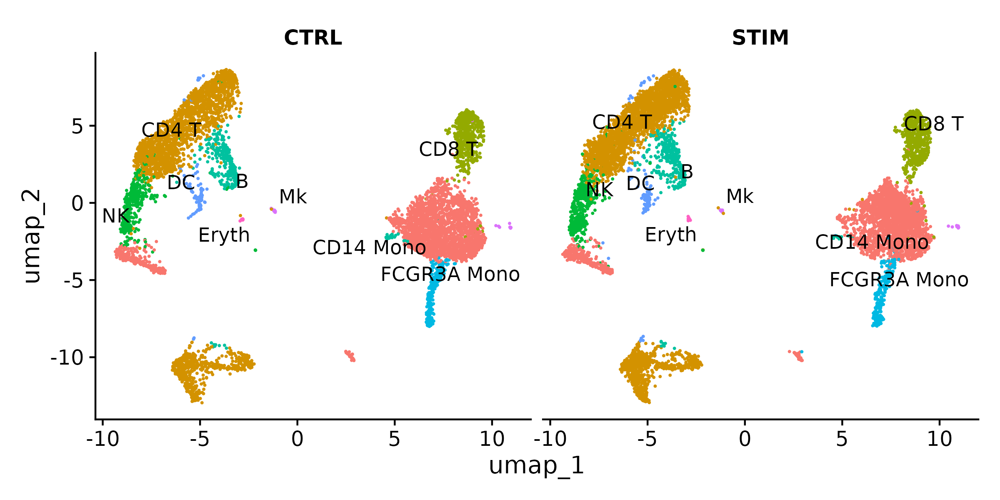
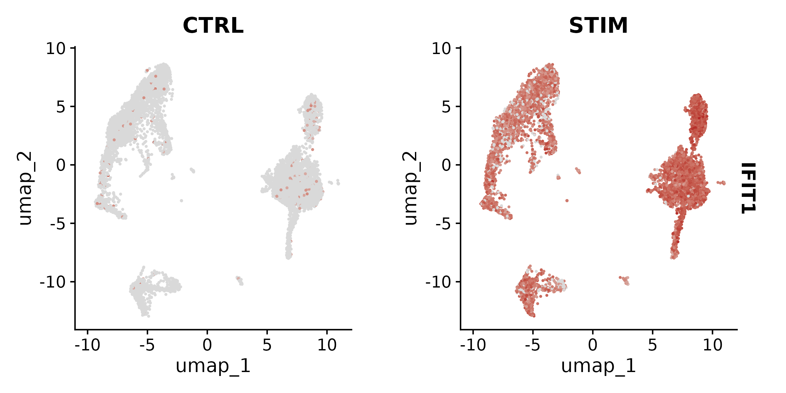

:::::::::::::::::::::::::::::::::::::: questions

- What are the main approaches for differential expression testing in scRNA-seq?
- Why is pseudobulk analysis preferred over per-cell testing for multi-sample experiments?
- How do we create volcano plots and other visualizations to interpret DE results?
- How do we connect lists of DE genes to biological pathways using GO enrichment?
- How should we export our results for sharing and reproducibility?

::::::::::::::::::::::::::::::::::::::::::::::::

::::::::::::::::::::::::::::::::::::: objectives

- Compare Wilcoxon, MAST, and pseudobulk DE testing approaches and choose the right one for your design
- Run pseudobulk differential expression using AggregateExpression
- Create volcano plots, feature plots, and violin plots to visualize DE results
- Perform gene ontology enrichment analysis with clusterProfiler and interpret the results
- Export Seurat objects, count matrices, and metadata for reproducibility and sharing

::::::::::::::::::::::::::::::::::::::::::::::::

## Setup


``` r
library(Seurat)
library(ggplot2)
library(patchwork)
library(dplyr)
library(clusterProfiler)
library(org.Hs.eg.db)
```

## Loading the Integrated Data

We continue from the integrated and annotated IFNB dataset produced in the
previous episode. Make sure the cell type annotation is set as the active
identity.

Set up the working directory to match the previous episodes:


``` r
work_dir <- paste0(
    "/scratch/negishi/", Sys.getenv("USER"),
    "/scrna_workshop/"
)
setwd(work_dir)
```


``` r
ifnb <- readRDS(paste0(work_dir, "ifnb_annotated.rds"))
Idents(ifnb) <- "celltype"
DimPlot(ifnb, reduction = "umap", label = TRUE, repel = TRUE, split.by = "stim") +
    NoLegend()
```


:::::::::::::::::::::::::::::::::::::::::: spoiler

## Expected output



You should see two UMAP panels (CTRL and STIM) with the same cell type
structure in both. Cell types are labeled and colored consistently across
panels.

::::::::::::::::::::::::::::::::::::::::::::::::::

## DE Testing Methods

Seurat supports several statistical tests for differential expression. The
choice of method depends on your experimental design and whether you have
biological replicates.

| Method | Seurat parameter | Statistical model | Best for |
|--------|:----------------|:-----------------|:---------|
| **Wilcoxon rank-sum** | `test.use = "wilcox"` | Non-parametric rank test | Fast exploration, comparing clusters within a single sample |
| **MAST** | `test.use = "MAST"` | Hurdle model (logistic + Gaussian) | Accounts for dropout and cellular detection rate; per-cell testing with better modeling |
| **DESeq2 (pseudobulk)** | `test.use = "DESeq2"` | Negative binomial GLM on aggregated counts | Publication-quality results when biological replicates are available |

Let's start with the **Wilcoxon test** to quickly identify DE genes between
stimulated and control CD14+ monocytes:


``` r
# Subset to CD14+ monocytes
mono <- subset(ifnb, idents = "CD14 Mono")

# Set condition as active identity
Idents(mono) <- "stim"

# Run Wilcoxon DE test
mono.wilcox <- FindMarkers(mono,
                           ident.1 = "STIM",
                           ident.2 = "CTRL",
                           test.use = "wilcox",
                           min.pct = 0.25,
                           logfc.threshold = 0.25)
head(mono.wilcox, 10)
```

| Parameter | Value | Description |
|-----------|-------|-------------|
| `ident.1` | `"STIM"` | The first group (numerator). Positive `avg_log2FC` means higher in STIM. |
| `ident.2` | `"CTRL"` | The second group (denominator). |
| `test.use` | `"wilcox"` | Wilcoxon rank-sum test. Fast, non-parametric, works well for exploration. |
| `min.pct` | `0.25` | Only test genes detected in at least 25% of cells in either group. |
| `logfc.threshold` | `0.25` | Only test genes with at least 0.25 log2FC between groups. |


``` r
cat("Significant genes (padj < 0.05):", sum(mono.wilcox$p_val_adj < 0.05), "\n")
```

:::::::::::::::::::::::::::::::::::::::::: spoiler

## Expected output

```output
        p_val avg_log2FC pct.1 pct.2 p_val_adj
IFIT1       0   7.118    0.965 0.034         0
IFIT3       0   6.737    0.971 0.057         0
TNFSF10     0   6.322    0.959 0.062         0
RSAD2       0   6.620    0.920 0.042         0
IFIT2       0   6.894    0.909 0.040         0
MX1         0   4.824    0.953 0.099         0
CXCL10      0   7.975    0.873 0.032         0
LY6E        0   4.255    0.990 0.174         0
CXCL11      0   8.522    0.800 0.011         0
CCL8        0   9.063    0.800 0.015         0


Significant genes (padj < 0.05): 765 
```

You should see approximately **765 significant genes** at padj < 0.05. The
top genes include interferon-stimulated genes (IFIT1/2/3, RSAD2, MX1) and
IFN-inducible chemokines (CXCL10, CXCL11, CCL8). But notice that the
p-values are extremely small (effectively zero). This is a symptom of per-cell
testing with thousands of cells -- even modest differences become
"significant."

::::::::::::::::::::::::::::::::::::::::::::::::::


:::::::::::::::::::::::::::::::::::::::::: callout

## The pseudobulk revolution

The Wilcoxon and MAST tests treat **each cell as an independent observation**.
But cells from the same donor or the same sample are **not** independent --
they share the same genetic background, the same library preparation, and the
same sequencing run. This is called **pseudoreplication**, and it severely
inflates p-values.

For example, if you have 2,000 monocytes from one control sample and 2,000
from one stimulated sample, per-cell testing treats this as n = 4,000. But the
true sample size is n = 2 (one sample per condition). Every gene with even a
tiny difference will appear significant simply because of the enormous
"sample size."

**Pseudobulk analysis** solves this by aggregating all cells of the same type
from the same sample into a single expression profile. If you have 3 control
donors and 3 stimulated donors, you get 3 pseudobulk replicates per condition
-- the same as a bulk RNA-seq experiment with n = 3 per group. This gives
proper type I error control and realistic p-values.

**Always use pseudobulk** when you have biological replicates. Use per-cell
tests only for exploratory analysis or when you have a single sample per
condition and have no other option.

:::::::::::::::::::::::::::::::::::::::::::::::::::

## Pseudobulk Analysis

Pseudobulk aggregation sums the raw UMI counts for each gene across all cells
of the same cell type from the same sample, producing a bulk-like count matrix
with one column per sample-celltype combination.

:::::::::::::::::::::::::::::::::::::::::: callout

## The IFNB dataset has no biological replicates

The IFNB dataset has only one `orig.ident` per condition (IMMUNE_CTRL and
IMMUNE_STIM). If we aggregate by `celltype + stim + orig.ident`, we get
**one pseudobulk sample per group** -- not enough for DESeq2, which requires
at least 3.

To demonstrate the pseudobulk workflow, we create **pseudo-replicates** by
randomly splitting cells within each condition into 3 groups. This is a common
workaround for teaching and exploration, but be aware: pseudo-replicates do not
capture true biological variability across donors. For publication-quality DE,
you need genuine biological replicates (multiple donors or independent
experiments).

:::::::::::::::::::::::::::::::::::::::::::::::::::


``` r
# Create pseudo-replicates by randomly assigning cells to 3 groups per condition
set.seed(42)
ifnb$pseudo_rep <- paste0("rep", sample(1:3, ncol(ifnb), replace = TRUE))

# Verify: should see 3 roughly equal groups per condition
table(ifnb$stim, ifnb$pseudo_rep)
```


``` output
       rep1 rep2 rep3
  CTRL 2198 2198 2152
  STIM 2533 2465 2453
```

Now aggregate using the pseudo-replicate labels:


``` r
# Create pseudobulk counts
# Group by cell type, condition, and pseudo-replicate
bulk <- AggregateExpression(ifnb,
                            group.by = c("celltype", "stim", "pseudo_rep"),
                            return.seurat = TRUE)
bulk
```

| Parameter | Value | Description |
|-----------|-------|-------------|
| `group.by` | `c("celltype", "stim", "pseudo_rep")` | Metadata columns to group cells by. Each unique combination of cell type, condition, and pseudo-replicate becomes one pseudobulk column. |
| `return.seurat` | `TRUE` | Return a Seurat object (instead of a raw matrix) so we can use `FindMarkers` on it. |

:::::::::::::::::::::::::::::::::::::::::: spoiler

## Expected output

```output
An object of class Seurat 
14053 features across 54 samples within 1 assay 
Active assay: RNA (14053 features, 0 variable features)
 3 layers present: counts, data, scale.data
```

The number of samples equals the number of unique cell type x condition x
pseudo-replicate combinations. With 9 cell types, 2 conditions, and 3
pseudo-replicates, you get up to 54 pseudobulk samples (some may be fewer if
a cell type has very few cells in a given replicate).

::::::::::::::::::::::::::::::::::::::::::::::::::

Now we can run DESeq2-based DE testing on the pseudobulk object. We subset to
CD14+ monocytes and compare conditions:


``` r
# Subset pseudobulk to CD14 Mono samples
bulk.mono <- subset(bulk, celltype == "CD14 Mono")

# Set condition as active identity
Idents(bulk.mono) <- "stim"

# Run DESeq2 on pseudobulk counts
mono.pseudo <- FindMarkers(bulk.mono,
                           ident.1 = "STIM",
                           ident.2 = "CTRL",
                           test.use = "DESeq2")
head(mono.pseudo, 10)
```


``` r
cat("Significant genes (padj < 0.05):", sum(mono.pseudo$p_val_adj < 0.05, na.rm = TRUE), "\n")
```

:::::::::::::::::::::::::::::::::::::::::: spoiler

## Expected output


``` output
       p_val avg_log2FC pct.1 pct.2 p_val_adj
ISG15      0   6.441088     1     1         0
IFI6       0   3.705585     1     1         0
IFI44L     0   3.374846     1     1         0
GBP1       0   2.535916     1     1         0
S100A8     0  -2.276587     1     1         0
MNDA       0   2.661545     1     1         0
RSAD2      0   5.839812     1     1         0
TMSB10     0   1.655318     1     1         0
VAMP5      0   2.977336     1     1         0
SSB        0   2.470712     1     1         0


Significant genes (p_val_adj < 0.05): 1455 
```

The pseudobulk analysis identifies **1455 significant genes** -- more than
the Wilcoxon test (765). This may seem surprising: we said pseudobulk is more
conservative, so why does it find more? Because we used **pseudo-replicates**,
not true biological replicates. The 3 random splits within each condition have
very low within-group variance, giving DESeq2 high statistical power.

With genuine biological replicates (different donors with real between-donor
variability), the pseudobulk gene count would typically be **much lower** than
the per-cell test. The high count here is an artifact of pseudo-replication and
should not be interpreted as pseudobulk being more sensitive in general.

::::::::::::::::::::::::::::::::::::::::::::::::::

## Visualization and Interpretation

### Volcano plot

A volcano plot shows the relationship between statistical significance
(-log10 p-value, y-axis) and biological effect size (log2 fold change,
x-axis). Each point is a gene. Genes in the upper corners are both
statistically significant and biologically meaningful.


``` r
# Use Wilcoxon results for visualization (more genes to plot)
mono.wilcox$gene <- rownames(mono.wilcox)
mono.wilcox$significance <- case_when(
    mono.wilcox$p_val_adj < 0.05 & mono.wilcox$avg_log2FC > 0.5  ~ "Up",
    mono.wilcox$p_val_adj < 0.05 & mono.wilcox$avg_log2FC < -0.5 ~ "Down",
    TRUE ~ "NS"
)

ggplot(mono.wilcox, aes(x = avg_log2FC, y = -log10(p_val_adj), color = significance)) +
    geom_point(size = 0.5, alpha = 0.6) +
    scale_color_manual(values = c("Up" = "firebrick", "Down" = "steelblue", "NS" = "grey70")) +
    geom_vline(xintercept = c(-0.5, 0.5), linetype = "dashed", color = "grey40") +
    geom_hline(yintercept = -log10(0.05), linetype = "dashed", color = "grey40") +
    labs(x = "Log2 fold change (STIM vs CTRL)",
         y = "-log10(adjusted p-value)",
         title = "CD14+ Monocytes: STIM vs CTRL",
         color = "Direction") +
    theme_minimal()
```


How to read the volcano plot:

- **Upper right**: genes significantly upregulated in stimulated cells (ISGs, chemokines)
- **Upper left**: genes significantly downregulated in stimulated cells
- **Bottom center**: non-significant genes (low fold change or high p-value)
- **Dashed lines**: significance cutoffs (|log2FC| > 0.5 and padj < 0.05)

### Feature and violin plots

Visualize specific DE genes on the UMAP and across conditions:


``` r
FeaturePlot(ifnb,
            features = "IFIT1",
            split.by = "stim",
            cols = c("grey85", "firebrick"))
```




``` r
VlnPlot(ifnb,
        features = c("IFIT1", "CXCL10", "MX1"),
        split.by = "stim",
        pt.size = 0,
        ncol = 3)
```


### Dot plot across cell types

A dot plot can show the top DE genes across all cell types simultaneously,
revealing which responses are shared and which are cell-type-specific:


``` r
top_de_genes <- head(rownames(mono.wilcox), 10)
DotPlot(ifnb,
        features = top_de_genes,
        split.by = "stim",
        cols = c("steelblue", "firebrick")) +
    coord_flip() +
    theme(axis.text.x = element_text(angle = 45, hjust = 1))
```


## Functional Enrichment

A list of hundreds of DE genes is difficult to interpret gene by gene.
**Gene Ontology (GO) enrichment analysis** asks: are the DE genes enriched
for specific biological processes? This connects individual gene changes to
broader biological themes.

### Converting gene symbols to Entrez IDs

clusterProfiler requires Entrez gene IDs. We convert from gene symbols using
`bitr()`:


``` r
# Get significant upregulated genes
sig_genes <- mono.wilcox %>%
    filter(p_val_adj < 0.05, avg_log2FC > 0.5) %>%
    rownames()

cat("Number of significant upregulated genes:", length(sig_genes), "\n")

# Convert gene symbols to Entrez IDs
gene_ids <- bitr(sig_genes,
                 fromType = "SYMBOL",
                 toType = "ENTREZID",
                 OrgDb = org.Hs.eg.db)
head(gene_ids)
```

| Parameter | Value | Description |
|-----------|-------|-------------|
| `fromType` | `"SYMBOL"` | Input ID type (gene symbols like ISG15, IFIT1). |
| `toType` | `"ENTREZID"` | Output ID type (Entrez gene IDs like 9636, 3434). |
| `OrgDb` | `org.Hs.eg.db` | Organism annotation database (human). |


:::::::::::::::::::::::::::::::::::::::::: spoiler

## Expected output


``` output
Number of significant upregulated genes: 271 

   SYMBOL ENTREZID
1   IFIT1     3434
2   IFIT3     3437
3 TNFSF10     8743
4   RSAD2    91543
5   IFIT2     3433
6     MX1     4599
```

::::::::::::::::::::::::::::::::::::::::::::::::::

### Running GO enrichment


``` r
go_results <- enrichGO(gene = gene_ids$ENTREZID,
                       OrgDb = org.Hs.eg.db,
                       ont = "BP",
                       pAdjustMethod = "BH",
                       qvalueCutoff = 0.05,
                       readable = TRUE)
```

| Parameter | Value | Description |
|-----------|-------|-------------|
| `gene` | `gene_ids$ENTREZID` | Vector of Entrez gene IDs to test. |
| `OrgDb` | `org.Hs.eg.db` | Organism annotation database. |
| `ont` | `"BP"` | GO ontology category: "BP" (Biological Process), "MF" (Molecular Function), or "CC" (Cellular Component). |
| `pAdjustMethod` | `"BH"` | Benjamini-Hochberg method for multiple testing correction. |
| `qvalueCutoff` | `0.05` | Only return terms with q-value below this threshold. |
| `readable` | `TRUE` | Convert Entrez IDs in the output back to gene symbols for readability. |

Visualize the top enriched GO terms with a dot plot:


``` r
dotplot(go_results, showCategory = 15) +
    ggtitle("GO Biological Process: STIM vs CTRL CD14+ Monocytes")
```


:::::::::::::::::::::::::::::::::::::::::: spoiler

## Expected output


The top enriched GO terms should include:

- **response to virus**
- **defense response to virus**
- **viral process**
- **viral life cycle**
- **regulation of innate immune response**
- **regulation of viral process**
- **viral genome replication**

These terms are entirely consistent with IFN-beta stimulation. IFN-beta is a
type I interferon that activates antiviral defense programs, and the GO
enrichment confirms that the DE genes are concentrated in exactly these
pathways.

::::::::::::::::::::::::::::::::::::::::::::::::::

### KEGG pathway enrichment

For a complementary view, we can also test KEGG pathways:


``` r
kegg_results <- enrichKEGG(gene = gene_ids$ENTREZID,
                           organism = "hsa",
                           pAdjustMethod = "BH",
                           qvalueCutoff = 0.05)
head(kegg_results, 5)
```

:::::::::::::::::::::::::::::::::::::::::: spoiler

## Expected output


``` output
                   category               subcategory       ID                         Description GeneRatio
hsa04621 Organismal Systems             Immune system hsa04621 NOD-like receptor signaling pathway    22/166
hsa05168     Human Diseases Infectious disease: viral hsa05168    Herpes simplex virus 1 infection    17/166
hsa05169     Human Diseases Infectious disease: viral hsa05169        Epstein-Barr virus infection    18/166
hsa05164     Human Diseases Infectious disease: viral hsa05164                         Influenza A    16/166
hsa04612 Organismal Systems             Immune system hsa04612 Antigen processing and presentation    11/166
          BgRatio RichFactor FoldEnrichment    zScore       pvalue     p.adjust       qvalue
hsa04621 187/9382 0.11764706       6.649185 10.472204 1.358486e-12 3.124518e-10 2.702672e-10
hsa05168 180/9382 0.09444444       5.337818  7.886310 1.677668e-08 1.503560e-06 1.300562e-06
hsa05169 205/9382 0.08780488       4.962562  7.698570 1.961165e-08 1.503560e-06 1.300562e-06
hsa05164 173/9382 0.09248555       5.227105  7.531253 6.092210e-08 3.503021e-06 3.030073e-06
hsa04612  82/9382 0.13414634       7.581693  8.033604 1.806443e-07 8.309640e-06 7.187743e-06
                                                                                                                        geneID
hsa04621 4938/3665/115361/2633/4939/4940/6347/3428/115362/10616/7295/3320/6772/837/2635/79792/114769/3326/2634/834/10010/10628
hsa05168                                 4938/3665/5610/64135/684/4939/4940/6347/3133/6890/6772/3107/8717/6672/29992/6892/3134
hsa05169                              3627/4938/9636/3665/5610/4939/4940/3133/6890/6772/3107/4067/958/8717/9541/4616/6892/3134
hsa05164                                       8743/91543/4599/3627/4938/4600/3665/5610/64135/4939/4940/6347/6772/8717/103/834
hsa04612                                                                3303/3133/5721/6890/3320/3107/1520/3326/1514/6892/3134
         Count
hsa04621    22
hsa05168    17
hsa05169    18
hsa05164    16
hsa04612    11
```

Top KEGG pathways should include entries like "Influenza A", "Hepatitis C",
"RIG-I-like receptor signaling pathway", and "NOD-like receptor signaling
pathway" -- all pathways involving the interferon/antiviral response.

::::::::::::::::::::::::::::::::::::::::::::::::::

## Exporting Results

At the end of an analysis, you should export your results in formats that
support reproducibility, sharing, and downstream use.

### Save the annotated Seurat object


``` r
saveRDS(ifnb, file = paste0(work_dir, "ifnb_annotated.rds"))
```

### Export the count matrix and metadata

For the PBMC 10k dataset from earlier episodes, you can export the raw counts
and metadata as CSV files:


``` r
# Export raw count matrix (warning: can be large for big datasets)
counts_matrix <- GetAssayData(pbmc, layer = "counts")
writeMM(counts_matrix, file = "counts.mtx")

# Export metadata
write.csv(pbmc@meta.data, file = "metadata.csv", quote = FALSE)

# Export gene names
write.csv(data.frame(gene = rownames(pbmc)), file = "features.csv",
          row.names = FALSE, quote = FALSE)
```

For smaller datasets, you can export as a dense CSV:


``` r
write.csv(as.matrix(GetAssayData(pbmc, layer = "counts")),
          file = "counts_dense.csv")
```

### Format conversion for Python users

If collaborators use the Python/Scanpy ecosystem, you can convert your Seurat
object to AnnData format using the `sceasy` package:


``` r
# Install sceasy if needed: remotes::install_github("cellgeni/sceasy")
library(sceasy)
sceasy::convertFormat(pbmc,
                      from = "seurat",
                      to = "anndata",
                      outFile = "pbmc_annotated.h5ad")
```

### GEO submission

For submitting data to NCBI GEO, you typically need:

- **Raw count matrix** (genes x cells) in MTX or CSV format
- **Cell metadata** (barcodes, cell types, conditions) as a TSV/CSV
- **Processing description** (software versions, parameters, filtering criteria)

:::::::::::::::::::::::::::::::::::::::::: callout

## Reproducibility checklist

Before sharing or publishing your analysis, ensure you have:

- **Saved your R session info** so others know exactly which package versions
  you used:

  ```r
  writeLines(capture.output(sessionInfo()), "session_info.txt")
  ```

- **Pinned package versions** in your analysis scripts or used `renv` to create
  a reproducible environment.

- **Saved intermediate RDS files** at each major step (`pbmc_filtered.rds`,
  `pbmc_normalized.rds`, `pbmc_clustered.rds`, `pbmc_annotated.rds`) so others
  can enter the pipeline at any point.

- **Documented all parameter choices**: QC thresholds, number of PCs,
  clustering resolution, normalization method, integration method, and DE test
  used.

- **Recorded the random seed** if you used one (e.g., `set.seed(42)` before
  UMAP or clustering).

:::::::::::::::::::::::::::::::::::::::::::::::::::

::::::::::::::::::::::::::::::::::::: challenge

## Challenge 1: Wilcoxon vs. Pseudobulk

Run both Wilcoxon (per-cell) and pseudobulk (DESeq2) DE testing for stimulated
vs. control CD14+ monocytes. Compare the number of significant genes and the
p-value distributions.


``` r
# Wilcoxon (already computed above)
n_wilcox <- sum(mono.wilcox$p_val_adj < 0.05)
cat("Wilcoxon significant genes:", n_wilcox, "\n")

# Pseudobulk (already computed above)
n_pseudo <- sum(mono.pseudo$p_val_adj < 0.05, na.rm = TRUE)
cat("Pseudobulk significant genes:", n_pseudo, "\n")

# Compare p-value distributions for shared genes
shared_genes <- intersect(rownames(mono.wilcox), rownames(mono.pseudo))
comparison <- data.frame(
    gene = shared_genes,
    wilcox_pval = mono.wilcox[shared_genes, "p_val_adj"],
    pseudo_pval = mono.pseudo[shared_genes, "p_val_adj"]
)
comparison <- comparison[complete.cases(comparison), ]

ggplot(comparison, aes(x = -log10(wilcox_pval), y = -log10(pseudo_pval))) +
    geom_point(size = 0.5, alpha = 0.5) +
    geom_abline(slope = 1, intercept = 0, color = "red", linetype = "dashed") +
    labs(x = "-log10(p-value) Wilcoxon",
         y = "-log10(p-value) Pseudobulk",
         title = "P-value comparison: Wilcoxon vs Pseudobulk") +
    theme_minimal()
```


Which method gives more conservative results? Why?

:::::::::::::::::::::::: solution


You should find that:

- **Wilcoxon** identifies 765 significant genes
- **Pseudobulk** identifies 1455 (with pseudo-replicates)

Pseudobulk finds **more** significant genes here, which may seem to contradict
the usual advice that pseudobulk is more conservative. The reason: our
pseudo-replicates (random cell splits) have very low within-group variance, so
DESeq2 gets very high power. With **real** biological replicates (different
donors), the between-donor variability would inflate variance estimates and
the gene count would drop substantially.

The scatter plot shows a complex pattern:

- A **dense band along the x-axis** (Wilcoxon significant, pseudobulk not) --
  genes with small effects that Wilcoxon detects via per-cell power but
  pseudobulk misses.
- Many points **above the diagonal** -- genes where pseudobulk yields smaller
  p-values, because DESeq2's count-based model is more powerful when
  within-group variance is low.
- Some points **below the diagonal** -- genes where Wilcoxon is more significant.

With true biological replicates, you would expect most points to shift below
the diagonal and the overall pseudobulk gene count to drop well below the
Wilcoxon count.

**Rule of thumb:** Use Wilcoxon for quick exploration and hypothesis
generation. Use pseudobulk for any result you plan to report or publish. And
for publication, ensure you have true biological replicates, not
pseudo-replicates.

:::::::::::::::::::::::::::::::::

::::::::::::::::::::::::::::::::::::::::::::::::

::::::::::::::::::::::::::::::::::::: challenge

## Challenge 2: GO Enrichment of IFN-beta Response Genes

Run GO enrichment on the top 200 upregulated genes (by fold change) in
stimulated vs. control CD14+ monocytes. What are the top 5 biological
processes? Do they make sense for IFN-beta stimulation?


``` r
# Get top 200 upregulated genes by fold change
top200 <- mono.wilcox %>%
    filter(p_val_adj < 0.05, avg_log2FC > 0) %>%
    arrange(desc(avg_log2FC)) %>%
    head(200)
top200_genes <- rownames(top200)

# Convert to Entrez IDs
top200_ids <- bitr(top200_genes,
                   fromType = "SYMBOL",
                   toType = "ENTREZID",
                   OrgDb = org.Hs.eg.db)

# Run GO enrichment
go_top200 <- enrichGO(gene = top200_ids$ENTREZID,
                      OrgDb = org.Hs.eg.db,
                      ont = "BP",
                      pAdjustMethod = "BH",
                      qvalueCutoff = 0.05,
                      readable = TRUE)

# Show top 5 terms
head(go_top200, 5)

# Visualize
dotplot(go_top200, showCategory = 10) +
    ggtitle("GO BP: Top 200 upregulated genes in STIM CD14+ Monocytes")
```


:::::::::::::::::::::::: solution


The top 5 biological processes should include terms like:

| Rank | GO Term | Interpretation |
|:----:|:--------|:--------------|
| 1 | response to virus | Broad viral response including both detection and effector mechanisms |
| 2 | defense response to virus | Direct antiviral effector programs activated by IFN-beta |
| 3 | viral process | Genes involved in the viral life cycle, many of which are ISGs that restrict it |
| 4 | viral life cycle | Overlap with viral process; reflects IFIT, OAS, and MX family genes |
| 5 | regulation of viral process | Regulatory genes that modulate antiviral defense (e.g., TRIM, IRF family) |

These results make complete biological sense. IFN-beta (interferon beta) is a
**type I interferon** that signals through the IFNAR receptor complex,
activating the JAK-STAT pathway, which turns on hundreds of
interferon-stimulated genes (ISGs). These ISGs encode proteins that directly
inhibit viral replication (MX1, IFIT1/2/3), degrade viral RNA (RSAD2), recruit
immune cells via chemokines (CXCL10, CXCL11, CCL8), and alert neighboring
cells to the viral threat.

The GO enrichment confirms that our DE analysis is capturing the expected
biology: the top upregulated genes in stimulated monocytes are overwhelmingly
involved in antiviral and interferon signaling pathways. This serves as
important biological validation that the computational pipeline (integration,
DE testing, enrichment) is working correctly.

:::::::::::::::::::::::::::::::::

::::::::::::::::::::::::::::::::::::::::::::::::

::::::::::::::::::::::::::::::::::::: keypoints

- Per-cell DE tests (Wilcoxon, MAST) treat each cell as independent, inflating p-values through pseudoreplication
- Pseudobulk analysis aggregates cells by sample and cell type, providing statistically valid results with proper type I error control
- Volcano plots visualize the relationship between effect size (log2FC) and significance (-log10 p-value) for all tested genes
- Gene ontology enrichment connects lists of DE genes to biological pathways, providing functional interpretation of differential expression results
- Always export session info, save intermediate objects, and document parameter choices for reproducibility

::::::::::::::::::::::::::::::::::::::::::::::::
