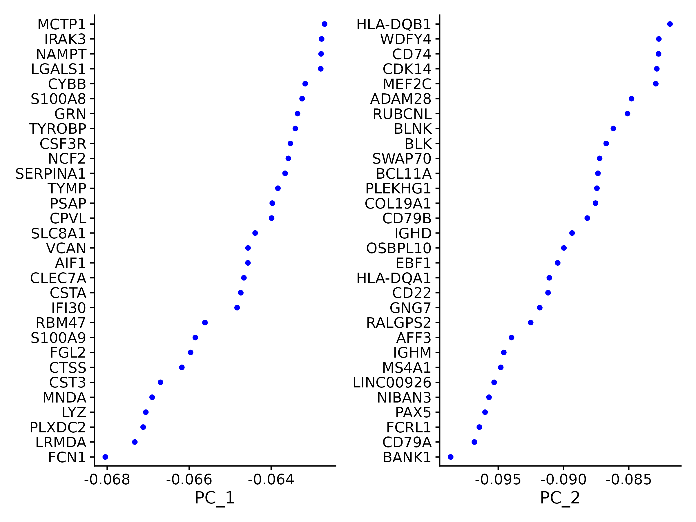
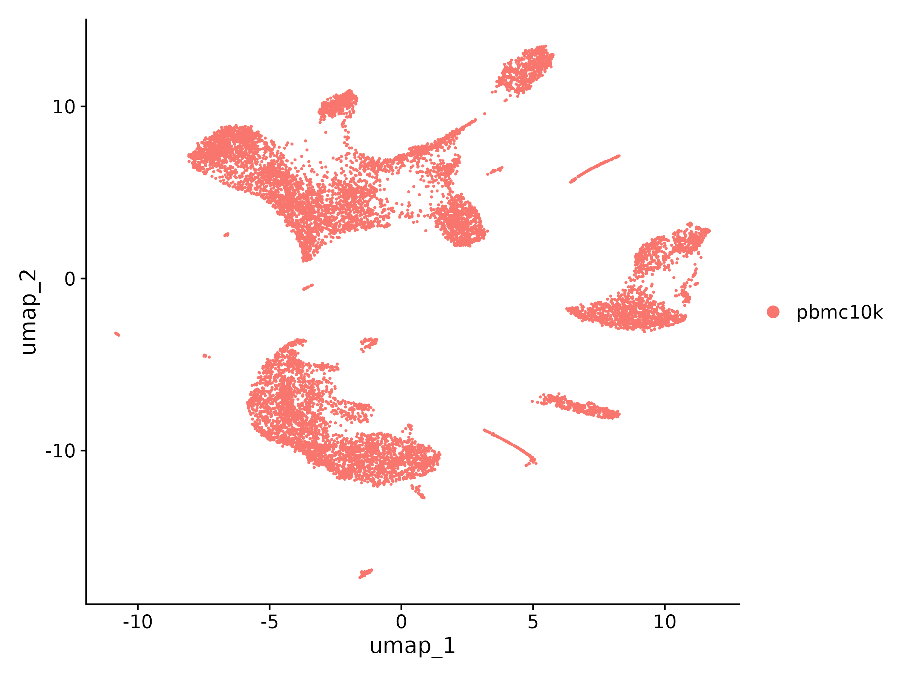
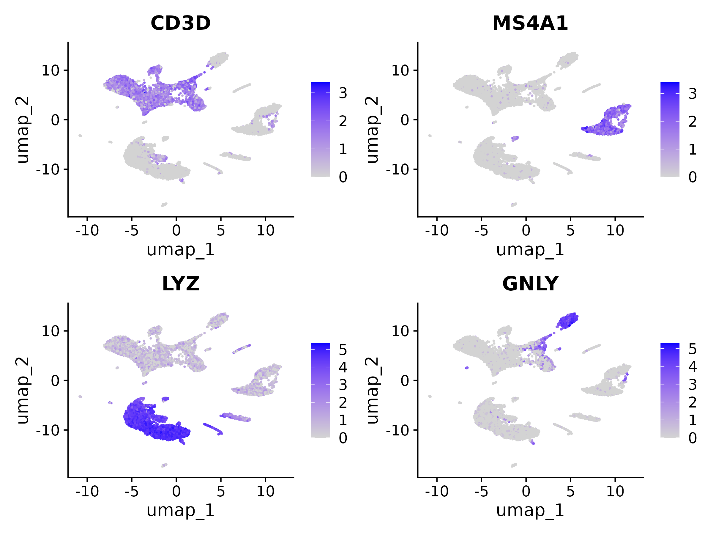
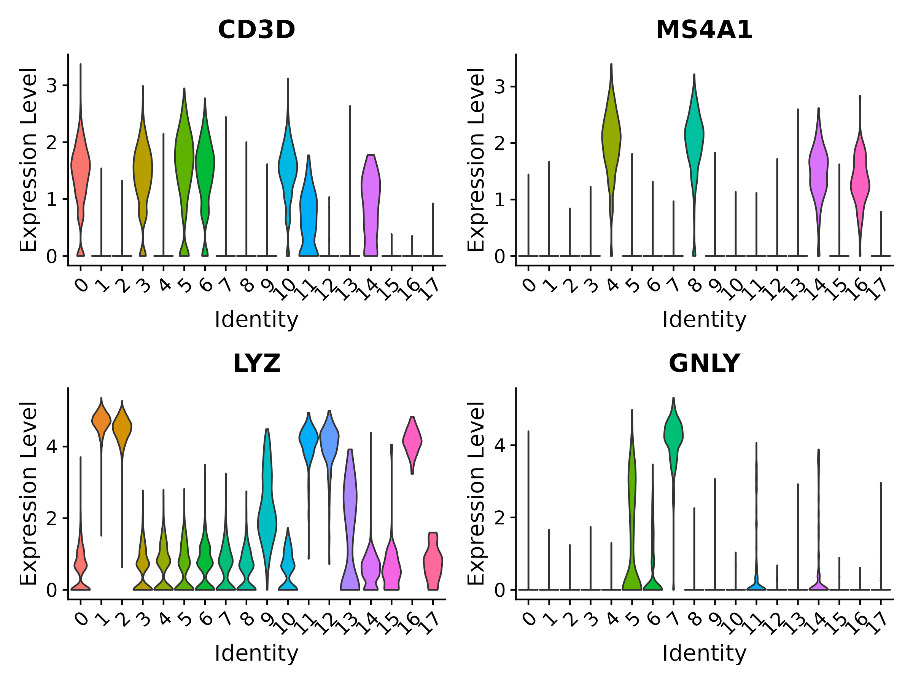
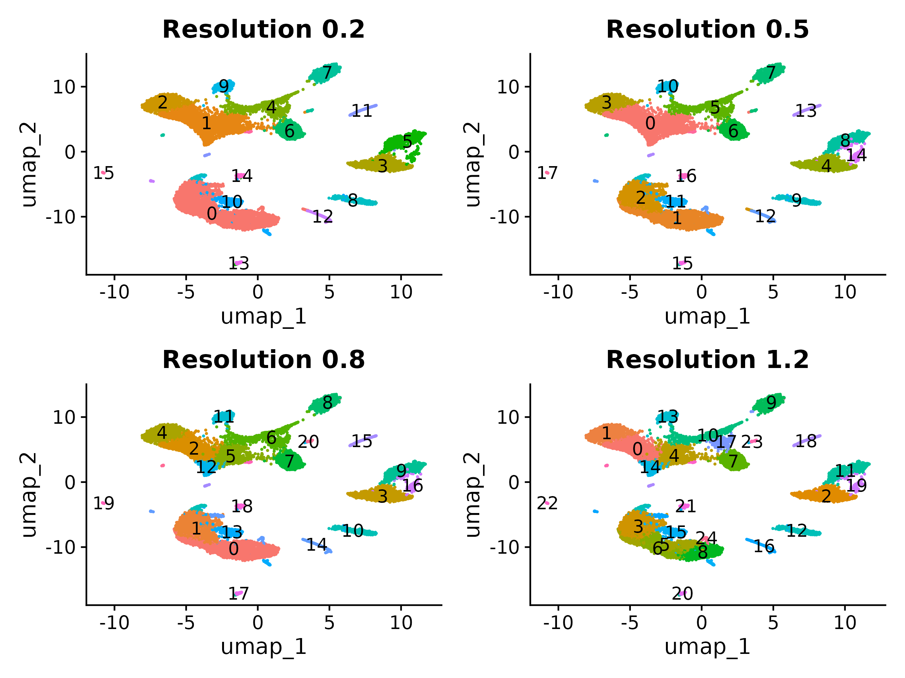
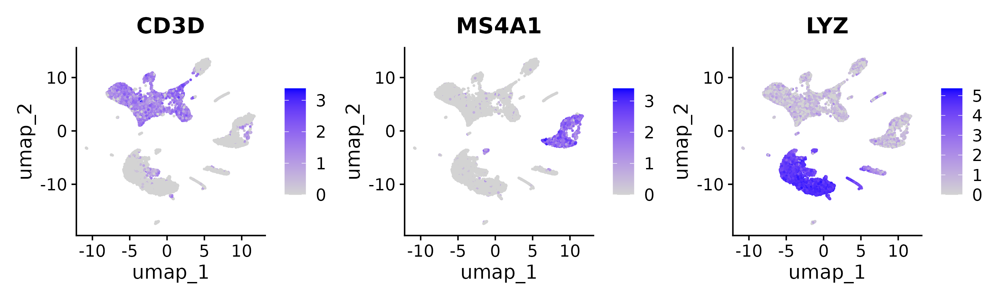
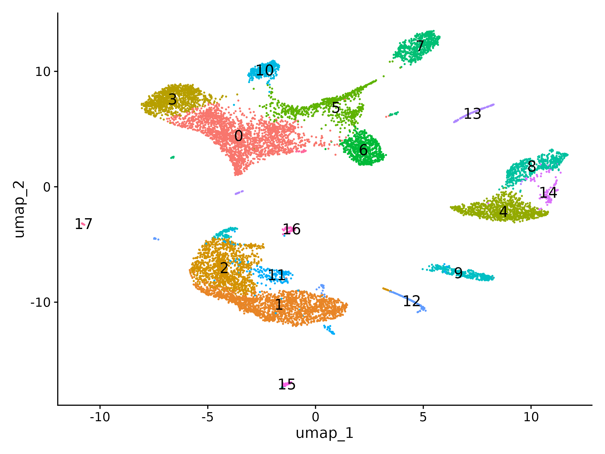

:::::::::::::::::::::::::::::::::::::: questions

- Why do we need to reduce the dimensions of scRNA-seq data before clustering?
- How do we choose the right number of principal components?
- What does UMAP show us and what can it NOT tell us?
- How does graph-based clustering work and what does the resolution parameter control?
- How do we evaluate whether our clustering resolution is appropriate?

::::::::::::::::::::::::::::::::::::::::::::::::

::::::::::::::::::::::::::::::::::::: objectives

- Run PCA on variable features and select an appropriate number of PCs using the elbow plot
- Generate a UMAP embedding for 2D visualization of cell relationships
- Construct a shared nearest neighbor graph and identify clusters with the Louvain algorithm
- Explore multiple clustering resolutions and use clustree to assess cluster stability
- Visualize known marker genes on the UMAP to preview cell type identity

::::::::::::::::::::::::::::::::::::::::::::::::

::::::::::::::::::::::::::::::::::::::: prereq

## Prerequisites

This episode requires an RStudio session on the Negishi cluster. Launch
**RStudio (bioconductor)** under **Bioinformatics Apps** on
[Open OnDemand](https://gateway.negishi.rcac.purdue.edu) as described in the
[Setup](../learners/setup.md#starting-rstudio-on-open-ondemand) instructions.
You will also need the `pbmc_normalized.rds` object saved at the end of the
previous episode.

:::::::::::::::::::::::::::::::::::::::

## Setup


``` r
library(Seurat)
library(ggplot2)
library(patchwork)
library(clustree)
```

## Loading the Normalized Data

We start from the normalized, scaled Seurat object saved at the end of the
previous episode. This object has the `counts`, `data`, and `scale.data`
layers populated, with 2,000 variable features selected.

Set up the working directory to match the previous episodes:


``` r
work_dir <- paste0(
    "/scratch/negishi/", Sys.getenv("USER"),
    "/scrna_workshop/"
)
setwd(work_dir)
```


``` r
pbmc <- readRDS(paste0(work_dir, "pbmc_normalized.rds"))
pbmc
```

:::::::::::::::::::::::::::::::::::::::::: spoiler

## Expected output

```output
An object of class Seurat 
29155 features across 11310 samples within 1 assay 
Active assay: RNA (29155 features, 2000 variable features)
 3 layers present: counts, data, scale.data
```

::::::::::::::::::::::::::::::::::::::::::::::::::


## Principal Component Analysis (PCA)

Our dataset has ~2,000 variable features, but many of these genes are
correlated -- they go up and down together across cells because they are
co-regulated in the same cell types. **PCA (Principal Component Analysis)**
exploits these correlations to compress the data into a smaller set of
**principal components (PCs)**. Each PC is a linear combination of genes that
captures a distinct axis of variation in the data.

The key properties of PCA:

- **PC1** captures the direction of greatest variance across all cells
- **PC2** captures the next greatest variance, orthogonal to PC1
- Each subsequent PC captures decreasing amounts of variance
- The first 10--20 PCs typically capture the major biological structure (cell
  types), while later PCs are dominated by noise


``` r
pbmc <- RunPCA(pbmc, features = VariableFeatures(object = pbmc))
```

| Parameter | Value | Description |
|-----------|-------|-------------|
| `features` | `VariableFeatures(object = pbmc)` | Which genes to use for PCA. We use the 2,000 variable features selected in the previous episode. |

By default, Seurat computes 50 PCs. Let's examine which genes drive the first
two components:


``` r
VizDimLoadings(pbmc, dims = 1:2, reduction = "pca")
```
{alt="Dot plots of the top 30 genes by loading magnitude for PC1 and PC2, with PC1 dominated by myeloid markers and PC2 by B cell markers."}

Each point represents a gene's **loading** (contribution) to that PC. For PC1,
you should see monocyte/myeloid markers (CST3, LYZ, S100A9, FCN1) among the
top genes. This tells us that **PC1 separates myeloid from lymphoid cells**
-- the largest source of variation in PBMCs. PC2 is dominated by B cell
markers (BANK1, CD79A, MS4A1, PAX5), indicating that B cells are the next
major axis of variation.

We can also visualize PCs as heatmaps to see which genes and cells contribute
most:


``` r
DimHeatmap(pbmc, dims = 1:9, cells = 500, balanced = TRUE)
```

| Parameter | Value | Description |
|-----------|-------|-------------|
| `dims` | `1:9` | Which PCs to plot. |
| `cells` | `500` | Number of cells to include (randomly sampled from each extreme of the PC). |
| `balanced` | `TRUE` | Plot equal numbers of cells from the positive and negative ends of each PC. |

Each heatmap shows the top genes (rows) ordered by their loading, with cells
(columns) ordered by their PC score. Clear blocks of correlated expression
indicate PCs that capture real biological structure. PCs that look noisy
(no clear pattern) are capturing technical variation or random noise.

{alt="Grid of nine heatmaps for PC1 through PC9, each showing top genes ordered by loading and cells ordered by PC score to reveal distinct expression programs."}


### Choosing the number of PCs

Not all 50 PCs are informative. Later PCs capture decreasing amounts of
variance and eventually become dominated by noise. We need to decide how many
PCs to retain for downstream steps (UMAP and clustering).

The **elbow plot** shows the standard deviation explained by each PC:


``` r
ElbowPlot(pbmc, ndims = 30)
```

{alt="Elbow plot of standard deviation versus PC number showing a steep decline through PC7 and a plateau after PC10, with the elbow around PC 8 to 10."}


Look for the **elbow** -- the point where the curve transitions from steep
decline to a flatter plateau. PCs before the elbow capture substantial
biological signal; PCs after the elbow are mostly noise.

:::::::::::::::::::::::::::::::::::::::::: callout

## How many PCs?

For the PBMC 10k dataset, the elbow typically falls around **PC 12--15**. We
will use **15 PCs** for the rest of this episode.

In practice, the exact number is not critical. Using 10 vs. 20 PCs usually
produces very similar clustering results for well-separated cell types.
The choice matters more for subtle distinctions between closely related
populations.

**When in doubt, err on the side of including more PCs** (e.g., 20). Using
too few PCs risks losing biological signal from rarer cell types. Using a few
extra PCs adds a small amount of noise but rarely changes the major structure.

An alternative to visual inspection is the **JackStraw** procedure
(`JackStrawPlot()`), which uses a permutation test to identify statistically
significant PCs. However, it is computationally expensive for large datasets
and is rarely necessary when the elbow is clear.

:::::::::::::::::::::::::::::::::::::::::::::::::::


## UMAP Visualization

PCA reduces our data from 2,000 dimensions to 15, but we still cannot
visualize 15 dimensions directly. **UMAP** (Uniform Manifold Approximation and
Projection) further reduces the data to just 2 dimensions for plotting. Unlike
PCA, UMAP is a **non-linear** method: it can unfold complex relationships that
PCA cannot capture, placing similar cells close together and dissimilar cells
far apart in 2D space.


``` r
pbmc <- RunUMAP(pbmc, dims = 1:15)
```

| Parameter | Value | Description |
|-----------|-------|-------------|
| `dims` | `1:15` | Which PCs to use as input. We use the 15 PCs selected above. |

Visualize the UMAP embedding:


``` r
DimPlot(pbmc, reduction = "umap")
```

{alt="UMAP scatter plot of 11310 cells in a single color before clustering, with cells forming several spatially distinct groups that correspond to different cell types."}

At this point, cells are not yet clustered (all are the same color). But you
can already see that cells organize into distinct groups on the UMAP. These
groups correspond to different cell types.

### UMAP parameters

UMAP has two key parameters that control the appearance of the plot:

| Parameter | Default | Effect |
|-----------|:--------|:-------|
| `n.neighbors` | 30 | Controls the balance between local and global structure. **Low values** (5--15) emphasize local neighborhoods, producing tighter clusters. **High values** (50--200) emphasize global structure, producing smoother layouts. |
| `min.dist` | 0.3 | Controls how tightly UMAP packs points. **Low values** (0.01--0.1) produce dense, compact clusters. **High values** (0.5--1.0) spread clusters out more evenly. |

The defaults work well for most datasets. Adjusting these parameters changes
the **visual appearance** of the plot but does **not** change the underlying
data or the clustering results (which operate on PCA space, not UMAP space).

:::::::::::::::::::::::::::::::::::::::::: callout

## UMAP interpretation pitfalls

UMAP plots are powerful visualization tools, but they can be misleading if
over-interpreted. Three things you should **NOT** infer from a UMAP:

1. **Distances between clusters do not reflect true biological similarity.**
   Two clusters that appear far apart on the UMAP may actually be
   transcriptionally very similar, and vice versa. UMAP distorts global
   distances to preserve local neighborhoods.

2. **Cluster size on the plot does not reflect population size.** A large,
   spread-out cluster may contain fewer cells than a small, compact one.
   UMAP adjusts spacing to show local structure, not proportional
   representation.

3. **Different random seeds produce different layouts.** Running UMAP twice
   with different seeds will give a different arrangement of clusters. The
   overall groupings will be the same (the same cells will cluster together),
   but their positions and orientations on the plot will differ. Never compare
   spatial positions across two separate UMAP runs.

**Always verify biological conclusions with quantitative methods** (marker
gene expression, differential expression tests, cluster composition
statistics) rather than relying on visual impressions from UMAP alone.

:::::::::::::::::::::::::::::::::::::::::::::::::::

:::::::::::::::::::::::::::::::::::::::::: callout

## t-SNE as an alternative

Before UMAP became standard, **t-SNE** (t-distributed Stochastic Neighbor
Embedding) was the most common visualization method for scRNA-seq. You can run
it with `RunTSNE(pbmc, dims = 1:15)`. t-SNE is similar in purpose to UMAP but
tends to be slower and produces rounder, more separated clusters. The same
interpretation caveats apply. Most current analyses use UMAP because it is
faster, better preserves global structure, and scales better to large datasets.

:::::::::::::::::::::::::::::::::::::::::::::::::::


## Graph-Based Clustering

With the PCA embedding computed, we can now group cells into clusters. Seurat
uses a **graph-based clustering** approach that works in two steps:

### Step 1: Build a neighbor graph

`FindNeighbors()` constructs a **K-nearest neighbor (KNN) graph** in PCA
space. For each cell, it identifies its *k* most similar cells based on
Euclidean distance in the first 15 PCs. These connections are then refined
into a **shared nearest neighbor (SNN) graph**, where the connection strength
between two cells depends on how much their neighborhoods overlap.


``` r
pbmc <- FindNeighbors(pbmc, dims = 1:15)
```

| Parameter | Value | Description |
|-----------|-------|-------------|
| `dims` | `1:15` | Which PCs to use for computing distances. Must match the PCs used for UMAP. |
| `k.param` | `20` (default) | Number of nearest neighbors per cell. Higher values produce a more connected graph with smoother clustering. Lower values preserve finer local structure. |

### Step 2: Detect communities

`FindClusters()` applies a **community detection algorithm** to the SNN graph.
The algorithm finds groups of cells that are densely connected to each other
but sparsely connected to the rest of the graph. The **resolution** parameter
controls the granularity of clustering:


``` r
pbmc <- FindClusters(pbmc, resolution = 0.5)
```

| Parameter | Value | Description |
|-----------|-------|-------------|
| `resolution` | `0.5` | Controls the number of clusters. Lower values (0.1--0.3) produce fewer, larger clusters. Higher values (1.0--2.0) produce more, smaller clusters. |
| `algorithm` | `1` (default) | Community detection method. `1` = Louvain (default, fast and reliable). `4` = Leiden (more robust against poorly connected clusters, requires the `leidenalg` Python package). |

:::::::::::::::::::::::::::::::::::::::::: spoiler

## Expected output

At resolution 0.5, you should get approximately **18 clusters**, numbered
starting from 0. The exact number may vary slightly depending on random seed
and software versions.


``` output
Modularity Optimizer version 1.3.0 by Ludo Waltman and Nees Jan van Eck

Number of nodes: 11310
Number of edges: 410535

Running Louvain algorithm...
Maximum modularity in 10 random starts: 0.9317
Number of communities: 18
Elapsed time: 1 seconds
```

::::::::::::::::::::::::::::::::::::::::::::::::::

The cluster assignments are stored in the object metadata. Let's check them:


``` r
head(Idents(pbmc))
table(Idents(pbmc))
```

:::::::::::::::::::::::::::::::::::::::::: spoiler

## Expected output

```output
AAACCCAAGCGCCCAT-1 AAACCCAAGGTTCCGC-1 AAACCCACAGACAAGC-1 AAACCCACAGAGTTGG-1 AAACCCACAGGTATGG-1 
                 0                 12                 13                  1                  7 
AAACCCACATAGTCAC-1 
                 4 
Levels: 0 1 2 3 4 5 6 7 8 9 10 11 12 13 14 15 16 17


   0    1    2    3    4    5    6    7    8    9   10   11   12   13   14   15   16   17 
2112 1810 1187 1015 1006  716  639  634  517  429  357  234  176  175  122   78   64   39 
```

Cluster 0 is the largest with 2,112 cells (T cells, which are the most
abundant PBMC type). Cluster 17 is the smallest with only 39 cells (likely
a rare population like platelets or dendritic cells).

::::::::::::::::::::::::::::::::::::::::::::::::::

Now let's visualize the clusters on the UMAP:


``` r
DimPlot(pbmc, reduction = "umap", label = TRUE, label.size = 5) +
    NoLegend()
```

{alt="UMAP plot colored by Louvain cluster identity at resolution 0.5, showing 18 clusters numbered 0 through 17 with large clusters in the center and small clusters at the periphery."}

### Exploring multiple resolutions

The resolution parameter is the most important choice in clustering. Too low
and distinct cell types are merged; too high and single cell types are split
into artificial sub-clusters. The best way to evaluate the right resolution is
to try several and compare.


``` r
pbmc <- FindClusters(pbmc, resolution = 0.2)
pbmc <- FindClusters(pbmc, resolution = 0.5)
pbmc <- FindClusters(pbmc, resolution = 0.8)
pbmc <- FindClusters(pbmc, resolution = 1.2)
```

Each call adds a new column to the metadata named `RNA_snn_res.X` (where X is
the resolution value). We can visualize how cells move between clusters at
different resolutions using **clustree**:


``` r
clustree(pbmc, prefix = "RNA_snn_res.")
```
{alt="Clustree diagram tracing cluster membership from resolution 0.2 to 1.2, with clean branches indicating stable splits and tangled arrows indicating unstable over-splitting."}

In the clustree plot, each row is a resolution and each node is a cluster.
Arrows show how cells move between clusters as resolution increases. Look for:

- **Clean splits**: one cluster at a lower resolution cleanly divides into two
  at a higher resolution. This suggests a real biological distinction.
- **Unstable splits**: cells from one cluster scatter across multiple clusters
  at a higher resolution, or cells bounce between clusters. This suggests
  over-splitting.

Set the active cluster identity to our chosen resolution:


``` r
Idents(pbmc) <- "RNA_snn_res.0.5"
```

Save the clustered object for the next episode:


``` r
saveRDS(pbmc, file = "pbmc_clustered.rds")
```


## Exploring Clusters

Before formal cell type annotation (next episode), we can already preview cell
identity by overlaying known marker genes on the UMAP. If our clustering is
good, each marker should light up in a distinct cluster.


``` r
FeaturePlot(pbmc,
            features = c("CD3D", "MS4A1", "LYZ", "GNLY"),
            ncol = 2)
```

{alt="Four UMAP panels showing expression of CD3D, MS4A1, LYZ, and GNLY on a grey-to-purple gradient, each marking distinct cell populations for T cells, B cells, monocytes, and NK cells."}


| Gene | Cell type | Expected pattern |
|------|:----------|:----------------|
| `CD3D` | T cells | Lights up the large T cell clusters (the biggest groups on the UMAP) |
| `MS4A1` | B cells | Lights up a compact cluster separate from T cells |
| `LYZ` | CD14+ Monocytes | Lights up monocyte clusters, distinct from lymphocytes |
| `GNLY` | NK cells | Lights up a cluster adjacent to but separate from T cells |

We can also view these markers as violin plots to see the expression
distribution across clusters:


``` r
VlnPlot(pbmc,
        features = c("CD3D", "MS4A1", "LYZ", "GNLY"),
        ncol = 2,
        pt.size = 0)
```
{alt="Violin plots of CD3D, MS4A1, LYZ, and GNLY expression across 18 clusters, showing each marker with high expression in specific clusters and near-zero expression elsewhere."}

Even without formal annotation, you can see that these markers segregate
cleanly into distinct clusters. CD3D marks several clusters (T cell subtypes),
MS4A1 is specific to one cluster (B cells), LYZ is strong in one or two
clusters (monocytes), and GNLY is specific to another (NK cells). This gives
us confidence that the clustering is capturing biologically meaningful
groupings. In the next episode, we will systematically identify marker genes
for every cluster and assign cell type labels.


::::::::::::::::::::::::::::::::::::: challenge

## Challenge 1: Choosing a Resolution with Clustree

Run clustering at resolutions 0.2, 0.5, 0.8, and 1.2 (we already did this
above). Use the `clustree` plot to answer:

1. At which resolution do clusters start splitting unstably?
2. Which resolution gives a number of clusters that best matches the known
   PBMC cell types (~8--10 major types)?
3. How many clusters do you get at each resolution?


``` r
# Count clusters at each resolution
cat("Resolution 0.2:", length(unique(pbmc$RNA_snn_res.0.2)), "clusters\n")
cat("Resolution 0.5:", length(unique(pbmc$RNA_snn_res.0.5)), "clusters\n")
cat("Resolution 0.8:", length(unique(pbmc$RNA_snn_res.0.8)), "clusters\n")
cat("Resolution 1.2:", length(unique(pbmc$RNA_snn_res.1.2)), "clusters\n")

# Visualize side by side
p1 <- DimPlot(pbmc, group.by = "RNA_snn_res.0.2", label = TRUE) +
    NoLegend() + ggtitle("Resolution 0.2")
p2 <- DimPlot(pbmc, group.by = "RNA_snn_res.0.5", label = TRUE) +
    NoLegend() + ggtitle("Resolution 0.5")
p3 <- DimPlot(pbmc, group.by = "RNA_snn_res.0.8", label = TRUE) +
    NoLegend() + ggtitle("Resolution 0.8")
p4 <- DimPlot(pbmc, group.by = "RNA_snn_res.1.2", label = TRUE) +
    NoLegend() + ggtitle("Resolution 1.2")

(p1 + p2) / (p3 + p4)
```

::::::::::::::::::::::::: solution


{alt="Side-by-side UMAP plots at resolutions 0.2, 0.5, 0.8, and 1.2 showing progressively more clusters as resolution increases."}


Expected cluster counts:

| Resolution | Approximate clusters |
|:----------:|:--------------------:|
| 0.2 | 16 |
| 0.5 | 18 |
| 0.8 | 21 |
| 1.2 | 25 |

**Resolution 0.5** gives 18 clusters, which captures the 8 major PBMC cell
types (CD4+ T, CD8+ T, B cells, CD14+ monocytes, FCGR3A+ monocytes, NK
cells, dendritic cells, platelets) along with some sub-clusters (e.g., naive
vs. memory T cells), which is biologically reasonable.

**Resolution 0.2** under-clusters with 16 clusters: it merges some distinct
cell subtypes. You may lose meaningful biological distinctions.

**Resolution 0.8** starts to over-split with 21 clusters: the clustree plot
shows clusters from resolution 0.5 splitting into sub-clusters, with some
cells moving between clusters in ways that are not stable. This does not mean
0.8 is wrong -- it may reveal real sub-populations -- but the splits become
harder to annotate confidently.

**Resolution 1.2** clearly over-splits with 25 clusters, many of which are
fragments of the same cell type. The clustree plot shows extensive
cross-cluster mixing at this resolution.

For this workshop we use **resolution 0.5** as a good balance between
capturing distinct cell types and avoiding excessive fragmentation.

:::::::::::::::::::::::::::::::::

::::::::::::::::::::::::::::::::::::::::::::::::

::::::::::::::::::::::::::::::::::::: challenge

## Challenge 2: Mapping Markers to Clusters

Use `FeaturePlot()` to visualize three markers on the UMAP:

- **CD3D** (T cells)
- **MS4A1** (B cells)
- **LYZ** (monocytes)

Then use the cluster-labeled UMAP to determine which cluster number(s)
correspond to each cell type.


``` r
FeaturePlot(pbmc, features = c("CD3D", "MS4A1", "LYZ"), ncol = 3)
DimPlot(pbmc, reduction = "umap", label = TRUE, label.size = 5) + NoLegend()
```

:::::::::::::::::::::::: solution


{alt="Three UMAP panels showing expression of CD3D, MS4A1, and LYZ. CD3D expression is concentrated in the upper-left and lower-left regions. MS4A1 lights up a compact group in the upper-right. LYZ is strongest in the lower-left clusters."}

{alt="UMAP plot with 18 clusters labeled 0 through 17 for cross-referencing with the FeaturePlot above."}


By comparing the FeaturePlot panels with the labeled UMAP, you should see the
following pattern (exact cluster numbers may differ depending on your run):

| Marker | Cell type | Cluster(s) |
|--------|:----------|:-----------|
| CD3D | T cells | Clusters 0, 2, 3, 5, 6 (several groups across the upper-left and lower-left UMAP). CD3D is expressed in both CD4+ and CD8+ T cells, so it marks multiple clusters. |
| MS4A1 | B cells | Cluster 7 (a compact, clearly separated group in the upper-right). MS4A1 (also known as CD20) is highly specific to B cells. |
| LYZ | CD14+ Monocytes | Clusters 1 and 2 (large groups in the lower portion of the UMAP). You may also see weaker LYZ expression in a smaller monocyte cluster (FCGR3A+). |

The fact that each marker cleanly maps to specific clusters confirms that
our clustering at resolution 0.5 is capturing meaningful biological groupings.
Notice that CD3D marks multiple clusters -- this is expected because there are
several T cell subtypes (CD4+ naive, CD4+ memory, CD8+) that form separate
clusters but all express the pan-T cell marker CD3D.

In the next episode, we will use `FindAllMarkers()` to systematically identify
the genes that define each cluster and assign proper cell type labels.

:::::::::::::::::::::::::::::::::

::::::::::::::::::::::::::::::::::::::::::::::::

::::::::::::::::::::::::::::::::::::: keypoints

- PCA reduces ~2,000 variable genes to ~15 principal components that capture the major axes of biological variation
- The elbow plot helps choose how many PCs to retain; for PBMCs, 15 PCs is typically sufficient
- UMAP provides an intuitive 2D visualization but should not be used to infer distances, cluster sizes, or quantitative relationships
- Graph-based clustering builds a shared nearest neighbor graph in PCA space and detects communities using the Louvain or Leiden algorithm
- The resolution parameter controls clustering granularity; clustree helps identify the resolution where clusters begin to split unstably

::::::::::::::::::::::::::::::::::::::::::::::::
