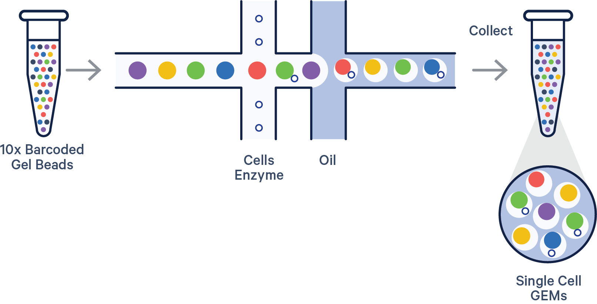
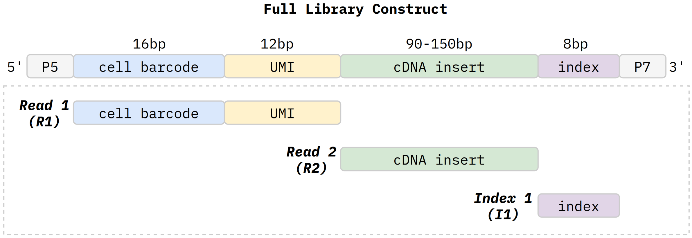
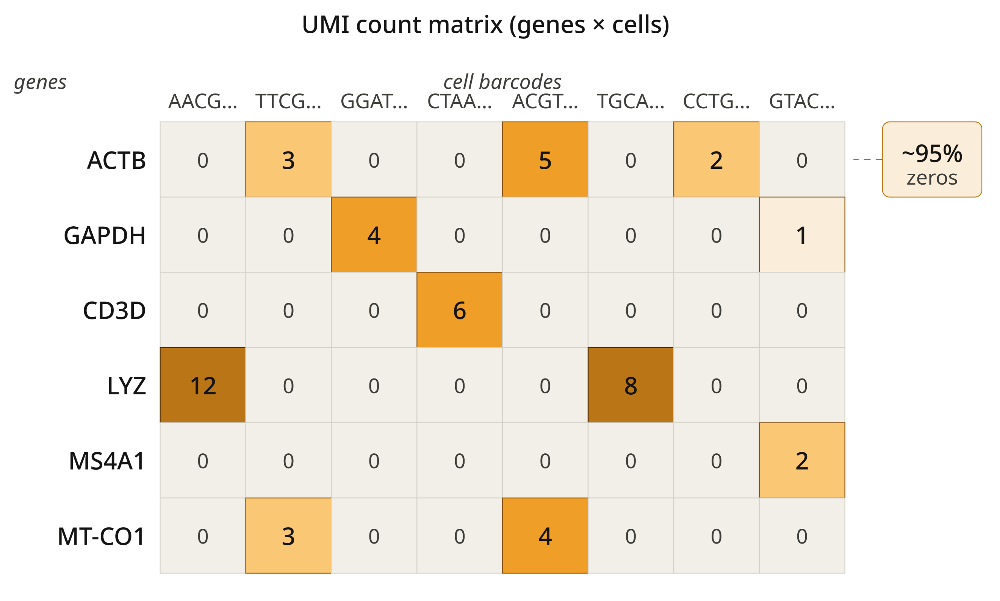
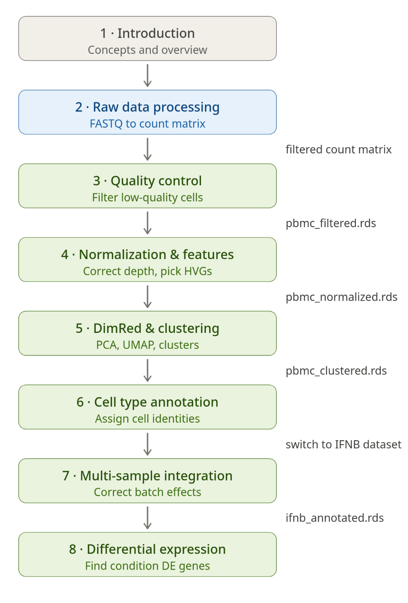

:::::::::::::::::::::::::::::::::::::: questions

- What is single-cell RNA sequencing and how does it differ from bulk RNA-seq?
- How does the 10x Genomics Chromium platform capture and barcode individual cells?
- What does the resulting count matrix look like and why are UMIs important?
- What are the main computational steps in a scRNA-seq analysis workflow?
- What will this workshop cover and what is out of scope?

::::::::::::::::::::::::::::::::::::::::::::::::

::::::::::::::::::::::::::::::::::::: objectives

- Explain what single-cell RNA-seq measures and why cellular heterogeneity matters
- Describe the 10x Chromium droplet-based workflow from cell capture through sequencing
- Interpret the structure of a UMI count matrix and explain why it is sparse
- Outline the end-to-end computational pipeline covered in this workshop
- Identify the scope and limitations of this workshop

::::::::::::::::::::::::::::::::::::::::::::::::

## What Is Single-Cell RNA-Seq?

Every tissue in your body is made up of many different cell types, and each
cell type carries out its function by expressing a distinct set of genes.
Traditional **bulk RNA-seq** measures gene expression by grinding up a piece of
tissue and sequencing the RNA from all cells at once. The result is a single
average expression profile that blends signals from every cell type together.
This is perfectly fine when the goal is to compare overall gene expression
between two conditions, but it hides all of the cell-to-cell variation within
the sample.

Think of it like making a smoothie. If you blend strawberries, blueberries, and
bananas together, you can tell that the smoothie contains fruit, and you might
even detect the flavors of the individual ingredients. But you cannot tell how
many strawberries went in, whether one banana was riper than the others, or
whether there was a single grape hiding at the bottom of the blender. Bulk
RNA-seq gives you the smoothie. **Single-cell RNA-seq (scRNA-seq)** gives you
the fruit bowl: every piece of fruit is kept separate, so you can count, sort,
and inspect them one by one.

scRNA-seq works by isolating individual cells, capturing their mRNA, and
sequencing each cell's transcriptome independently. Instead of one expression
profile per sample, you get thousands of individual expression profiles, one
per cell. This lets you:

- **Discover cell types** that were previously unknown or hard to distinguish
- **Track how cells change** during development, disease progression, or in
  response to treatment
- **Identify rare populations** such as stem cells or drug-resistant tumor cells
  that are invisible in bulk data
- **Map cell-cell communication** by looking at which ligands and receptors are
  expressed in neighboring cell types

Since the first scRNA-seq experiment was published in 2009, the technology has
scaled from single cells to millions of cells per experiment. It is now a
routine tool in immunology, neuroscience, cancer biology, and developmental
biology.

:::::::::::::::::::::::::::::::::::::::: callout

## Bulk vs. Single-Cell

| Feature | Bulk RNA-seq | Single-cell RNA-seq |
|---------|:------------|:-------------------|
| Resolution | One profile per sample | One profile per cell |
| Input | ~1 million cells (pooled) | ~1,000 -- 20,000+ individual cells |
| Output | One expression vector per sample | A cells-by-genes matrix |
| Genes detected per sample | ~15,000 -- 20,000 | ~1,000 -- 5,000 per cell (due to dropout) |
| Cost per sample | ~$200 -- $500 | ~$2,000 -- $5,000 (library + sequencing) |
| Best for | Comparing conditions, differential expression with biological replicates | Discovering cell types, studying heterogeneity, trajectory analysis |

Single-cell experiments detect fewer genes **per cell** than bulk experiments
because each cell contains only a small amount of mRNA. However, when you
combine information across thousands of cells, the total number of genes
detected across the full dataset is comparable to bulk RNA-seq.

:::::::::::::::::::::::::::::::::::::::

## How Does 10x Chromium Work?

The 10x Genomics Chromium platform is the most widely used droplet-based
scRNA-seq system. It can profile thousands to tens of thousands of cells in a
single run. The core idea is simple: wrap each cell in its own tiny droplet
along with a barcoded gel bead, so that every mRNA molecule from that cell gets
tagged with the same unique barcode.

Here is how the process works, step by step:

**1. GEM generation.**
A suspension of single cells is loaded onto a Chromium microfluidic chip along
with gel beads and partitioning oil. The chip combines these three inputs into
tiny droplets called **GEMs** (Gel Beads-in-Emulsion). Each GEM is designed to
contain exactly one gel bead and at most one cell. In practice, most GEMs are
empty (no cell), a fraction contain one cell, and a small number contain two or
more cells (these are called **doublets** and will be addressed during quality
control).

**2. Cell lysis and barcoding.**
Inside each GEM, the cell is lysed and its mRNA is released. The gel bead
dissolves, releasing millions of oligonucleotide primers that all share the
same **cell barcode** -- a 16-nucleotide sequence unique to that bead. Each
primer also carries a **UMI** (Unique Molecular Identifier), a random
12-nucleotide sequence that is different on every primer. The mRNA molecules
hybridize to these primers via their poly(A) tails and are reverse-transcribed
into cDNA. Because all primers in the same GEM have the same cell barcode,
every cDNA molecule from the same cell is tagged with the same barcode. And
because each primer has a different UMI, each original mRNA molecule gets a
unique tag.

**3. Library construction.**
After reverse transcription, the GEMs are broken and the barcoded cDNA from all
cells is pooled together. The cDNA is amplified by PCR, fragmented, and
prepared into a sequencing library. Even though the cDNA from all cells is now
mixed in one tube, the cell barcodes embedded in each molecule let us
computationally sort the reads back to their cell of origin.

**4. Sequencing.**
The library is sequenced on an Illumina sequencer, producing paired-end reads
plus an index read. The read structure is:

- **Read 1 (28 bp):** The first 16 bases are the **cell barcode** (identifies
  which cell). The next 12 bases are the **UMI** (identifies which original
  mRNA molecule). Read 1 does not contain any transcript sequence.
- **Read 2 (variable length, typically 90--150 bp):** This is the actual
  **cDNA insert** that gets mapped to the reference transcriptome to determine
  which gene the mRNA came from.
- **Index read (I1, 8 bp):** The **sample index** used for demultiplexing when
  multiple samples are pooled on the same sequencing lane.

The alignment software (Cell Ranger or STARsolo) reads all three components:
it uses the index read to assign reads to samples, the cell barcode to assign
reads to cells, the UMI to count unique molecules, and Read 2 to identify the
gene of origin.

:::::::::::::::::::::::::::::::::::::::: callout

## Other Single-Cell Platforms

While this workshop focuses on 10x Genomics Chromium, several other scRNA-seq
platforms exist:

- **Drop-seq**: An early droplet-based method developed in the McCarroll lab
  (Harvard). Uses a similar barcoding approach but with lower per-cell capture
  efficiency than 10x Chromium.
- **inDrop**: Another droplet-based platform developed in the Bhatt lab
  (Harvard). Uses hydrogel beads that release barcoded primers upon UV exposure.
- **Smart-seq2 / Smart-seq3**: Plate-based methods that capture full-length
  transcripts. They provide much deeper coverage per cell but are limited to
  hundreds of cells per experiment and are significantly more expensive per cell.
- **Parse Biosciences (Evercode)**: A combinatorial barcoding method that does
  not require specialized microfluidic equipment. Cells are split across wells
  and barcoded in multiple rounds, enabling very high throughput.

Each platform has trade-offs in throughput, cost, sensitivity, and transcript
coverage. The 10x Chromium platform is the most common choice for large-scale
cell atlas projects and is the standard in most core facilities, which is why
we use it here.

:::::::::::::::::::::::::::::::::::::::

## The Count Matrix

The end result of raw data processing (covered in the next episode) is a **UMI
count matrix**. This is a table where each row is a gene, each column is a
cell, and each entry is the number of unique mRNA molecules (UMIs) detected for
that gene in that cell.

A few important properties of this matrix:

**It is very sparse.** A typical human cell expresses around 2,000 to 5,000
genes out of a total of approximately 30,000 protein-coding genes in the
genome. On top of that, scRNA-seq has limited sensitivity -- it captures only a
fraction of the mRNA molecules actually present in the cell. As a result,
roughly **95% of the entries in the count matrix are zeros**. This is not an
error; it is an inherent property of the technology. Specialized statistical
methods have been developed to handle this sparsity.

**Counts are integers.** Because UMIs deduplicate PCR artifacts, each entry in
the matrix represents the number of distinct original mRNA molecules detected,
not the number of sequencing reads. This makes UMI counts more quantitative
than read counts.

**UMIs solve the PCR duplication problem.** During library preparation, cDNA is
amplified by PCR so there is enough material to sequence. Without UMIs, a
single mRNA molecule that was amplified 100 times would produce 100 reads and
appear to be highly expressed. With UMIs, all 100 reads share the same UMI
sequence and are collapsed into a single count. This means UMI counts are
proportional to the actual number of mRNA molecules in the cell, not to PCR
amplification efficiency.

For the PBMC 10k v3 dataset we will use in this workshop, the count matrix
contains approximately 11,800 cells and 36,600 genes, but after filtering out
lowly-expressed genes and low-quality cells, we will work with roughly 8,000 --
10,000 cells and 15,000 -- 20,000 genes.

## Analysis Workflow Overview

The computational analysis of scRNA-seq data follows a series of well-defined
steps. Each step in the pipeline builds on the output of the previous one. This
workshop covers the complete workflow from raw sequencing data through
biological interpretation.

**1. Raw Data Processing (Episode 2).**
Starting from FASTQ files, we align reads to the human reference genome and
quantify gene expression per cell. We will use two tools: **Cell Ranger** (the
commercial pipeline from 10x Genomics) and **STARsolo** (a fast open-source
alternative). Both produce the UMI count matrix described above.

**2. Quality Control (Episode 3).**
Not all barcodes in the count matrix represent healthy, real cells. Some
correspond to empty droplets, dying cells, or doublets. We filter cells based
on three key metrics: the number of detected genes, the total UMI count, and
the percentage of reads mapping to mitochondrial genes (a marker of cell
stress). This step ensures we only carry high-quality cells forward.

**3. Normalization and Feature Selection (Episode 4).**
Cells are sequenced to different depths, so raw counts are not directly
comparable between cells. Normalization corrects for these differences. We will
apply two methods: **LogNormalize** (a simple and widely used approach) and
**SCTransform** (a more sophisticated variance-stabilizing method). We also
select **highly variable genes** -- the 2,000 or so genes that vary the most
across cells and carry the strongest biological signal.

**4. Dimensionality Reduction and Clustering (Episode 5).**
With 20,000+ genes per cell, we need to reduce the data to a manageable number
of dimensions. **PCA** (Principal Component Analysis) compresses the data into
the top principal components. We then use **UMAP** to create a 2D visualization
and apply the **Leiden algorithm** to group similar cells into clusters.

**5. Cell Type Annotation (Episode 6).**
Clusters are just numbers until we assign biological meaning. We identify cell
types by examining **marker genes** -- genes that are specifically expressed in
one cluster but not others. We will annotate clusters both manually (using
known PBMC markers) and automatically (using **SingleR**, which compares
expression profiles to labeled reference datasets).

**6. Multi-Sample Integration (Episode 7).**
When analyzing cells from multiple samples or experimental conditions, batch
effects can cause cells to cluster by sample rather than by cell type.
**Integration** algorithms correct for these technical differences while
preserving real biological variation. We will use Seurat's **CCA (Canonical
Correlation Analysis)** integration on an IFN-beta stimulated PBMC dataset to
learn how to combine control and treated samples.

**7. Differential Expression (Episode 8).**
Finally, we ask: which genes change between conditions? We will compare gene
expression between control and stimulated cells within each cell type. We will
cover both cell-level testing and **pseudobulk** analysis (the statistically
preferred approach for multi-sample experiments). We will also run **gene
ontology enrichment** to connect lists of differentially expressed genes to
biological pathways.

## Scope of This Workshop

This workshop teaches a standard scRNA-seq analysis workflow using a specific
set of tools and data:

- **Platform:** 10x Genomics Chromium 3' Gene Expression (v3 chemistry)
- **Organism:** Human (GRCh38 reference genome)
- **Dataset:** 10k PBMCs (peripheral blood mononuclear cells), a well-characterized
  immune cell mixture
- **Analysis toolkit:** Seurat v5 in R, running on Purdue's Negishi HPC cluster
- **Integration dataset:** IFN-beta stimulated PBMCs from the SeuratData package

By the end of the workshop you will have a solid understanding of the core
scRNA-seq analysis pipeline and be able to apply these same steps to your own
datasets.

**What is NOT covered in this workshop:**

- **Spatial transcriptomics** (Visium, MERFISH, Slide-seq)
- **Multi-modal assays** (CITE-seq, Multiome ATAC+GEX)
- **Trajectory and pseudotime analysis** (Monocle3, RNA velocity, scVelo)
- **Python-based analysis** (Scanpy / AnnData ecosystem)
- **Experimental design** and wet-lab sample preparation
- **Custom reference genome building** for non-model organisms

These are all important topics, but each warrants its own dedicated workshop.
If you are interested in any of these areas, see the Additional Reading section
in the [Reference](learners/reference.md) page for pointers to relevant
resources.

::::::::::::::::::::::::::::::::::::: keypoints

- Single-cell RNA-seq measures gene expression in individual cells, revealing cellular heterogeneity that bulk RNA-seq averages out
- The 10x Chromium platform uses droplet-based barcoding: each cell gets a unique 16 bp cell barcode and each mRNA molecule gets a 12 bp UMI
- The UMI count matrix is very sparse (~95% zeros) because each cell expresses only a fraction of all genes and capture efficiency is limited
- The scRNA-seq analysis pipeline progresses through alignment, QC, normalization, dimensionality reduction, clustering, annotation, integration, and differential expression
- This workshop focuses on 10x Chromium 3' GEX data analyzed with Seurat v5 in R on the Purdue Negishi HPC cluster

::::::::::::::::::::::::::::::::::::::::::::::::
