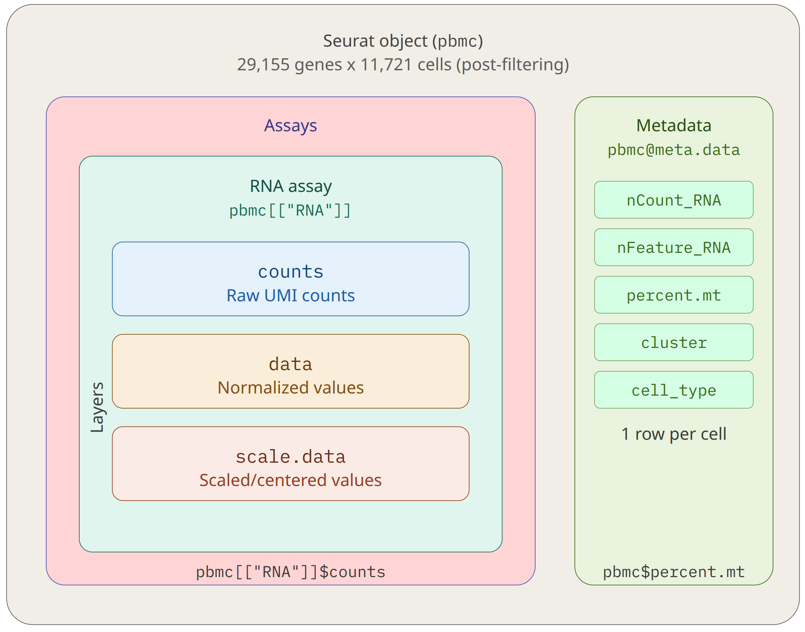
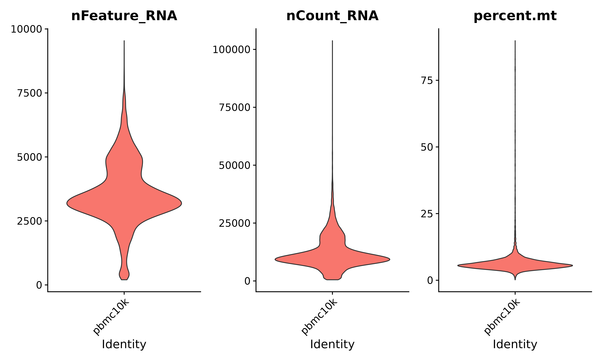
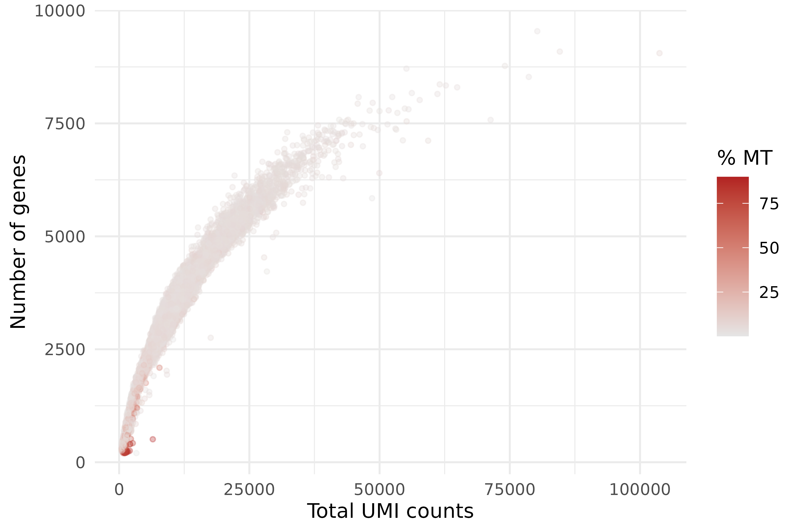
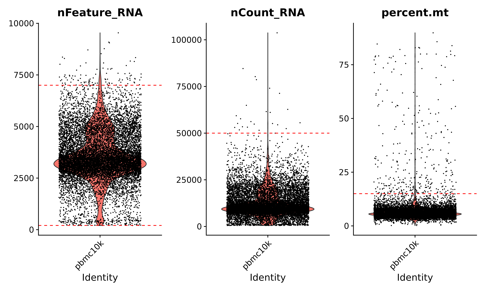
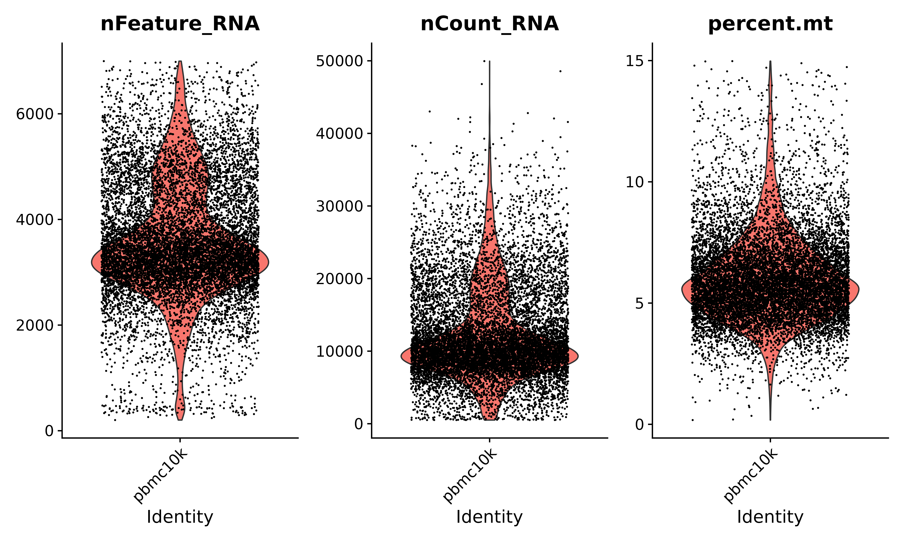
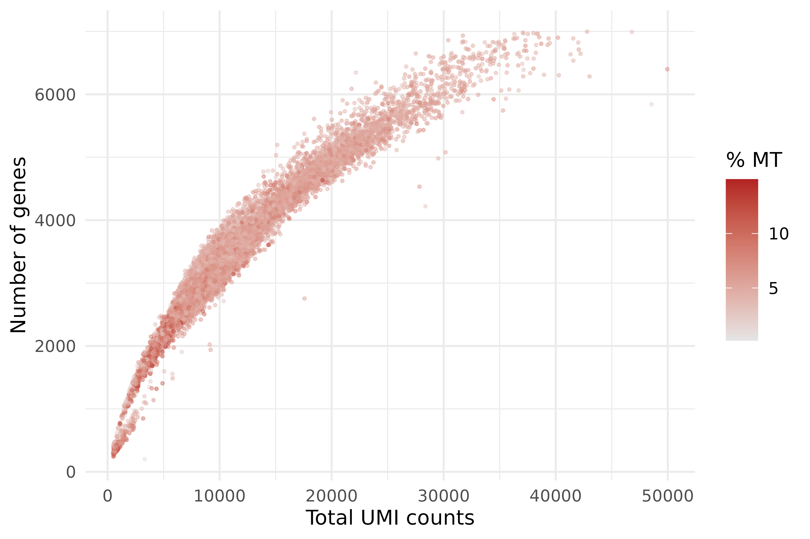

:::::::::::::::::::::::::::::::::::::: questions

- How do we load a 10x count matrix into R and create a Seurat object?
- What quality metrics should we examine for scRNA-seq data?
- How do we choose appropriate filtering thresholds?
- How does mitochondrial gene percentage help identify dying cells?
- What are doublets and how can we detect them?

::::::::::::::::::::::::::::::::::::::::::::::::

::::::::::::::::::::::::::::::::::::: objectives

- Load a Cell Ranger filtered count matrix into a Seurat v5 object
- Calculate and visualize QC metrics: nFeature_RNA, nCount_RNA, and percent.mt
- Apply filtering thresholds to remove low-quality cells
- Describe what doublets are and when dedicated detection tools are needed

::::::::::::::::::::::::::::::::::::::::::::::::

## Setup

```{r setup, message=FALSE, warning=FALSE, eval=FALSE}
library(Seurat)
library(ggplot2)
library(patchwork)
```

## Loading Data into Seurat

The starting point for this episode is the **filtered count matrix** produced
by Cell Ranger in the previous episode. This matrix lives in the
`filtered_feature_bc_matrix/` directory and consists of three files:
`barcodes.tsv.gz`, `features.tsv.gz`, and `matrix.mtx.gz`. Seurat's
`Read10X()` function reads all three files and assembles them into a sparse
matrix in R.

First, set up the path to the Cell Ranger output so that all file references
in this episode use the same base directory:

```{r set-paths, eval=FALSE}
data_dir <- paste0(
    "/scratch/negishi/", Sys.getenv("USER"),
    "/scrna_workshop/cellranger_output/pbmc10k/outs/filtered_feature_bc_matrix/"
)
work_dir <- paste0(
    "/scratch/negishi/", Sys.getenv("USER"),
    "/scrna_workshop/"
)
```

Now load the count matrix:

```{r load-data, eval=FALSE}
setwd(work_dir)
pbmc.data <- Read10X(data.dir = data_dir)
```

`Read10X()` returns a sparse matrix where rows are genes and columns are cell
barcodes. Let's check its dimensions before creating the Seurat object:

```{r check-dims, eval=FALSE}
dim(pbmc.data)
```

:::::::::::::::::::::::::::::::::::::::::: spoiler

## Expected output

```output
[1] 38606 11809
```

This tells us the matrix contains 38,606 genes (rows) and 11,809 cell barcodes
(columns).

::::::::::::::::::::::::::::::::::::::::::::::::::

Now we create a **Seurat object**, which is the central data structure for all
downstream analysis. The `CreateSeuratObject()` function takes the raw count
matrix and applies two initial filters:

- `min.cells = 3` removes genes detected in fewer than 3 cells (these are too
  rare to be informative)
- `min.features = 200` removes cells with fewer than 200 detected genes (these
  are likely empty droplets or debris)

```{r create-seurat, eval=FALSE}
pbmc <- CreateSeuratObject(
    counts = pbmc.data,
    project = "pbmc10k",
    min.cells = 3,
    min.features = 200
)
pbmc
```

:::::::::::::::::::::::::::::::::::::::::: spoiler

## Expected output

```output
An object of class Seurat 
29155 features across 11721 samples within 1 assay 
Active assay: RNA (29155 features, 0 variable features)
 1 layer present: counts
```

After the initial filters, we have approximately 23,700 genes and 11,700 cells.
The gene count dropped from 36,601 because many genes were detected in fewer
than 3 cells and were removed.

::::::::::::::::::::::::::::::::::::::::::::::::::

| Parameter | Value | Description |
|-----------|-------|-------------|
| `counts` | `pbmc.data` | The raw UMI count matrix (genes x cells). |
| `project` | `"pbmc10k"` | A name for this project, stored in the object metadata. |
| `min.cells` | `3` | Keep only genes detected in at least 3 cells. Removes very rare genes. |
| `min.features` | `200` | Keep only cells with at least 200 detected genes. Removes likely empty droplets. |

### Understanding the Seurat v5 object

The Seurat object stores all data and analysis results in an organized
structure. The key components are:

- **Assays**: containers for expression data. Our object has one assay called
  `RNA`. Each assay can hold multiple **layers** of the data at different
  processing stages.
- **Layers**: the expression matrices within an assay:
    - `counts` -- the raw UMI counts (populated now)
    - `data` -- the normalized expression values (populated after normalization)
    - `scale.data` -- the scaled/centered values (populated after scaling)
- **Metadata**: a data frame with one row per cell, storing QC metrics, cluster
  assignments, and any other per-cell annotations.

{alt="Diagram of the Seurat v5 object showing the RNA assay with its three layers (counts, data, scale.data) and the per-cell metadata columns"}

You can inspect the metadata that Seurat automatically computed during object
creation:

```{r show-metadata, eval=FALSE}
head(pbmc@meta.data)
```

:::::::::::::::::::::::::::::::::::::::::: spoiler

## Expected output

```output
                   orig.ident nCount_RNA nFeature_RNA
AAACCCAAGCGCCCAT-1    pbmc10k       4282         2152
AAACCCAAGGTTCCGC-1    pbmc10k      29509         5990
AAACCCACAGACAAGC-1    pbmc10k        574          358
AAACCCACAGAGTTGG-1    pbmc10k       8400         2881
AAACCCACAGGTATGG-1    pbmc10k       9675         3731
AAACCCACATAGTCAC-1    pbmc10k      10058         3365
```

Seurat automatically calculated two metrics per cell:

- `nCount_RNA` -- the total number of UMIs in that cell
- `nFeature_RNA` -- the number of unique genes detected in that cell

::::::::::::::::::::::::::::::::::::::::::::::::::

:::::::::::::::::::::::::::::::::::::::: callout

## Seurat v5 layer syntax

Seurat v5 introduced a new **layer-based architecture**. To access expression
data, use the `$` operator on the assay:

```r
# Seurat v5 syntax (use this)
pbmc[["RNA"]]$counts     # raw counts
pbmc[["RNA"]]$data       # normalized data (after NormalizeData)
pbmc[["RNA"]]$scale.data # scaled data (after ScaleData)
```

If you see older tutorials using the `@` slot syntax, that is Seurat v4 and
will not work correctly with v5 objects:

```r
# Seurat v4 syntax (do NOT use)
pbmc@assays$RNA@counts   # deprecated
```

:::::::::::::::::::::::::::::::::::::::


## QC Metrics

Not every barcode in the count matrix represents a healthy cell. Some barcodes
correspond to dying cells, empty droplets that slipped through Cell Ranger's
filter, or doublets (two cells in one droplet). Before we can analyze the data,
we need to identify and remove these low-quality barcodes.

We evaluate cell quality using three metrics:

| Metric | What it measures | Low-quality signal |
|--------|:----------------|:------------------|
| `nFeature_RNA` | Number of unique genes detected per cell | Very low: empty droplet or debris. Very high: possible doublet. |
| `nCount_RNA` | Total UMI counts per cell | Very low: failed capture. Very high: possible doublet. |
| `percent.mt` | Percentage of UMIs from mitochondrial genes | High (>15--20%): dying or stressed cell. |

Let's calculate the mitochondrial percentage. Human mitochondrial gene names
start with `MT-` (e.g., MT-CO1, MT-ND1, MT-ATP6), so we use a pattern match:

```{r calc-mt, eval=FALSE}
pbmc[["percent.mt"]] <- PercentageFeatureSet(pbmc, pattern = "^MT-")
```

Now let's inspect the distribution of all three metrics. First, we look at the
summary statistics:

```{r summary-stats, eval=FALSE}
summary(pbmc$nFeature_RNA)
summary(pbmc$nCount_RNA)
summary(pbmc$percent.mt)
```

:::::::::::::::::::::::::::::::::::::::::: spoiler

## Expected output

```output
# nFeature_RNA
   Min. 1st Qu.  Median    Mean 3rd Qu.    Max. 
    201    2895    3378    3557    4270    9540 

# nCount_RNA
   Min. 1st Qu.  Median    Mean 3rd Qu.    Max. 
    505    8047   10357   12280   15166  103741 

# percent.mt
   Min. 1st Qu.  Median    Mean 3rd Qu.    Max. 
 0.1752  4.8509  5.7882  6.7695  7.0114 89.8376 
```

Most cells have 2,900-4,300 genes (IQR), 8,000-15,000 UMIs (IQR), and
4.9-7.0% mitochondrial content (IQR). But notice the maximum values: one cell
has 9,540 genes (possible doublet), another has over 103,000 UMIs, and one
cell has nearly 90% mitochondrial reads (clearly dying). These outliers are
what QC filtering removes.

::::::::::::::::::::::::::::::::::::::::::::::::::

### Violin plots

Violin plots show the distribution of each metric across all cells. They
are the standard first visualization for scRNA-seq QC.

```{r vlnplot, eval=FALSE, fig.alt="Three violin plots showing the distribution of nFeature_RNA, nCount_RNA, and percent.mt across all cells. Most cells cluster in a central distribution with outliers at the tails."}
VlnPlot(pbmc,
        features = c("nFeature_RNA", "nCount_RNA", "percent.mt"),
        ncol = 3,
        pt.size = 0,
        layer = "counts")
```


{alt="Violin plots of nFeature_RNA, nCount_RNA, and percent.mt showing the distribution of QC metrics across all cells before filtering"}

Setting `pt.size = 0` hides individual points so the distribution shape is
easier to see with 10,000+ cells. If you want to see points, set
`pt.size = 0.1`.


### Scatter plots

Scatter plots reveal relationships **between** metrics. The most informative
plot is `nCount_RNA` vs. `nFeature_RNA`, which should show a strong positive
correlation: cells with more total UMIs generally detect more genes. Points
that deviate from this trend are suspicious.

```{r scatter, eval=FALSE, fig.alt="Scatter plot of total UMI counts versus number of genes detected per cell, with points colored by mitochondrial percentage. Most cells form a dense cloud along a diagonal, with outliers showing high mitochondrial content."}
ggplot(pbmc@meta.data, aes(x = nCount_RNA, y = nFeature_RNA, color = percent.mt)) +
    geom_point(size = 0.5, alpha = 0.4) +
    scale_color_gradient(low = "grey90", high = "firebrick", name = "% MT") +
    theme_minimal() +
    labs(x = "Total UMI counts", y = "Number of genes")
```

{alt="Scatter plot of total UMI counts versus number of genes per cell colored by mitochondrial percentage, with high-mito cells highlighted in red"}


What to look for in this plot:

- **Main cloud**: most cells should form a dense cloud along a rough diagonal.
  These are healthy cells with a proportional relationship between total RNA
  content and gene diversity.
- **Bottom-left outliers**: cells with very few UMIs and very few genes. These
  are empty droplets or debris that slipped through the Cell Ranger filter.
- **Top-right outliers**: cells with both very high UMI counts and very high
  gene counts. These are potential doublets -- two cells captured in one
  droplet, producing double the RNA content.
- **High mitochondrial cells**: points colored in yellow/bright colors in the
  viridis scale. These often sit below the main diagonal because the cell is
  losing cytoplasmic RNA while retaining mitochondrial RNA.

:::::::::::::::::::::::::::::::::::::::: callout

## What do dying cells look like?

When a cell is damaged or dying, its **cell membrane** becomes leaky.
Cytoplasmic mRNA molecules -- which are small and not membrane-bound -- escape
through the holes in the membrane. However, **mitochondrial mRNA** is protected
inside the double-membraned mitochondria and does not leak out as readily.

The result is a cell with:

- **High `percent.mt`**: the remaining RNA is disproportionately mitochondrial
- **Low `nFeature_RNA`**: many cytoplasmic transcripts have leaked out
- **Low `nCount_RNA`**: total RNA content is reduced

This is why mitochondrial percentage is such a reliable indicator of cell
quality. A healthy PBMC typically has 3--8% mitochondrial content. Cells with
>15% are likely damaged, and cells with >20% are almost certainly compromised.

:::::::::::::::::::::::::::::::::::::::


## Setting Thresholds

Now we apply filters to remove low-quality cells. There are no universal
thresholds that work for every dataset. The right cutoffs depend on the tissue
type, species, experimental protocol, and sequencing depth. The best approach
is to **inspect the distributions** (as we just did) and choose thresholds that
remove clear outliers while preserving the bulk of the data.

For this PBMC dataset, we apply the following thresholds:

- `nFeature_RNA > 200`: remove cells with very few genes (likely empty)
- `nFeature_RNA < 7000`: remove cells with an extreme number of genes
  (possible doublets)
- `nCount_RNA < 50000`: remove cells with unusually high UMI counts
  (possible doublets)
- `percent.mt < 15`: remove cells with high mitochondrial content (likely dying)

Let's visualize where these cutoffs fall on the violin plots. Red dashed lines
mark the thresholds:

```{r vlnplot-thresholds, eval=FALSE, fig.alt="Three violin plots of nFeature_RNA, nCount_RNA, and percent.mt with red dashed lines indicating the filtering thresholds."}
p1 <- VlnPlot(pbmc, features = "nFeature_RNA", pt.size = 0.1, layer = "counts") +
    geom_hline(yintercept = c(205,7000), linetype = "dashed", color = "red") +
    NoLegend()
p2 <- VlnPlot(pbmc, features = "nCount_RNA", pt.size = 0.1, layer = "counts") +
    geom_hline(yintercept = 50000, linetype = "dashed", color = "red") +
    NoLegend()
p3 <- VlnPlot(pbmc, features = "percent.mt", pt.size = 0.1, layer = "counts") +
    geom_hline(yintercept = 15, linetype = "dashed", color = "red") +
    NoLegend()
p1 + p2 + p3 + plot_layout(ncol = 3)
```

{alt="Violin plots of nFeature_RNA, nCount_RNA, and percent.mt with red dashed lines showing the filtering thresholds and individual cells visible as points"}


Cells above or below the red lines will be removed. The small point size
(`pt.size = 0.1`) lets you see how many individual cells fall outside the
thresholds.

Let's record how many cells we have before filtering:

```{r before-filter, eval=FALSE}
cat("Cells before filtering:", ncol(pbmc), "\n")
```

Apply the filters:

```{r filter, eval=FALSE}
pbmc <- subset(pbmc,
               subset = nFeature_RNA > 200 &
                        nFeature_RNA < 7000 &
                        nCount_RNA < 50000 &
                        percent.mt < 15)
cat("Cells after filtering:", ncol(pbmc), "\n")
```

:::::::::::::::::::::::::::::::::::::::::: spoiler

## Expected output

```output
Cells before filtering: 11721
Cells after filtering: 11310
```

Filtering removes ~400 cells (~3.5% of the total). The
exact number depends on minor differences in the Cell Ranger version and
reference used. You should have roughly 11,300 cells remaining.

::::::::::::::::::::::::::::::::::::::::::::::::::

Let's verify the filtering by looking at the QC distributions again:

```{r vlnplot-after, eval=FALSE, fig.alt="Three violin plots of nFeature_RNA, nCount_RNA, and percent.mt after filtering. The distributions are tighter with extreme outliers removed."}
VlnPlot(pbmc,
        features = c("nFeature_RNA", "nCount_RNA", "percent.mt"),
        ncol = 3,
        pt.size = 0,
        layer = "counts")
```
{alt="Violin plots of nFeature_RNA, nCount_RNA, and percent.mt after filtering, showing tighter distributions with extreme outliers removed"}


The violin plots should now show tighter distributions with the extreme tails
removed. The mitochondrial percentage should be capped below 15%.

Let's also verify with a scatter plot:

```{r scatter-after, eval=FALSE, fig.alt="Scatter plot of total UMI counts versus number of genes after filtering. The cloud is now bounded with outliers removed."}
ggplot(pbmc@meta.data, aes(x = nCount_RNA, y = nFeature_RNA, color = percent.mt)) +
    geom_point(size = 0.5, alpha = 0.4) +
    scale_color_gradient(low = "grey90", high = "firebrick", name = "% MT") +
    theme_minimal() +
    labs(x = "Total UMI counts", y = "Number of genes")
```

{alt="Scatter plot of total UMI counts versus number of genes after filtering, colored by mitochondrial percentage, showing a tighter cloud with outliers removed"}


Finally, save the filtered object for the next episode:

```{r save, eval=FALSE}
saveRDS(pbmc, file = "pbmc_filtered.rds")
```

:::::::::::::::::::::::::::::::::::::::: callout

## MAD-based filtering

Instead of choosing fixed thresholds by visual inspection, a more principled
approach is **MAD-based filtering** (Median Absolute Deviation). The idea is
to compute the median and MAD of each QC metric, then flag any cell that falls
more than a set number of MADs from the median as an outlier.

The formula for an upper threshold is:

**threshold = median + N x MAD**

and for a lower threshold:

**threshold = median - N x MAD**

where N is typically 3 or 5. For example, a cell is flagged as high
mitochondrial if:

**percent.mt > median(percent.mt) + 3 x MAD(percent.mt)**

This approach is **adaptive**: it adjusts automatically to the distribution of
each dataset, so you don't need to guess appropriate cutoffs. It is implemented
in the `scuttle` Bioconductor package via the `isOutlier()` function.

For this workshop, we use fixed thresholds for simplicity and transparency, but
MAD-based filtering is recommended for production analyses where you process
many datasets with varying quality.

:::::::::::::::::::::::::::::::::::::::


## Doublet Detection

::::::::::::::::::::::::::::::::::::::: callout

## Doublets in scRNA-seq

A **doublet** occurs when two cells are captured in the same GEM droplet and
tagged with the same cell barcode. The resulting "cell" has roughly double the
RNA content of a real single cell, producing a hybrid expression profile that
blends two cell types.

**How doublets appear in QC metrics:** Doublets tend to have high `nCount_RNA`
and high `nFeature_RNA` because they contain RNA from two cells. Our upper
threshold on `nFeature_RNA < 5000` catches some of the most extreme doublets,
but it cannot identify doublets between similar cell types (e.g., two T cells)
because their combined profile looks like a normal high-quality T cell.

**Dedicated doublet detection tools** such as
[scDblFinder](https://bioconductor.org/packages/scDblFinder/) and
[DoubletFinder](https://github.com/chris-mcginnis-ucsf/DoubletFinder)
use a simulation-based approach: they create artificial doublets by randomly
combining pairs of real cells, then train a classifier to identify real cells
that resemble these artificial doublets.

**When dedicated detection matters most:**

- High cell loading (>10,000 cells targeted) where doublet rates exceed 5--8%
- Multiplexed experiments (e.g., cell hashing) with cross-sample doublets
- Studies where rare intermediate populations could be confused with doublets

**For this dataset**, the 10x Chromium platform at standard loading (~10,000
cells targeted) produces a doublet rate of approximately 3--5%. At this level,
most doublets will be removed by our QC filters or will form small
insignificant clusters that can be identified and removed during cell type
annotation. We will not run a dedicated doublet detection tool in this workshop,
but be aware of these tools for your own analyses.

:::::::::::::::::::::::::::::::::::::::


::::::::::::::::::::::::::::::::::::: challenge

## Challenge 1: Propose Your Own Thresholds

Look at the violin plots and scatter plots you generated above. Based on the
distributions, propose your own filtering thresholds for `nFeature_RNA`,
`nCount_RNA`, and `percent.mt`. Justify your choices. How many cells pass your
filters compared to the default thresholds
(`nFeature_RNA > 200 & nFeature_RNA < 5000 & percent.mt < 15`)?

Run the following code with your chosen values:

```{r challenge1, eval=FALSE}
# Replace the ??? with your thresholds
pbmc_custom <- subset(pbmc,
                      subset = nFeature_RNA > ??? &
                               nFeature_RNA < ??? &
                               percent.mt < ???)
cat("Cells with custom thresholds:", ncol(pbmc_custom), "\n")
```

:::::::::::::::::::::::: solution

There is no single correct answer -- reasonable thresholds depend on how
conservative you want to be. Here is one example of a slightly more
conservative approach:

```{r solution1, eval=FALSE}
pbmc_custom <- subset(pbmc,
                      subset = nFeature_RNA > 300 &
                               nFeature_RNA < 4000 &
                               percent.mt < 10)
cat("Cells with custom thresholds:", ncol(pbmc_custom), "\n")
```

This retains 7,579 cells compared to ~11,000 with the default thresholds --
a loss of roughly 26% of the data. The trade-offs are:

- `nFeature_RNA > 300` (vs. 200): slightly more aggressive removal of
  low-complexity cells, but may also remove some small cell types like
  platelets that naturally express few genes.
- `nFeature_RNA < 4000` (vs. 5000): this is the biggest driver of cell loss
  here. The median nFeature_RNA in this dataset is ~3,378, so a 4,000 ceiling
  cuts into the upper quartile and removes a substantial number of valid cells,
  not just doublets.
- `percent.mt < 10` (vs. 15): removes more potentially stressed cells, but
  some immune cell types (e.g., activated T cells) naturally have moderately
  elevated mitochondrial content.

The key point is that **more aggressive filtering is not always better**. Every
cell you remove is data you lose. Dropping from ~10,000 to 7,579 cells means
losing nearly a quarter of the dataset, which could reduce statistical power
and under-represent cell types that naturally have higher gene counts or
mitochondrial content. The goal is to remove cells that would distort the
analysis, not to enforce an artificially narrow definition of "high quality."

:::::::::::::::::::::::::::::::::

::::::::::::::::::::::::::::::::::::::::::::::::

::::::::::::::::::::::::::::::::::::: challenge

## Challenge 2: Aggressive mitochondrial filtering

What happens if you set `percent.mt < 5` instead of `percent.mt < 15`? Run the
following code and compare the number of remaining cells. Would this threshold
be too aggressive for PBMCs?

```{r challenge2, eval=FALSE}
# Starting from the unfiltered object (re-load if needed)
pbmc_strict <- subset(pbmc,
                      subset = nFeature_RNA > 200 &
                               nFeature_RNA < 5000 &
                               percent.mt < 5)
cat("Cells with percent.mt < 5:", ncol(pbmc_strict), "\n")

pbmc_default <- subset(pbmc,
                       subset = nFeature_RNA > 200 &
                                nFeature_RNA < 5000 &
                                percent.mt < 15)
cat("Cells with percent.mt < 15:", ncol(pbmc_default), "\n")
```

:::::::::::::::::::::::: solution

## Solution

With `percent.mt < 5`, only **2,709 cells remain**, compared to 9,874 with
`percent.mt < 15`. That is a loss of **over 72% of the dataset**.

This is **far too aggressive for PBMCs**. Here is why:

- The median mitochondrial percentage in this dataset is ~5.8%, meaning a `< 5`
  cutoff removes the majority of cells by definition -- not just dying cells,
  but most of the healthy population.
- Different immune cell types have naturally different mitochondrial content.
  Activated T cells, monocytes, and NK cells tend to have higher mitochondrial
  content (6-12%) because they are metabolically active. A `< 5` threshold
  disproportionately removes these populations, biasing your downstream
  analysis toward cell types with low metabolic activity.
- A threshold of `< 5` might be appropriate for some cell lines or tissues
  where mitochondrial content is uniformly low, but for primary immune cells
  from blood, 10-15% is a more appropriate cutoff.

As a general rule, look at the distribution of `percent.mt` in your data. If
there is a clear separation between a low-mt peak and a high-mt tail, set your
threshold in the valley between them. If the distribution is unimodal (one
smooth peak), a fixed cutoff based on MAD (see the callout above) is safer than
an arbitrary round number.

:::::::::::::::::::::::::::::::::

::::::::::::::::::::::::::::::::::::::::::::::::
::::::::::::::::::::::::::::::::::::: keypoints

- `Read10X()` loads a Cell Ranger count matrix and `CreateSeuratObject()` creates the central data structure for Seurat analysis
- The three key QC metrics are nFeature_RNA (genes per cell), nCount_RNA (UMIs per cell), and percent.mt (mitochondrial percentage)
- High mitochondrial percentage indicates damaged cells that are losing cytoplasmic RNA through a leaky membrane
- Filtering thresholds should be chosen by inspecting the data distributions, not by applying universal fixed cutoffs
- Dedicated doublet detection tools (scDblFinder, DoubletFinder) are available for high-loading experiments but are not always necessary at standard loading rates

::::::::::::::::::::::::::::::::::::::::::::::::
