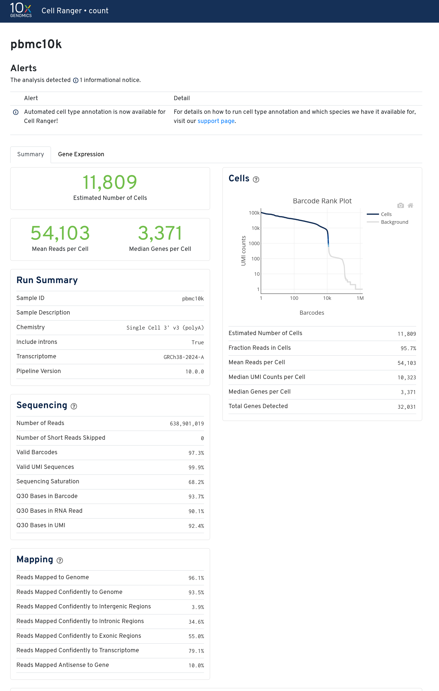

:::::::::::::::::::::::::::::::::::::: questions

- How do we organize scRNA-seq data files on an HPC cluster?
- How do we align 10x Chromium FASTQ files with Cell Ranger?
- How do we run STARsolo as an open-source alternative?
- How do the outputs from Cell Ranger and STARsolo compare?

::::::::::::::::::::::::::::::::::::::::::::::::

::::::::::::::::::::::::::::::::::::: objectives

- Set up a working directory and verify FASTQ and reference files on the cluster
- Write and submit a SLURM job script for Cell Ranger count
- Write and submit a SLURM job script for STARsolo
- Interpret Cell Ranger's web_summary.html and key QC metrics
- Compare the filtered count matrices produced by both tools

::::::::::::::::::::::::::::::::::::::::::::::::

::::::::::::::::::::::::::::::::::::::: prereq

## Prerequisites

This episode requires an active account on Purdue's Negishi cluster and
familiarity with basic Linux commands (`cd`, `ls`, `mkdir`, `cat`). You should
be comfortable submitting SLURM jobs with `sbatch` and monitoring them with
`squeue`. This episode requires shell access to the Negishi cluster via SSH.
See the [SSH Setup](../learners/setup.md#ssh-setup) section for connection
instructions.

:::::::::::::::::::::::::::::::::::::::

:::::::::::::::::::::::::::::::::::::::: callout

## Cell Ranger Licensing

Cell Ranger is proprietary software from 10x Genomics. It is free to download
and use, but it requires acceptance of the 10x Genomics End User License
Agreement. **STARsolo is fully open source** (MIT license) and produces
equivalent results. If you cannot use Cell Ranger due to licensing constraints,
STARsolo is an excellent alternative. This workshop covers both tools so you
can choose whichever is appropriate for your situation.

:::::::::::::::::::::::::::::::::::::::

## Data Organization

Before running any alignment, we need a clean directory structure. All workshop
files live under `${RCAC_SCRATCH}/scrna_workshop/`. Let's create the directory
layout and copy the data.

```bash
mkdir -p ${RCAC_SCRATCH}/scrna_workshop/{fastq,reference,cellranger_output,starsolo_output}
```

This creates the following structure:

```
${RCAC_SCRATCH}/scrna_workshop/
├── fastq/                  # Raw FASTQ files
├── reference/              # Reference genome and index
├── cellranger_output/      # Cell Ranger results
└── starsolo_output/        # STARsolo results
```

Now copy the pre-staged workshop data from the shared depot:

```bash
rsync -avP /depot/workshop/data/scrna_workshop/ ${RCAC_SCRATCH}/scrna_workshop/
```

Extract the 10x barcode whitelist from the Cell Ranger container (needed for
STARsolo):

```bash
module load biocontainers
singularity exec ${BIOC_IMAGE_DIR}/cumulusprod_cellranger:10.0.0.sif \
    zcat /software/cellranger-10.0.0/lib/python/cellranger/barcodes/3M-february-2018_TRU.txt.gz \
    > ${RCAC_SCRATCH}/scrna_workshop/reference/3M-february-2018.txt
```

Verify that the FASTQ files are present:

```bash
ls -1 ${RCAC_SCRATCH}/scrna_workshop/fastq/
```

:::::::::::::::::::::::::::::::::::::::::: spoiler

## Expected output

```output
pbmc_10k_v3_S1_L001_I1_001.fastq.gz
pbmc_10k_v3_S1_L001_R1_001.fastq.gz
pbmc_10k_v3_S1_L001_R2_001.fastq.gz
pbmc_10k_v3_S1_L002_I1_001.fastq.gz
pbmc_10k_v3_S1_L002_R1_001.fastq.gz
pbmc_10k_v3_S1_L002_R2_001.fastq.gz
```

::::::::::::::::::::::::::::::::::::::::::::::::::

Verify that the reference genome is present:

```bash
ls ${RCAC_SCRATCH}/scrna_workshop/reference/
```

:::::::::::::::::::::::::::::::::::::::::: spoiler

## Expected output

```output
3M-february-2018.txt  refdata-gex-GRCh38-2024-A
```

::::::::::::::::::::::::::::::::::::::::::::::::::

### Understanding the FASTQ file names

The file names follow the 10x Genomics naming convention:

```
pbmc_10k_v3_S1_L001_R1_001.fastq.gz
│            │  │    │   └── File number (always 001 for single-file lanes)
│            │  │    └────── Read type: R1 or R2
│            │  └─────────── Lane number: L001 or L002
│            └────────────── Sample index: S1
└─────────────────────────── Sample name
```

This dataset was sequenced across two lanes (L001, L002), producing four files
total: two lanes times two reads per lane.

### What is in each read?

**Read 1 (R1)** contains the cell barcode and UMI. It is 28 bp long: the first
16 bases are the cell barcode (which cell this read came from) and the next 12
bases are the UMI (which original mRNA molecule this read represents). Read 1
does **not** contain any transcript sequence.

**Read 2 (R2)** contains the cDNA insert. This is the actual transcript
fragment that gets mapped to the reference genome to determine which gene the
mRNA came from. It is typically 90--150 bp long.

Let's inspect the first few reads from each file to see this in practice:

```bash
cd ${RCAC_SCRATCH}/scrna_workshop/fastq
zcat pbmc_10k_v3_S1_L001_R1_001.fastq.gz | head -8
```

:::::::::::::::::::::::::::::::::::::::::: spoiler

## Expected output

You will see two FASTQ records. Each record has four lines: a header line
starting with `@`, the sequence, a `+` separator, and quality scores. Notice
that every R1 sequence is exactly 28 bp -- that is the 16 bp cell barcode
followed by the 12 bp UMI.

```output
@A00228:279:HFWFVDMXX:1:1101:3260:1000 1:N:0:NCAAGATG
NACCAACAGTCGAATAGTGTCATCTGCT
+
#FFFFFFFFFFFFFFFFFFFFFFFFFFF
@A00228:279:HFWFVDMXX:1:1101:3821:1000 1:N:0:NCAAGATG
NTGTCTTAGCCTAGGACGGCCTCCGCCA
+
#FFFFFFFFFFFFFFFFFFFFFFFFFFF
```

::::::::::::::::::::::::::::::::::::::::::::::::::

```bash
zcat pbmc_10k_v3_S1_L001_R2_001.fastq.gz | head -8
```

:::::::::::::::::::::::::::::::::::::::::: spoiler

## Expected output

R2 reads are longer (91 bp in this dataset) and contain transcript sequence
that will be mapped to the genome.

```output
@A00228:279:HFWFVDMXX:1:1101:3260:1000 2:N:0:NCAAGATG
NTATAAAATCACCACGGTCTTTAGCCATGCACAAACGGTAGTTTTGTGTGTTGGCTGCTCCACTGTCCTCTGCCAGCCTACAGGAGGAAAA
+
#FFFFFFFFFFFFFFFFF:FFFFFFFFFFFFFFFF:FFFFFFFFFFFFFFFFFFFFFFFFFFFFFFFFFFFFFFFFFFFFFFFFFFFFFFF
@A00228:279:HFWFVDMXX:1:1101:3821:1000 2:N:0:NCAAGATG
NTTCTATTGGAAACCCGGTCTTTACAAAAAAATACAAAAATCAGCTGGGCGTTGGCCGCGCGTGGTGGCTCACACCTGTAATCTCAGCACT
+
#FFFFFFFFFFFFFFFFFFFFFF:,FFFFFFFFFFFFFFFFFFFFFFFFFFFFF:FFFFFFF:FFFFFF:FFF:F:FFFFFFFFFFFFFFF
```

::::::::::::::::::::::::::::::::::::::::::::::::::

### The reference genome

The reference genome is a 10x Genomics pre-built package based on the human
GRCh38 assembly. This package contains everything Cell Ranger needs to align
reads:

```bash
ls ${RCAC_SCRATCH}/scrna_workshop/reference/refdata-gex-GRCh38-2024-A/
```

:::::::::::::::::::::::::::::::::::::::::: spoiler

## Expected output

```output
fasta/     genes/     reference.json     star/
```

::::::::::::::::::::::::::::::::::::::::::::::::::

The key components are:

- `fasta/genome.fa` -- the genome sequence (FASTA)
- `genes/genes.gtf` -- the gene annotation (GTF)
- `star/` -- a pre-built STAR genome index (used internally by Cell Ranger)
- `reference.json` -- metadata about the reference build

Both Cell Ranger and STARsolo use STAR for alignment under the hood. Cell
Ranger ships its own bundled STAR binary and uses the index inside this
reference package. For STARsolo, we can either build our own STAR index or
reuse the one inside this package.


## Processing with Cell Ranger

Cell Ranger is the official analysis pipeline from 10x Genomics. The
`cellranger count` command takes FASTQ files and a reference genome as input
and produces a filtered UMI count matrix as output. We will run it as a SLURM
batch job on Negishi.

Create the job script:

```bash
cat << 'EOF' > ${RCAC_SCRATCH}/scrna_workshop/run_cellranger.sh
#!/bin/bash
#SBATCH --nodes=1
#SBATCH --ntasks=64
#SBATCH --time=1-00:00:00
#SBATCH --job-name=cellranger
#SBATCH --account=workshop
#SBATCH --partition=cpu
#SBATCH --output=cellranger_%j.out
#SBATCH --error=cellranger_%j.err

# Load modules
ml --force purge
ml biocontainers
ml cellranger

# Move to the output directory
cd ${RCAC_SCRATCH}/scrna_workshop/cellranger_output

# Run Cell Ranger count
cellranger count \
    --id=pbmc10k \
    --transcriptome=${RCAC_SCRATCH}/scrna_workshop/reference/refdata-gex-GRCh38-2024-A \
    --fastqs=${RCAC_SCRATCH}/scrna_workshop/fastq \
    --create-bam true \
    --sample=pbmc_10k_v3 \
    --localcores=${SLURM_CPUS_ON_NODE} \
    --localmem=100
EOF
```

Submit the job and monitor its progress:

```bash
cd ${RCAC_SCRATCH}/scrna_workshop
sbatch run_cellranger.sh
squeue -u ${USER} # or squeue --me
```

The job typically takes 30--60 minutes on 16 cores, depending on cluster load.

### Cell Ranger count parameters

| Parameter | Value | Description |
|-----------|-------|-------------|
| `--id` | `pbmc10k` | A unique run ID. Cell Ranger creates an output directory with this name. |
| `--transcriptome` | `.../refdata-gex-GRCh38-2024-A` | Path to the 10x-compatible reference genome package containing the FASTA, GTF, and STAR index. |
| `--fastqs` | `.../fastq` | Directory containing the FASTQ files. Cell Ranger auto-detects files matching the sample name. |
| `--create-bam` | `true` | Generate a BAM file with aligned reads. Starting with Cell Ranger v8, BAM output is off by default; set to `true` if you need the BAM for downstream tools such as velocyto or variant calling. |
| `--sample` | `pbmc_10k_v3` | The sample name prefix in the FASTQ file names. Cell Ranger selects files matching this prefix. |
| `--localcores` | `${SLURM_CPUS_ON_NODE}` | Number of CPU cores to use. We set this to match the SLURM allocation so Cell Ranger does not try to use more cores than allocated. |
| `--localmem` | `64` | Maximum memory (in GB) that Cell Ranger is allowed to use. |

:::::::::::::::::::::::::::::::::::::::: callout

## What if I have multiple samples?

**Q:** I have 4 samples (WT_rep1, WT_rep2, KO_rep1, KO_rep2). Do I pass them
all to one `cellranger count` command?

**A:** No. `cellranger count` processes **one sample** per invocation. Use a
SLURM array job to run them in parallel:

```bash
#!/bin/bash
#SBATCH --array=0-3
#SBATCH --nodes=1
#SBATCH --ntasks=16
#SBATCH --time=1-00:00:00
#SBATCH --job-name=cellranger
#SBATCH --account=workshop

ml --force purge
ml biocontainers cellranger

SAMPLES=(WT_rep1 WT_rep2 KO_rep1 KO_rep2)
SAMPLE=${SAMPLES[$SLURM_ARRAY_TASK_ID]}

cd ${RCAC_SCRATCH}/scrna_workshop/cellranger_output

cellranger count \
    --id=${SAMPLE} \
    --transcriptome=${RCAC_SCRATCH}/scrna_workshop/reference/refdata-gex-GRCh38-2024-A \
    --fastqs=${RCAC_SCRATCH}/scrna_workshop/fastq \
    --create-bam true \
    --sample=${SAMPLE} \
    --localcores=${SLURM_CPUS_ON_NODE} \
    --localmem=64
```

For most downstream analyses, merge samples in Seurat (e.g., with
`merge()` or `IntegrateLayers()`) rather than using `cellranger aggr`.

:::::::::::::::::::::::::::::::::::::::

### Cell Ranger output files

When the job completes, Cell Ranger creates the following directory structure:

```bash
ls ${RCAC_SCRATCH}/scrna_workshop/cellranger_output/pbmc10k/outs/
```

The key output files are:

```
pbmc10k/outs/
├── filtered_feature_bc_matrix/     # The count matrix (filtered to real cells)
│   ├── barcodes.tsv.gz             # List of cell barcodes
│   ├── features.tsv.gz             # List of genes
│   └── matrix.mtx.gz               # Sparse count matrix (MatrixMarket format)
├── raw_feature_bc_matrix/          # Count matrix for ALL barcodes (including empty drops)
├── web_summary.html                # Interactive QC report
├── metrics_summary.csv             # Key metrics as a CSV file
├── possorted_genome_bam.bam        # Aligned reads (large file)
└── molecule_info.h5                # Per-molecule info (used for aggregation)
```

The **filtered_feature_bc_matrix/** directory is the most important output.
It contains the UMI count matrix with only cell-containing barcodes (empty
droplets have been removed by Cell Ranger's cell calling algorithm). This is
the file we will load into Seurat in the next episode.

The three files inside use the **MatrixMarket** sparse format:

- **barcodes.tsv.gz** -- one cell barcode per line
- **features.tsv.gz** -- one gene per line (Ensembl ID, gene symbol, feature type)
- **matrix.mtx.gz** -- the sparse matrix with row indices (genes), column
  indices (cells), and UMI counts

:::::::::::::::::::::::::::::::::::::::: callout

## Interpreting web_summary.html

The `web_summary.html` file is an interactive HTML report that summarizes
the quality of your Cell Ranger run. Open it in a web browser (you can copy
it to your local machine with `scp` or view it through Open OnDemand). Here
are the key metrics to check:

| Metric | Healthy range | What it means |
|--------|:-------------|:-------------|
| **Estimated Number of Cells** | Matches expectations (e.g., ~10,000) | The number of barcodes Cell Ranger identified as real cells. |
| **Median Genes per Cell** | >1,000 for most tissues | How many genes are detected in a typical cell. Very low values may indicate poor capture. |
| **Reads Mapped Confidently to Transcriptome** | >50% | Fraction of reads that align to annotated genes. Low values suggest reference mismatch or sample contamination. |
| **Sequencing Saturation** | >50% for most experiments | Fraction of reads that are PCR duplicates. Low saturation means more sequencing would detect additional UMIs. High saturation means you have enough sequencing depth. |
| **Fraction Reads in Cells** | >70% | Fraction of reads assigned to cell-containing barcodes. Low values may indicate high ambient RNA. |

If any metric appears in red or orange in the web summary, investigate before
proceeding to downstream analysis.

:::::::::::::::::::::::::::::::::::::::

### Interpreting Cell Ranger output

{alt="Screenshot of the Cell Ranger web_summary.html report for the PBMC 10k dataset showing key QC metrics"}

The `web_summary.html` file is the first thing to check after every Cell Ranger run. Here are the key QC metrics from our PBMC 10k run:

| Metric | Value | What to look for |
|--------|-------|------------------|
| Estimated Number of Cells | 11,809 | Close to expected loading (~10k) |
| Median Genes per Cell | 3,371 | >1,000 for PBMCs is good |
| Reads Mapped Confidently to Transcriptome | 79.1% | >70% expected for 3' GEX |
| Sequencing Saturation | 68.2% | >60% adequate; >80% ideal |
| Fraction Reads in Cells | 95.7% | >90% indicates clean cell calling |
| Valid Barcodes | 97.3% | >95% expected |

A low Fraction Reads in Cells or low Median Genes per Cell would indicate problems with cell viability or library quality.

:::::::::::::::::::::::::::::::::::::::: callout

## Sequencing saturation of 68.2%: is that enough?

A saturation of 68.2% means that roughly 32% of additional sequencing would
yield new UMIs. For most differential expression and cell type identification
workflows, this depth is sufficient. Diminishing returns set in above ~80%
saturation, so deeper sequencing of this library would provide only marginal
gains.

:::::::::::::::::::::::::::::::::::::::


## Processing with STARsolo

STARsolo is a single-cell RNA-seq processing mode built into the STAR aligner.
It replicates the Cell Ranger pipeline -- demultiplexing, alignment, barcode
error correction, UMI deduplication, and cell filtering -- but runs
significantly faster because STAR is a highly optimized aligner. STARsolo is
fully open source and produces results that are nearly identical to Cell
Ranger.

### Building a STAR genome index

STARsolo requires a STAR genome index. You can either build one from scratch
or reuse the index that ships inside the Cell Ranger reference package. For
this workshop, we will build a fresh index from the genome FASTA and GTF files
included in the reference package. This ensures compatibility with the version
of STAR installed on the cluster.

:::::::::::::::::::::::::::::::::::::::: callout

## Reusing the Cell Ranger index

If you want to skip the index build, you can point STARsolo directly at the
pre-built index inside the Cell Ranger reference:
`${RCAC_SCRATCH}/scrna_workshop/reference/refdata-gex-GRCh38-2024-A/star/`.
However, this only works if the STAR version on the cluster matches the
version Cell Ranger used to build the index. If the versions differ, STAR
will exit with an error and you will need to build a new index.

:::::::::::::::::::::::::::::::::::::::

Create the index build script:

```bash
cat << 'EOF' > ${RCAC_SCRATCH}/scrna_workshop/build_star_index.sh
#!/bin/bash
#SBATCH --nodes=1
#SBATCH --ntasks=64
#SBATCH --time=1-00:00:00
#SBATCH --job-name=star_index
#SBATCH --account=workshop
#SBATCH --partition=cpu
#SBATCH --output=star_index_%j.out
#SBATCH --error=star_index_%j.err

# Load modules
ml --force purge
ml biocontainers
ml star

REF=${RCAC_SCRATCH}/scrna_workshop/reference/refdata-gex-GRCh38-2024-A
STAR_INDEX=${RCAC_SCRATCH}/scrna_workshop/reference/star_index

mkdir -p ${STAR_INDEX}
gunzip -c ${REF}/genes/genes.gtf.gz > ${REF}/genes/genes.gtf
STAR \
    --runMode genomeGenerate \
    --runThreadN ${SLURM_CPUS_ON_NODE} \
    --genomeDir ${STAR_INDEX} \
    --genomeFastaFiles ${REF}/fasta/genome.fa \
    --sjdbGTFfile ${REF}/genes/genes.gtf
EOF
```

```bash
sbatch ${RCAC_SCRATCH}/scrna_workshop/build_star_index.sh
```

This step requires approximately 32 GB of RAM and takes about 30 minutes on 16
cores. The resulting index will be written to
`${RCAC_SCRATCH}/scrna_workshop/reference/star_index/`.

### Running the STARsolo alignment

Once the index is ready, create the STARsolo alignment script. Note an
important difference from Cell Ranger: STAR expects the **cDNA read (R2)
first**, followed by the barcode read (R1) in the `--readFilesIn` argument.

```bash
cat << 'EOF' > ${RCAC_SCRATCH}/scrna_workshop/run_starsolo.sh
#!/bin/bash
#SBATCH --nodes=1
#SBATCH --ntasks=64
#SBATCH --time=1-00:00:00
#SBATCH --job-name=starsolo
#SBATCH --account=workshop
#SBATCH --partition=cpu
#SBATCH --output=starsolo_%j.out
#SBATCH --error=starsolo_%j.err

# Load modules
ml --force purge
ml biocontainers
ml star

# Define paths
FASTQ=${RCAC_SCRATCH}/scrna_workshop/fastq
STAR_INDEX=${RCAC_SCRATCH}/scrna_workshop/reference/star_index
WHITELIST=${RCAC_SCRATCH}/scrna_workshop/reference/3M-february-2018.txt

cd ${RCAC_SCRATCH}/scrna_workshop/starsolo_output

STAR \
    --runThreadN ${SLURM_CPUS_ON_NODE} \
    --genomeDir ${STAR_INDEX} \
    --sjdbGTFfile ${RCAC_SCRATCH}/scrna_workshop/reference/refdata-gex-GRCh38-2024-A/genes/genes.gtf \
    --readFilesIn \
        ${FASTQ}/pbmc_10k_v3_S1_L001_R2_001.fastq.gz,${FASTQ}/pbmc_10k_v3_S1_L002_R2_001.fastq.gz \
        ${FASTQ}/pbmc_10k_v3_S1_L001_R1_001.fastq.gz,${FASTQ}/pbmc_10k_v3_S1_L002_R1_001.fastq.gz \
    --readFilesCommand zcat \
    --soloType CB_UMI_Simple \
    --soloCBwhitelist ${WHITELIST} \
    --soloCBstart 1 \
    --soloCBlen 16 \
    --soloUMIstart 17 \
    --soloUMIlen 12 \
    --soloBarcodeMate 0 \
    --soloCBmatchWLtype 1MM_multi_Nbase_pseudocounts \
    --soloUMIfiltering MultiGeneUMI_CR \
    --soloUMIdedup 1MM_CR \
    --clipAdapterType CellRanger4 \
    --soloCellFilter EmptyDrops_CR \
    --outSAMtype BAM SortedByCoordinate \
    --outSAMattributes CR UR CY UY CB UB \
    --outFileNamePrefix starsolo_pbmc10k_
EOF
```

Submit the job:

```bash
sbatch ${RCAC_SCRATCH}/scrna_workshop/run_starsolo.sh
```

### STARsolo parameter reference

| Parameter | Value | Description |
|-----------|-------|-------------|
| `--runThreadN` | `${SLURM_CPUS_ON_NODE}` | Number of threads. Matches the SLURM allocation. |
| `--genomeDir` | `.../star_index` | Path to the STAR genome index directory. |
| `--sjdbGTFfile` | `.../genes/genes.gtf` | Gene annotation GTF file for splice junction detection and gene counting. |
| `--readFilesIn` | `R2_L001,R2_L002 R1_L001,R1_L002` | Input FASTQ files. **Important:** the cDNA read (R2) comes first, then the barcode read (R1). Multiple lanes are comma-separated within each read group; a space separates R2 from R1. |
| `--readFilesCommand` | `zcat` | Decompression command for gzipped FASTQ files. |
| `--soloType` | `CB_UMI_Simple` | Barcode geometry: a single cell barcode followed by a UMI on the barcode read. This is the standard layout for 10x Chromium libraries. |
| `--soloCBwhitelist` | `.../3M-february-2018.txt` | The 10x barcode whitelist file. This contains all 3.7 million valid cell barcode sequences for v3 chemistry. |
| `--soloCBstart` | `1` | Position where the cell barcode starts on the barcode read (1-based). |
| `--soloCBlen` | `16` | Length of the cell barcode in bases. |
| `--soloUMIstart` | `17` | Position where the UMI starts on the barcode read (immediately after the cell barcode). |
| `--soloUMIlen` | `12` | Length of the UMI in bases. For 10x v3 chemistry this is 12; for v2 chemistry it is 10. |
| `--soloBarcodeMate` | `0` | Which mate carries the barcode. `0` means the barcode is on a separate read (R1), not embedded in the cDNA read. |
| `--soloCBmatchWLtype` | `1MM_multi_Nbase_pseudocounts` | Barcode error correction strategy. Allows 1 mismatch when matching to the whitelist, handles N bases, and uses pseudocounts to resolve ambiguous corrections. This matches Cell Ranger's correction algorithm. |
| `--soloUMIfiltering` | `MultiGeneUMI_CR` | Filters UMIs that map to multiple genes using the Cell Ranger algorithm. |
| `--soloUMIdedup` | `1MM_CR` | UMI deduplication strategy allowing 1 mismatch, matching Cell Ranger's approach. |
| `--clipAdapterType` | `CellRanger4` | Clips adapter sequences using the same method as Cell Ranger 4+. |
| `--soloCellFilter` | `EmptyDrops_CR` | Cell calling algorithm. `EmptyDrops_CR` replicates Cell Ranger's EmptyDrops-based method for distinguishing real cells from empty droplets. |
| `--outSAMtype` | `BAM SortedByCoordinate` | Output a coordinate-sorted BAM file. |
| `--outSAMattributes` | `CR UR CY UY CB UB` | Include cell barcode and UMI tags in the BAM file (raw and error-corrected versions plus quality scores). |
| `--outFileNamePrefix` | `starsolo_pbmc10k_` | Prefix for all output file names. |

### STARsolo output files

STARsolo writes the count matrices under `Solo.out/` inside the output
directory:

```bash
ls ${RCAC_SCRATCH}/scrna_workshop/starsolo_output/starsolo_pbmc10k_Solo.out/Gene/filtered/
```

:::::::::::::::::::::::::::::::::::::::::: spoiler

## Expected output

```output
barcodes.tsv  features.tsv  matrix.mtx
```

::::::::::::::::::::::::::::::::::::::::::::::::::

The filtered directory contains three files in the same format as Cell Ranger:

- **barcodes.tsv** -- cell barcodes that passed the EmptyDrops cell filter
- **features.tsv** -- gene identifiers (Ensembl ID and gene symbol)
- **matrix.mtx** -- the sparse UMI count matrix in MatrixMarket format

Note that STARsolo's output files are **uncompressed** (`.tsv` and `.mtx`
rather than `.tsv.gz` and `.mtx.gz`). Seurat's `Read10X()` function handles
both compressed and uncompressed formats automatically.

:::::::::::::::::::::::::::::::::::::::: callout

## Runtime comparison

On 64 cores with the PBMC 10k v3 dataset, typical runtimes are:

- **Cell Ranger:** ~7 hours
- **STARsolo:** ~45 minutes

STARsolo is roughly 9x faster because STAR is a highly optimized C++ aligner,
while Cell Ranger wraps STAR with additional Python and Java orchestration
layers. Both produce nearly identical count matrices.

:::::::::::::::::::::::::::::::::::::::

### Interpreting STARsolo output

STARsolo writes alignment statistics to `Log.final.out` in the output
directory. Here are the key metrics from our PBMC 10k run:

| Metric | Value | What to look for |
|--------|-------|------------------|
| Uniquely mapped reads % | 89.28% | >80% for human GEX |
| Multi-mapping reads % | 7.14% | <10% typical |
| Unmapped: too short % | 2.56% | >10% suggests trimming or degradation |
| Mismatch rate per base | 0.56% | <1% expected |
| Mapping speed | 923.7M reads/hr | ~15x faster than Cell Ranger for this run |

Unlike Cell Ranger, STARsolo does not produce an HTML summary report. Check
`Log.final.out` for alignment statistics and `Solo.out/Gene/Summary.csv` for
cell-level metrics such as the number of cells detected and UMIs per cell.

## Comparing Outputs

Now that both tools have finished, let's compare their outputs. We can count
the number of cells (barcodes) and genes (features) detected by each tool
directly from the output files.

Cell Ranger:

```bash
echo "Cell Ranger cells:"
zcat ${RCAC_SCRATCH}/scrna_workshop/cellranger_output/pbmc10k/outs/filtered_feature_bc_matrix/barcodes.tsv.gz | wc -l

echo "Cell Ranger genes:"
zcat ${RCAC_SCRATCH}/scrna_workshop/cellranger_output/pbmc10k/outs/filtered_feature_bc_matrix/features.tsv.gz | wc -l
```

STARsolo:

```bash
echo "STARsolo cells:"
wc -l < ${RCAC_SCRATCH}/scrna_workshop/starsolo_output/starsolo_pbmc10k_Solo.out/Gene/filtered/barcodes.tsv

echo "STARsolo genes:"
wc -l < ${RCAC_SCRATCH}/scrna_workshop/starsolo_output/starsolo_pbmc10k_Solo.out/Gene/filtered/features.tsv
```

:::::::::::::::::::::::::::::::::::::::::: spoiler

## Expected output

Both tools should report very similar numbers:

```output
Cell Ranger cells:
11809
Cell Ranger genes:
38606

STARsolo cells:
11682
STARsolo genes:
38606
```

The cell counts may differ by a small amount (typically <1%) due to minor
differences in the EmptyDrops cell-calling implementation. The gene count is
identical because both tools use the same reference annotation.

::::::::::::::::::::::::::::::::::::::::::::::::::

### When to use each tool

**Use Cell Ranger when:**

- You need results that are directly comparable to 10x Genomics documentation
  and publications
- You want the interactive `web_summary.html` report
- Your institution has Cell Ranger installed and you don't need to worry about
  licensing
- You are running the standard 10x Chromium workflow with no custom
  modifications

**Use STARsolo when:**

- You need faster turnaround (especially important for large datasets or
  parameter sweeps)
- You need a fully open-source pipeline
- You are working with non-standard barcode configurations or custom protocols
- You want fine-grained control over alignment and counting parameters

For this workshop, the pre-computed `filtered_feature_bc_matrix/` in the
workshop data directory was generated with Cell Ranger. We will use it for all
downstream analysis starting in the next episode.


::::::::::::::::::::::::::::::::::::: challenge

## Challenge 1: Modify STARsolo for v2 Chemistry

The PBMC 10k dataset uses 10x Chromium **v3** chemistry (16 bp barcode + 12 bp
UMI). Older experiments used **v2** chemistry, which has a different UMI
length and barcode whitelist.

What parameters in the STARsolo command would you change to process a v2
chemistry library? (Hint: two parameters change and one additional parameter
needs a different file.)

:::::::::::::::::::::::: solution

Three changes are required for v2 chemistry:

1. **`--soloUMIlen 10`** instead of `12`. v2 chemistry uses 10 bp UMIs
   (compared to 12 bp in v3).

2. **`--soloCBwhitelist`** must point to the v2 whitelist file
   (`737K-august-2016.txt`) instead of the v3 whitelist
   (`3M-february-2018.txt`). The v2 whitelist contains ~737,000 valid barcodes;
   the v3 whitelist contains ~3.7 million.

3. **`--soloCBlen 16`** stays the same -- both v2 and v3 use 16 bp cell
   barcodes. The cell barcode length did not change between chemistry versions.

The updated parameters would look like:

```bash
    --soloCBwhitelist /path/to/737K-august-2016.txt \
    --soloCBlen 16 \
    --soloUMIstart 17 \
    --soloUMIlen 10 \
```

Always check the chemistry version in your experiment's documentation or the
`web_summary.html` from a previous Cell Ranger run. Using the wrong whitelist
or UMI length will result in very few cells being detected.

:::::::::::::::::::::::::::::::::

::::::::::::::::::::::::::::::::::::::::::::::::

::::::::::::::::::::::::::::::::::::: challenge

## Challenge 2: QC from Cell Ranger Summary

A colleague shares their Cell Ranger `metrics_summary.csv` with the following
values. Review the metrics and identify which one suggests a potential quality
concern.

| Metric | Value |
|--------|------:|
| Estimated Number of Cells | 8,500 |
| Mean Reads per Cell | 45,000 |
| Median Genes per Cell | 2,100 |
| Fraction Reads in Cells | 55.2% |
| Reads Mapped Confidently to Transcriptome | 62.5% |
| Sequencing Saturation | 28.3% |

:::::::::::::::::::::::: solution

Two metrics stand out:

1. **Fraction Reads in Cells (55.2%)** is low. A healthy value is typically
   >70%. When nearly half of all reads come from non-cell barcodes, it
   indicates a high level of **ambient RNA** (free-floating mRNA from lysed
   cells in the droplet suspension). This does not necessarily mean the
   experiment failed, but it means a large fraction of the sequencing budget
   was spent on background noise. Downstream tools like SoupX or CellBender can
   help correct for ambient RNA contamination.

2. **Sequencing Saturation (28.3%)** is low. This means that 71.7% of the
   reads are still detecting new UMIs -- in other words, additional sequencing
   would reveal more unique transcripts. A value below 50% suggests the library
   was **under-sequenced**. If the budget allows, resequencing the same library
   would improve gene detection. However, for some applications (e.g., cell
   type identification), 28% saturation may still be sufficient.

The other metrics look reasonable: 8,500 cells is within expectations for a
standard 10x run, median genes per cell >2,000 indicates decent capture
quality, and 62.5% reads mapped to transcriptome is acceptable for a human
sample.

:::::::::::::::::::::::::::::::::

::::::::::::::::::::::::::::::::::::::::::::::::

::::::::::::::::::::::::::::::::::::: keypoints

- Workshop data should be organized under `${RCAC_SCRATCH}/scrna_workshop/` with separate directories for FASTQ files, reference, and outputs
- Cell Ranger count aligns 10x FASTQ files and produces a filtered count matrix, a web summary report, and alignment metrics
- STARsolo replicates Cell Ranger's pipeline but runs approximately 9x faster and is fully open source
- Both tools produce a filtered count matrix in the same format: barcodes.tsv, features.tsv, and matrix.mtx
- Always inspect the Cell Ranger web_summary.html to check estimated cell count, median genes per cell, sequencing saturation, and fraction of reads in cells before proceeding

::::::::::::::::::::::::::::::::::::::::::::::::
