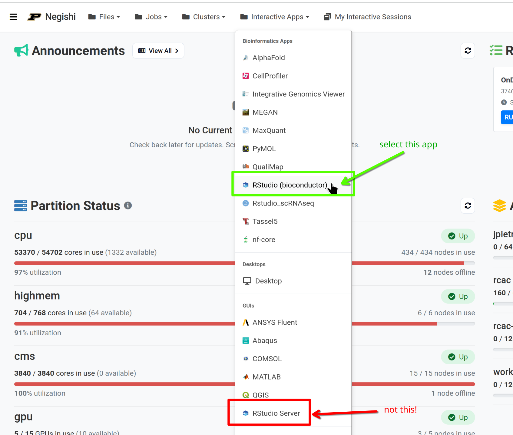
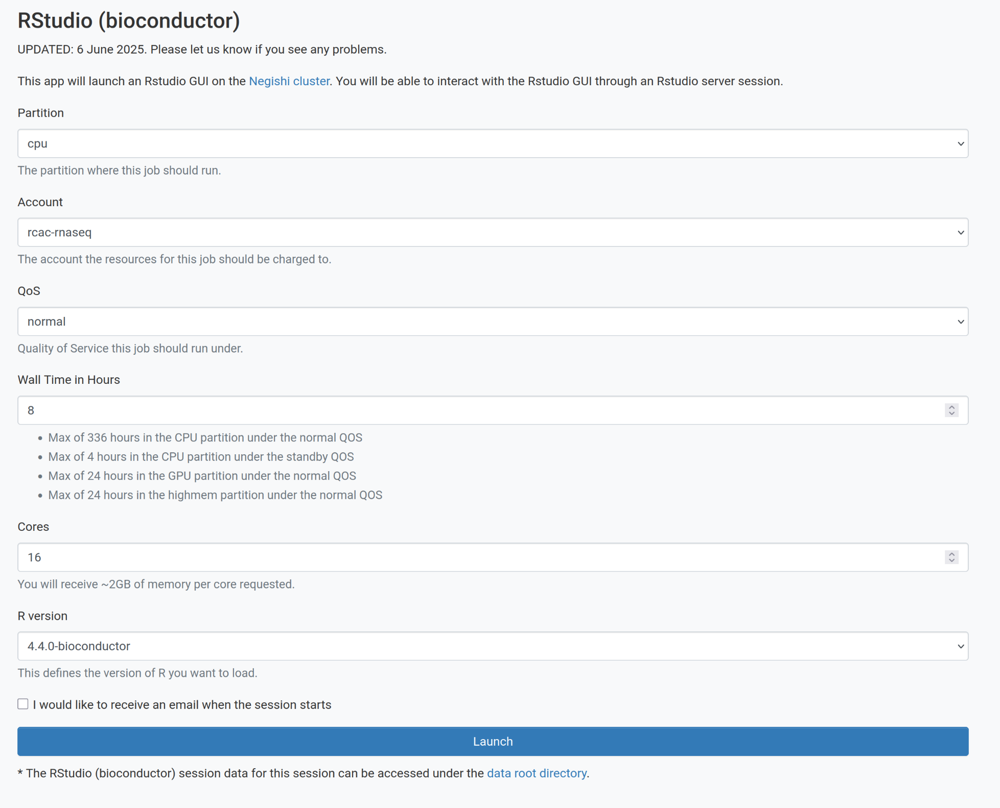

## Instructors

1. **Arun Seetharam**: Arun is a Bioinformatics Scientist at Purdue's Rosen Center for Advanced Computing (RCAC). He develops and delivers bioinformatics training workshops and provides research computing support for the Purdue community.

2. **Michael Carlson**, Ph.D.: Michael is a Senior Computational Scientist at Purdue University's Rosen Center for Advanced Computing (RCAC). Michael has a background in computational physics, specifically hypersonic materials. He also leads many introductory workshops in the High-Performance Computing domain.

## Workshop Schedule (4/21/2026)

| Time | Topic |
|:-----|:------|
| 8:30 -- 9:00 | Arrival & Setup |
| 9:00 -- 9:20 | Episode 1: Introduction to Single-Cell RNA-Seq |
| 9:20 -- 10:05 | Episode 2: Raw Data Processing |
| 10:05 -- 10:20 | Break |
| 10:20 -- 11:05 | Episode 3: Quality Control |
| 11:05 -- 11:55 | Episode 4: Normalization and Feature Selection |
| 11:55 -- 12:00 | Morning Recap |
| 12:00 -- 1:00 | Lunch |
| 1:00 -- 1:45 | Episode 5: Dimensionality Reduction and Clustering |
| 1:45 -- 2:30 | Episode 6: Cell Type Annotation |
| 2:30 -- 2:45 | Break |
| 2:45 -- 3:25 | Episode 7: Multi-Sample Integration |
| 3:25 -- 4:00 | Episode 8: Differential Expression & Wrap-up |
| 4:00 -- 4:30 | Q&A / Feedback |

## Prerequisites

This workshop assumes:

- **Basic Linux/command-line skills**: navigating directories, running commands, editing files
- **Basic R skills**: installing packages, reading/writing data, creating plots
- **A Purdue HPC account**: access to the Negishi cluster or Scholar (provided)
- **An SSH client**: terminal (macOS/Linux) or PuTTY/MobaXterm (Windows)

No prior experience with single-cell RNA-seq is required.

## What is not covered

This workshop focuses on the core scRNA-seq analysis workflow. The following topics are **not** covered:

- Experimental design and sample preparation
- Other single-cell modalities (ATAC-seq, CITE-seq, spatial transcriptomics)
- Trajectory/pseudotime analysis (Monocle3, RNA velocity)
- Advanced doublet detection methods (DoubletFinder, scDblFinder)
- Generating your own Cell Ranger reference genomes
- Multi-modal data integration

## SSH Setup

You need SSH access to the Negishi cluster for Episode 2 (raw data processing) and to copy the workshop data. Follow the instructions for your operating system below.

::::::::::::::::::::::::::::::::::::::: discussion

## Connecting to the Cluster

You will need SSH access to the Negishi cluster at Purdue. Choose the instructions for your operating system below.

:::::::::::::::::::::::::::::::::::::::::::::::::::

:::::::::::::::: solution

### Windows

1. Download and install [MobaXterm](https://mobaxterm.mobatek.net/) (recommended) or [PuTTY](https://www.putty.org/)
2. Open MobaXterm and click **Session > SSH**
3. Set **Remote host** to `negishi.rcac.purdue.edu`
4. Check **Specify username** and enter your Purdue career account username
5. Click **OK** and enter your password when prompted
6. Complete Microsoft two-factor authentication

:::::::::::::::::::::::::

:::::::::::::::: solution

### macOS

1. Open **Terminal** (Applications > Utilities > Terminal)
2. Connect to the cluster:

```bash
ssh your_username@negishi.rcac.purdue.edu
```

3. Enter your password (characters may not appear, but your password is being entered)
4. Complete Microsoft two-factor authentication

:::::::::::::::::::::::::

:::::::::::::::: solution

### Linux

1. Open your terminal emulator
2. Connect to the cluster:

```bash
ssh your_username@negishi.rcac.purdue.edu
```

3. Enter your password (characters may not appear, but your password is being entered)
4. Complete Microsoft two-factor authentication

:::::::::::::::::::::::::

## Data Setup

### Copying Workshop Data

The workshop data is pre-staged on the cluster. Copy it to your scratch directory:

```bash
mkdir -p ${RCAC_SCRATCH}/scrna_workshop
rsync -avP /depot/workshop/data/scrna_workshop/ ${RCAC_SCRATCH}/scrna_workshop/
```

This will copy:

- **FASTQ files**: `fastq/pbmc_10k_v3_S1_L00{1,2}_R{1,2}_001.fastq.gz`
- **10x Reference**: `reference/refdata-gex-GRCh38-2024-A/`
- **Pre-computed count matrix**: `filtered_feature_bc_matrix/` (for episodes 3+)
- **Pre-computed R objects**: `rds/` (optional, for jumping into later episodes)

### Verifying the Data

```bash
ls ${RCAC_SCRATCH}/scrna_workshop/
ls ${RCAC_SCRATCH}/scrna_workshop/fastq/
ls ${RCAC_SCRATCH}/scrna_workshop/filtered_feature_bc_matrix/
```

## Starting RStudio on Open OnDemand

For Episodes 3 to 8, we will use RStudio through Negishi's Open OnDemand (OOD) web portal. Follow these steps to launch an RStudio session.

### Step 1: Log in to Open OnDemand

Open your browser and navigate to [gateway.negishi.rcac.purdue.edu](https://gateway.negishi.rcac.purdue.edu). Complete the Purdue SSO login (BoilerKey/Duo with Microsoft authentication).

### Step 2: Launch RStudio (Bioconductor)

From the top menu bar, click the **Interactive Apps** tab. Under the **Bioinformatics Apps** section, select **RStudio (bioconductor)**.

::: callout

## Choose the correct app

Make sure you select **RStudio (bioconductor)** under **Bioinformatics Apps** --- *not* the **RStudio Server** option listed under the **GUIs** section. The Bioconductor version includes pre-installed single-cell analysis packages that we need for this workshop.



:::

### Step 3: Fill in the resource request

Enter the following settings:

| Field | Value |
|:------|:------|
| Partition | `cpu` |
| Account | *(provided by instructor)* |
| QoS | `normal` |
| Wall Time (hours) | `8` |
| Cores | `16` |
| R version | `4.4.0-bioconductor` |



Click **Launch** to submit the job.

### Step 4: Connect to the session

Your job will be queued briefly. Once the status changes to **Running**, click the **Connect to RStudio Server** button to open RStudio in a new browser tab.

## R Package Installation (skip this section if using OOD)

The R packages are pre-installed on the cluster. If you need to install them locally:

```r
# Install BiocManager if not already installed
if (!requireNamespace("BiocManager", quietly = TRUE))
    install.packages("BiocManager")

# Core packages
install.packages("Seurat")
install.packages("tidyverse")

# Bioconductor packages
BiocManager::install(c(
    "SingleR",
    "celldex",
    "clusterProfiler",
    "org.Hs.eg.db",
    "enrichplot"
))

# SeuratData for integration dataset
install.packages("remotes")
remotes::install_github("satijalab/seurat-data")
```

