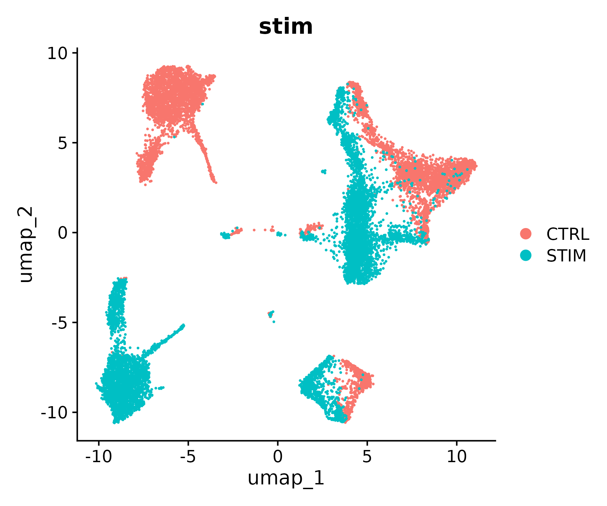
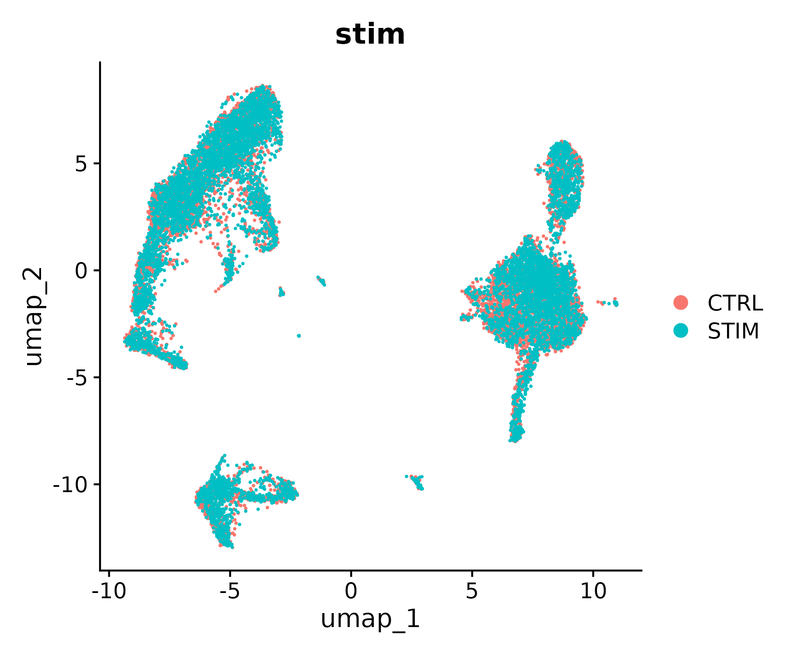
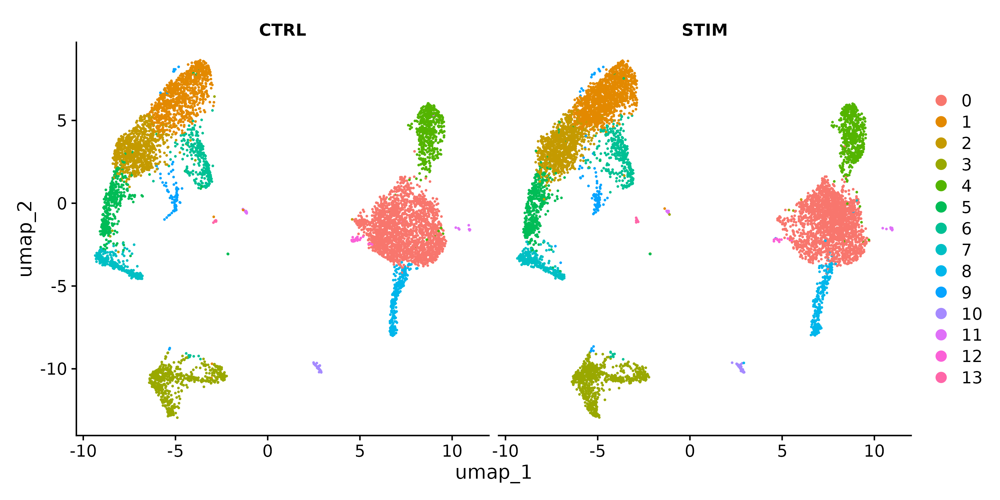
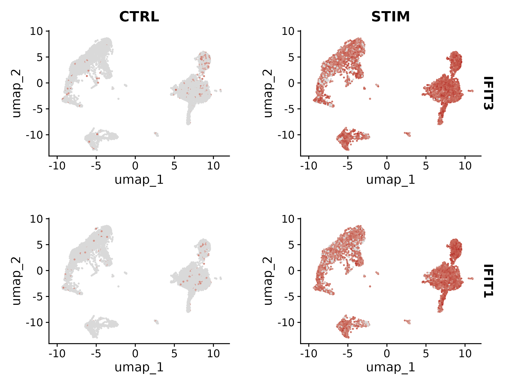
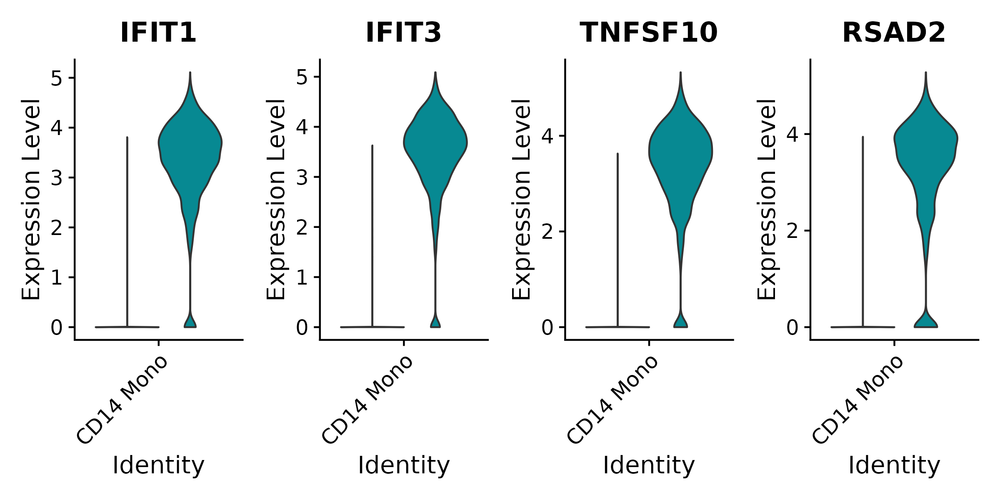
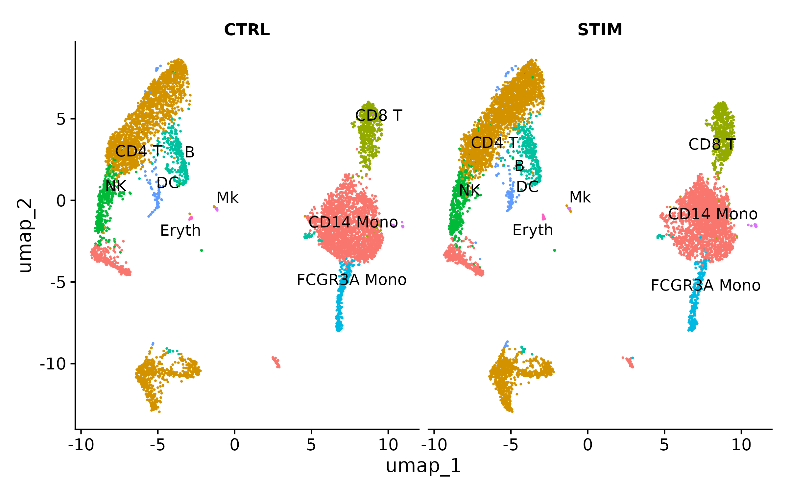
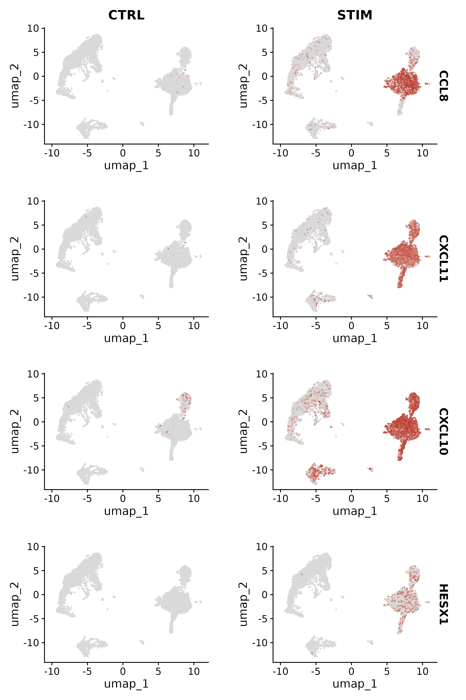

:::::::::::::::::::::::::::::::::::::: questions

- Why do cells from different samples cluster separately even when they are the same cell type?
- How does CCA-based integration correct for batch effects?
- How do we evaluate whether integration was successful without removing real biology?
- How do we find genes that differ between conditions within a specific cell type?
- When should we NOT integrate datasets?

::::::::::::::::::::::::::::::::::::::::::::::::

::::::::::::::::::::::::::::::::::::: objectives

- Explain the batch effect problem and why simple merging is insufficient
- Integrate two conditions using Seurat v5 CCA integration with IntegrateLayers
- Evaluate integration by checking condition mixing and preserved marker expression
- Identify conserved markers and condition-specific differentially expressed genes
- Recognize when integration is inappropriate for the experimental design

::::::::::::::::::::::::::::::::::::::::::::::::

## Setup


``` r
library(Seurat)
library(SeuratData)
library(ggplot2)
library(patchwork)
```

Set up the working directory to match the previous episodes:


``` r
work_dir <- paste0(
    "/scratch/negishi/", Sys.getenv("USER"),
    "/scrna_workshop/"
)
setwd(work_dir)
```

## Why Integration Is Needed

In the previous episodes, we analyzed a single sample of PBMCs. But many
experimental designs involve **multiple samples** -- different patients,
different time points, or different conditions (treated vs. control). When we
combine these samples for joint analysis, a common problem emerges: cells
cluster by **which sample they came from** rather than by **what cell type they
are**.

This happens because of **batch effects**: technical differences between samples
caused by variation in cell handling, library preparation, sequencing depth,
or reagent lots. These technical differences can be large enough to dominate
over the biological differences between cell types, making it impossible to
compare the same cell type across conditions.

**Integration** algorithms correct for batch effects by finding shared
biological structure across samples. The goal is to align the same cell types
so they co-cluster, while preserving the real biological differences (like
changes in gene expression due to treatment).

Let's see this problem in practice using a dataset of PBMCs from control and
IFN-beta stimulated conditions.


## Loading the IFNB Dataset

The IFNB dataset from the `SeuratData` package contains PBMCs from two
conditions:

- **CTRL**: untreated control PBMCs
- **STIM**: PBMCs stimulated with interferon-beta (IFN-beta), a cytokine that
  activates antiviral immune responses


``` r
InstallData("ifnb")
ifnb <- LoadData("ifnb")
ifnb
```

:::::::::::::::::::::::::::::::::::::::::: spoiler

## Expected output

```output
An object of class Seurat 
14053 features across 13999 samples within 1 assay 
Active assay: RNA (14053 features, 0 variable features)
 2 layers present: counts, data
```

The dataset has approximately 14,000 cells and 14,000 genes. The `stim` column
in the metadata records which condition each cell came from.

::::::::::::::::::::::::::::::::::::::::::::::::::


``` r
table(ifnb$stim)
```

:::::::::::::::::::::::::::::::::::::::::: spoiler

## Expected output

```output
CTRL STIM 
6548 7451 

```

Roughly 6,500 control cells and 7,500 stimulated cells.

::::::::::::::::::::::::::::::::::::::::::::::::::


## Preparing Data

In Seurat v5, multi-sample data is handled by **splitting the assay into
layers** -- one layer per sample. This keeps everything in a single object
while allowing integration methods to process each sample separately.


``` r
ifnb[["RNA"]] <- split(ifnb[["RNA"]], f = ifnb$stim)
ifnb
```

:::::::::::::::::::::::::::::::::::::::::: spoiler

## Expected output

```output
An object of class Seurat 
14053 features across 13999 samples within 1 assay 
Active assay: RNA (14053 features, 0 variable features)
 4 layers present: counts.CTRL, counts.STIM, data.CTRL, data.STIM
```

The counts are now stored in two separate layers: `counts.CTRL` and
`counts.STIM`.

::::::::::::::::::::::::::::::::::::::::::::::::::

Now run the standard preprocessing steps. When the assay is split,
`NormalizeData` and `FindVariableFeatures` process each layer independently:


``` r
ifnb <- NormalizeData(ifnb)
ifnb <- FindVariableFeatures(ifnb, selection.method = "vst", nfeatures = 2000)
ifnb <- ScaleData(ifnb)
ifnb <- RunPCA(ifnb)
```

Let's see what happens if we run UMAP and clustering **without** integration:


``` r
ifnb <- FindNeighbors(ifnb, dims = 1:30, reduction = "pca")
ifnb <- FindClusters(ifnb, resolution = 0.5)
ifnb <- RunUMAP(ifnb, dims = 1:30, reduction = "pca")
```


``` r
DimPlot(ifnb, reduction = "umap", group.by = "stim")
```




You should see a clear separation between control (CTRL) and stimulated (STIM)
cells. Instead of clustering by cell type (T cells with T cells, monocytes
with monocytes), the cells cluster by condition. This means we cannot directly
compare the same cell type between conditions -- which is exactly what we
want to do. This is the batch effect problem.


## Running Integration

Seurat v5 provides `IntegrateLayers()` as a unified interface for dataset
integration. We will use the **CCA (Canonical Correlation Analysis)** method,
which identifies shared sources of variation between the two conditions and
uses them to align the data.

CCA works by:

1. Finding **canonical correlation vectors** -- directions in gene expression
   space along which the two datasets are maximally correlated
2. Identifying **anchor pairs** -- cells from different conditions that are
   each other's mutual nearest neighbors in the shared CCA space
3. Using the anchors to compute a **correction vector** that aligns matching
   cell types across conditions


``` r
ifnb <- IntegrateLayers(object = ifnb,
                        method = CCAIntegration,
                        orig.reduction = "pca",
                        new.reduction = "integrated.cca")
```

| Parameter | Value | Description |
|-----------|-------|-------------|
| `method` | `CCAIntegration` | Use Canonical Correlation Analysis for integration. |
| `orig.reduction` | `"pca"` | The unintegrated PCA reduction to use as input. |
| `new.reduction` | `"integrated.cca"` | Name for the new integrated reduction that will be stored in the object. |

Now re-run the downstream steps using the **integrated** reduction instead
of the original PCA:


``` r
ifnb <- FindNeighbors(ifnb, reduction = "integrated.cca", dims = 1:30)
ifnb <- FindClusters(ifnb, resolution = 0.5)
ifnb <- RunUMAP(ifnb, reduction = "integrated.cca", dims = 1:30)
```

Visualize the integrated result:


``` r
DimPlot(ifnb, reduction = "umap", group.by = "stim")
```


The control and stimulated cells should now be intermingled within each
cluster. Cell types from both conditions co-cluster, which is what we want.

Let's verify with a split view:


``` r
DimPlot(ifnb, reduction = "umap", split.by = "stim")
```


Both panels should show the same overall structure, with the same clusters
present in both conditions. This confirms that integration successfully
aligned shared cell types.

Before proceeding to analysis, rejoin the layers so that expression data
from both conditions is accessible in a single matrix:


``` r
ifnb[["RNA"]] <- JoinLayers(ifnb[["RNA"]])
```

:::::::::::::::::::::::::::::::::::::::::: callout

## Other integration methods

Seurat v5 supports several integration methods through the same
`IntegrateLayers()` interface. You can swap `CCAIntegration` for any of these:

| Method | Function | Strengths |
|--------|:---------|:----------|
| **CCA** | `CCAIntegration` | Best for datasets with shared cell types. Robust to differences in cell type composition between batches. The default choice for most experiments. |
| **Harmony** | `HarmonyIntegration` | Very fast, scales well to large datasets (100k+ cells). Uses iterative soft clustering. Requires the `harmony` R package. Widely used and well-benchmarked. |
| **RPCA** | `RPCAIntegration` | Faster than CCA (uses reciprocal PCA instead of full CCA). Good when datasets are large or when CCA is too slow. May be less robust when cell type composition differs substantially between batches. |
| **scVI** | `scVIIntegration` | Deep learning approach. Excellent for complex batch structures (many batches, large composition differences). Requires Python and the `scvi-tools` package. Slower to run but often produces superior results on difficult datasets. |

For most standard experiments with two to five batches and shared cell types,
**CCA** or **Harmony** work well. Use **scVI** for more complex scenarios
(many batches, different tissues, cross-species integration).

:::::::::::::::::::::::::::::::::::::::::::::::::::

:::::::::::::::::::::::::::::::::::::::::: callout

## When NOT to integrate

Integration assumes that the same cell types exist in all batches and aligns
them. This is the wrong approach when:

- **All cells are expected to differ** between conditions. For example,
  comparing tumor cells to normal epithelial cells -- these are fundamentally
  different populations and should not be forced to co-cluster.
- **You want to find condition-specific cell types.** Integration pushes
  cells together, which can mask the appearance of a cell state that exists
  in only one condition.
- **The batch effect is minimal.** If cells already mix well by condition on
  the UMAP (as in some well-controlled experiments), integration is
  unnecessary and may introduce artifacts.

Always visualize the data **before integration** to assess whether batch
effects are actually present. If conditions already mix well, skip integration
and analyze directly.

:::::::::::::::::::::::::::::::::::::::::::::::::::


## Analysis on Integrated Data

Now that the data is integrated, we can annotate cell types and compare
between conditions.

### Annotating integrated clusters

Find markers for each integrated cluster:


``` r
ifnb.markers <- FindAllMarkers(ifnb,
                                only.pos = TRUE,
                                min.pct = 0.25,
                                logfc.threshold = 0.25)
```

Annotate the clusters using known PBMC markers (the same markers from
Episode 6):


``` r
# Adjust cluster IDs to match YOUR results
new.cluster.ids <- c(
    "CD14 Mono",    # 0
    "CD4 T",        # 1
    "CD4 T",        # 2
    "CD4 T",        # 3
    "CD8 T",        # 4
    "NK",           # 5
    "B",            # 6
    "CD14 Mono",    # 7
    "FCGR3A Mono",  # 8
    "DC",           # 9
    "CD14 Mono",    # 10
    "Mk",           # 11
    "B",            # 12
    "Eryth"         # 13
)
names(new.cluster.ids) <- levels(ifnb)
ifnb <- RenameIdents(ifnb, new.cluster.ids)
ifnb$celltype <- Idents(ifnb)
```


``` r
DimPlot(ifnb, reduction = "umap", label = TRUE, repel = TRUE) + NoLegend()
```


### Conserved markers

**Conserved markers** are genes that are markers for a cell type in **both**
conditions. `FindConservedMarkers()` tests for differential expression within
each condition separately and then combines the results:


``` r
conserved <- FindConservedMarkers(ifnb,
                                  ident.1 = "CD14 Mono",
                                  grouping.var = "stim",
                                  only.pos = TRUE)


head(conserved, 10)
```

| Parameter | Value | Description |
|-----------|-------|-------------|
| `ident.1` | `"CD14 Mono"` | The cell type to find markers for. |
| `grouping.var` | `"stim"` | The metadata column defining conditions. The test is run within each level of this variable. |
| `only.pos` | `TRUE` | Only return upregulated genes. |

The output has columns for each condition (e.g., `CTRL_avg_log2FC`,
`STIM_avg_log2FC`) showing that the marker is consistent across both. Genes
like LYZ, S100A9, and CD14 should appear as strong conserved markers for
monocytes.

:::::::::::::::::::::::::::::::::::::::::: spoiler

## Expected output


``` output
         CTRL_p_val CTRL_avg_log2FC CTRL_pct.1 CTRL_pct.2 CTRL_p_val_adj    STIM_p_val STIM_avg_log2FC
TYROBP            0        2.356269      0.940      0.227              0  0.000000e+00        2.337569
FCER1G            0        2.197678      0.930      0.233              0  0.000000e+00        2.549589
S100A8            0        4.739502      0.743      0.071              0  0.000000e+00        5.318497
C15orf48          0        2.720354      0.869      0.201              0  0.000000e+00        2.751572
IL8               0        3.651882      0.799      0.144              0 9.967253e-252        3.819957
CD63              0        2.740801      0.958      0.333              0  0.000000e+00        2.889984
S100A9            0        4.606045      0.691      0.069              0  0.000000e+00        5.236085
CTSB              0        3.116819      0.772      0.183              0  0.000000e+00        3.400786
LGALS1            0        2.400262      0.905      0.321              0  0.000000e+00        2.848345
TYMP              0        2.084914      0.860      0.282              0  0.000000e+00        2.267578
         STIM_pct.1 STIM_pct.2 STIM_p_val_adj      max_pval minimump_p_val
TYROBP        0.952      0.199   0.000000e+00  0.000000e+00              0
FCER1G        0.910      0.197   0.000000e+00  0.000000e+00              0
S100A8        0.445      0.020   0.000000e+00  0.000000e+00              0
C15orf48      0.860      0.201   0.000000e+00  0.000000e+00              0
IL8           0.295      0.028  1.400698e-247 9.967253e-252              0
CD63          0.931      0.276   0.000000e+00  0.000000e+00              0
S100A9        0.584      0.036   0.000000e+00  0.000000e+00              0
CTSB          0.822      0.183   0.000000e+00  0.000000e+00              0
LGALS1        0.867      0.217   0.000000e+00  0.000000e+00              0
TYMP          0.926      0.438   0.000000e+00  0.000000e+00              0
```

::::::::::::::::::::::::::::::::::::::::::::::::::


### Condition-specific differential expression

The most interesting biological question is: **which genes change between
control and stimulated cells within the same cell type?** To answer this, we
subset to a single cell type and compare conditions:


``` r
# Subset to CD14+ monocytes
mono <- subset(ifnb, idents = "CD14 Mono")

# Set the condition as the active identity
Idents(mono) <- "stim"

# Find DE genes between stimulated and control
mono.de <- FindMarkers(mono,
                       ident.1 = "STIM",
                       ident.2 = "CTRL",
                       min.pct = 0.25,
                       logfc.threshold = 0.25)
head(mono.de, 10)
```

:::::::::::::::::::::::::::::::::::::::::: spoiler

## Expected output


``` output
        p_val avg_log2FC pct.1 pct.2 p_val_adj
IFIT1       0   7.117626 0.965 0.034         0
IFIT3       0   6.737338 0.971 0.057         0
TNFSF10     0   6.322227 0.959 0.062         0
RSAD2       0   6.619577 0.920 0.042         0
IFIT2       0   6.893956 0.909 0.040         0
MX1         0   4.824046 0.953 0.099         0
CXCL10      0   7.975000 0.873 0.032         0
LY6E        0   4.255152 0.990 0.174         0
CXCL11      0   8.521702 0.800 0.011         0
CCL8        0   9.063100 0.800 0.015         0
```

The top DE genes are all **interferon-stimulated genes (ISGs)**: IFIT1, IFIT3,
TNFSF10, RSAD2, IFIT2. These are exactly the genes you would expect to be
upregulated by IFN-beta stimulation, confirming that our integration preserved
the biological signal while correcting the batch effect.

::::::::::::::::::::::::::::::::::::::::::::::::::


Save the annotated ifnb object for the next episode:


``` r
saveRDS(ifnb, file = "ifnb_annotated.rds")
```


### Visualizing condition-specific changes

Let's visualize a few ISGs to see the condition-specific response:


``` r
FeaturePlot(ifnb,
            features = c("IFIT3", "IFIT1"),
            split.by = "stim",
            cols = c("grey85", "firebrick"))
```




``` r
VlnPlot(ifnb,
        features = c("IFIT1", "IFIT3", "TNFSF10", "RSAD2"),
        split.by = "stim",
        idents = "CD14 Mono",
        ncol = 4,
        pt.size = 0)
```



IFIT1 and IFIT3 are strongly induced in the stimulated condition across
multiple cell types, with particularly strong expression in monocytes. This
demonstrates that integration corrected the batch effect (cell types co-cluster)
while preserving the biological effect of IFN-beta stimulation (ISGs are still
differentially expressed).


::::::::::::::::::::::::::::::::::::: challenge

## Challenge 1: Quantifying integration quality

After integration, check whether control and stimulated cells of the same type
are well mixed within each cluster. Use `DimPlot(split.by = "stim")` to
visualize, then compute the proportion of each condition per cluster.


``` r
# Split UMAP by condition
DimPlot(ifnb, reduction = "umap", split.by = "stim", label = TRUE, repel = TRUE) +
    NoLegend()

# Proportion table: condition per cell type
prop.table(table(Condition = ifnb$stim, CellType = Idents(ifnb)), margin = 2)
```

Are the proportions roughly balanced (close to 50/50) within each cell type?

:::::::::::::::::::::::: solution

## Solution

```output
         CellType
Condition CD14 Mono  CD4 T  CD8 T     NK      B FCGR3A Mono     DC     Mk  Eryth
     CTRL     0.504  0.432  0.477  0.435  0.482       0.530  0.447  0.446  0.458
     STIM     0.496  0.568  0.523  0.565  0.518       0.470  0.553  0.554  0.542
```



Most cell types fall in the **0.43--0.57** range, confirming that integration
successfully mixed cells from both conditions. The split UMAP shows the same
cell types present in both panels with similar spatial arrangement -- each
cluster appears in both CTRL and STIM with comparable density.

Some observations worth discussing:

- **CD14 Mono** is the best-mixed cell type (50.4/49.6), essentially a perfect
  split. This is expected for the most abundant population.
- **CD4 T and NK** show the largest deviation (~43/57), with more cells in the
  stimulated condition. This could reflect a real biological shift -- IFN-beta
  stimulation may promote T cell and NK cell survival or proliferation in
  culture -- rather than a failure of integration.
- **Rare populations** (Mk, Eryth, DC) show reasonable balance despite small
  cell numbers, where stochastic variation has more impact.

The key diagnostic: if integration had failed, you would see a cell type that
is 90%+ from one condition, or you would see the same cell type forming
separate clusters in the two panels. Neither is the case here. The moderate
CD4 T skew (43/57) is well within the range of expected biological variation
between a control and stimulated sample.

:::::::::::::::::::::::::::::::::

::::::::::::::::::::::::::::::::::::::::::::::::


::::::::::::::::::::::::::::::::::::: challenge

## Challenge 2: Interferon response genes in monocytes

Find the top 10 differentially expressed genes between stimulated and control
**CD14+ monocytes** (we computed this above as `mono.de`). Are these genes
consistent with an interferon stimulation response?


``` r
# Top 10 upregulated genes in stimulated vs control CD14+ monocytes
top10_de <- head(mono.de[order(mono.de$avg_log2FC, decreasing = TRUE), ], 10)
print(top10_de)

# Visualize the top 4 genes
FeaturePlot(ifnb,
            features = rownames(top10_de)[1:4],
            split.by = "stim",
            ncol = 4,
            cols = c("grey85", "firebrick"))
```

:::::::::::::::::::::::: solution

## Solution




``` output
                 p_val avg_log2FC pct.1 pct.2     p_val_adj
CCL8      0.000000e+00   9.063    0.800 0.015  0.000000e+00
CXCL11    0.000000e+00   8.522    0.800 0.011  0.000000e+00
CXCL10    0.000000e+00   7.975    0.873 0.032  0.000000e+00
HESX1    1.756212e-217   7.935    0.335 0.002 2.468004e-213
IFIT1     0.000000e+00   7.118    0.965 0.034  0.000000e+00
IFIT2     0.000000e+00   6.894    0.909 0.040  0.000000e+00
IFIT3     0.000000e+00   6.737    0.971 0.057  0.000000e+00
GMPR     1.772282e-239   6.634    0.371 0.005 2.490588e-235
RSAD2     0.000000e+00   6.620    0.920 0.042  0.000000e+00
APOBEC3B 1.261976e-127   6.600    0.273 0.034 1.773454e-123
```

The top 10 genes fall into two functional categories, both consistent with
IFN-beta stimulation:

| Gene | log2FC | pct.1 / pct.2 | Function |
|------|:------:|:--------------|:---------|
| CCL8 | 9.06 | 0.80 / 0.02 | Chemokine; recruits monocytes and T cells to sites of inflammation |
| CXCL11 | 8.52 | 0.80 / 0.01 | IFN-inducible chemokine; attracts activated T cells via CXCR3 |
| CXCL10 | 7.98 | 0.87 / 0.03 | IFN-inducible chemokine (IP-10); major recruiter of immune cells |
| HESX1 | 7.93 | 0.34 / 0.00 | Transcription factor; emerging role in IFN signaling |
| IFIT1 | 7.12 | 0.97 / 0.03 | Directly induced by type I IFN; inhibits viral translation |
| IFIT2 | 6.89 | 0.91 / 0.04 | Antiviral effector; regulates translation during infection |
| IFIT3 | 6.74 | 0.97 / 0.06 | Antiviral effector; forms complex with IFIT1 and IFIT2 |
| GMPR | 6.63 | 0.37 / 0.01 | Guanosine monophosphate reductase; modulates purine metabolism |
| RSAD2 | 6.62 | 0.92 / 0.04 | Viperin; broad-spectrum antiviral enzyme induced by IFN |
| APOBEC3B | 6.60 | 0.27 / 0.03 | Cytidine deaminase; innate antiviral defense via RNA editing |

Two patterns stand out:

**Chemokines dominate the top 3.** CCL8, CXCL11, and CXCL10 have the highest
fold changes (7.9-9.1), reflecting the monocyte's primary role as a sentinel
cell: upon IFN stimulation, monocytes broadcast chemokine signals to recruit
other immune cells. Note the pct.2 values (0.01-0.03) -- these chemokines are
essentially absent in control cells and massively induced by stimulation.

**Classical ISGs fill the rest.** IFIT1/2/3, RSAD2, and APOBEC3B are
canonical interferon-stimulated genes that directly inhibit viral replication.
The IFIT family shows the highest pct.1 values (0.91-0.97), meaning nearly
every stimulated monocyte expresses them -- a hallmark of a robust, uniform
interferon response.

The FeaturePlot confirms this visually: CCL8, CXCL11, CXCL10, and HESX1 are
virtually absent in the CTRL panels (gray) and strongly expressed in the STIM
panels (red), with the signal concentrated in the monocyte clusters (right
side of the UMAP). CXCL10 and CXCL11 also show some expression in the
stimulated CD4 T and NK clusters, consistent with these cell types also
responding to IFN-beta, though less strongly than monocytes.

:::::::::::::::::::::::::::::::::

::::::::::::::::::::::::::::::::::::::::::::::::
::::::::::::::::::::::::::::::::::::: keypoints

- Batch effects cause cells to cluster by sample rather than by cell type, preventing cross-condition comparisons
- CCA integration finds shared correlation structure between conditions and aligns matching cell types using anchor pairs
- In Seurat v5, multi-sample data is handled by splitting assay layers, integrating, then rejoining layers for downstream analysis
- Always verify integration by checking that conditions mix within clusters AND that known biological differences (like ISG expression) are preserved
- Integration is not always appropriate; skip it when conditions have no shared cell types or when batch effects are minimal

::::::::::::::::::::::::::::::::::::::::::::::::
