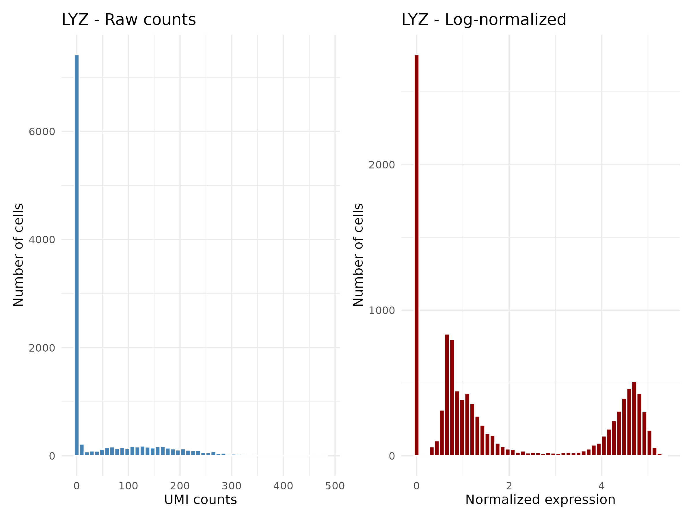
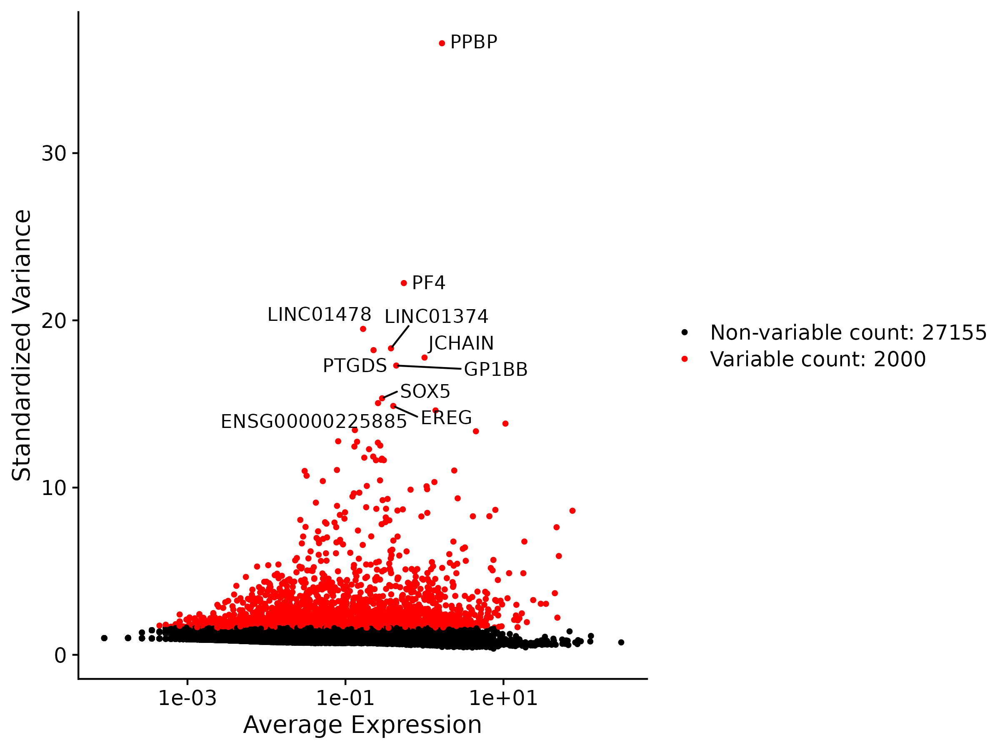
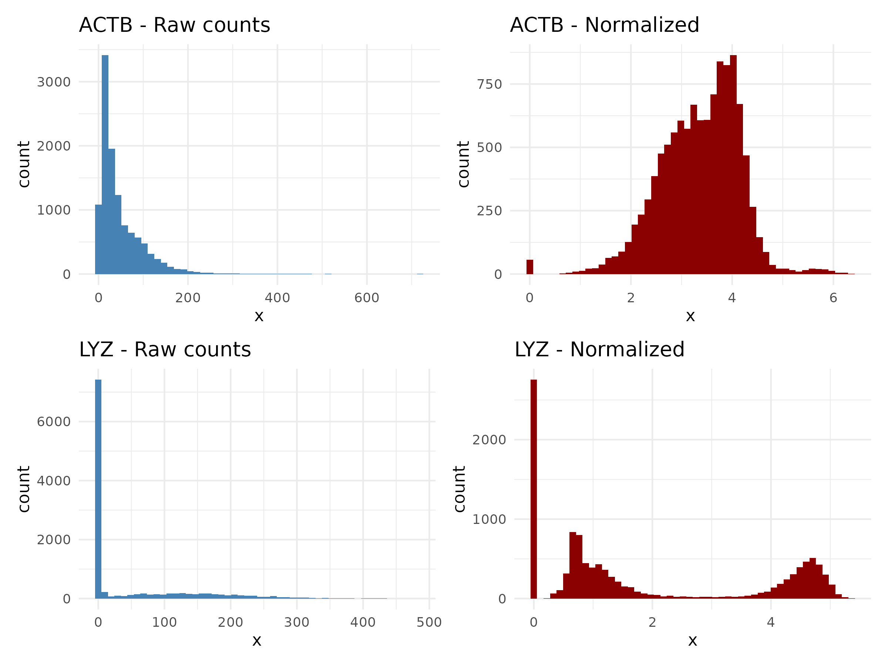

:::::::::::::::::::::::::::::::::::::: questions

- Why do we need to normalize scRNA-seq data before comparing cells?
- How does log normalization work and where are the results stored?
- What are highly variable features and why do we select them?
- What does scaling do and when should we regress out confounders?
- How does SCTransform differ from the LogNormalize workflow?

::::::::::::::::::::::::::::::::::::::::::::::::

::::::::::::::::::::::::::::::::::::: objectives

- Apply log normalization to correct for differences in sequencing depth between cells
- Identify highly variable features using variance-stabilizing transformation
- Scale the data to prepare for PCA
- Describe SCTransform as an alternative to the three-step LogNormalize workflow

::::::::::::::::::::::::::::::::::::::::::::::::

::::::::::::::::::::::::::::::::::::::: prereq

## Prerequisites

This episode requires an RStudio session on the Negishi cluster. Launch
**RStudio (bioconductor)** under **Bioinformatics Apps** on
[Open OnDemand](https://gateway.negishi.rcac.purdue.edu) as described in the
[Setup](../learners/setup.md#starting-rstudio-on-open-ondemand) instructions.
You will also need the `pbmc_filtered.rds` object saved at the end of the
previous episode.

:::::::::::::::::::::::::::::::::::::::

## Setup


``` r
library(Seurat)
library(ggplot2)
library(patchwork)
```

## Loading the Filtered Data

We start from the filtered Seurat object saved at the end of the previous
episode. This object contains only cells that passed our QC thresholds.

Set up the working directory to match the previous episode:


``` r
work_dir <- paste0(
    "/scratch/negishi/", Sys.getenv("USER"),
    "/scrna_workshop/"
)
setwd(work_dir)
```


``` r
pbmc <- readRDS(paste0(work_dir, "pbmc_filtered.rds"))
pbmc
```

:::::::::::::::::::::::::::::::::::::::::: spoiler

## Expected output

```output
An object of class Seurat 
29155 features across 11310 samples within 1 assay 
Active assay: RNA (29155 features, 0 variable features)
 1 layer present: counts
```

The object has 29,155 genes and 11,310 cells. Only the `counts`
layer is populated at this stage. By the end of this episode we will fill in
the `data` and `scale.data` layers as well.

::::::::::::::::::::::::::::::::::::::::::::::::::

Right now, the only expression data we have is raw UMI counts. Before we can
compare gene expression between cells, we need to address a fundamental
problem: **cells are sequenced to different depths**.

Consider two cells that are biologically identical -- they express the same
genes at the same levels. If Cell A was sequenced to 5,000 total UMIs and Cell
B to 10,000 total UMIs, every gene in Cell B will appear to have roughly twice
the counts of Cell A. This is purely a technical artifact of sequencing depth,
not a biological difference. Normalization corrects for this so that expression
values are comparable across cells.


## Log Normalization

The standard normalization in Seurat is **LogNormalize**. It applies a simple
three-step transformation to each cell independently:

1. **Divide** each gene's count by the cell's total UMI count
2. **Multiply** by a scale factor (default 10,000) so the values are not
   tiny fractions
3. **Log-transform** with `log1p` (natural log of 1 + x) to compress the
   dynamic range

The formula for a single gene *g* in cell *c* is:

**normalized(g, c) = log(1 + count(g, c) / total_counts(c) x 10000)**


``` r
pbmc <- NormalizeData(pbmc,
                      normalization.method = "LogNormalize",
                      scale.factor = 10000)
```

| Parameter | Value | Description |
|-----------|-------|-------------|
| `normalization.method` | `"LogNormalize"` | Divide by total counts, multiply by scale factor, log1p transform. |
| `scale.factor` | `10000` | Multiplicative factor applied after dividing by total counts. The default 10,000 means normalized values are in "counts per 10,000" before log transformation. |

After normalization, the results are stored in the `data` layer of the RNA
assay:


``` r
pbmc
```

:::::::::::::::::::::::::::::::::::::::::: spoiler

## Expected output

```output
An object of class Seurat 
29155 features across 11310 samples within 1 assay 
Active assay: RNA (29155 features, 0 variable features)
 2 layers present: counts, data
```

Notice that we now have **2 layers**: `counts` (raw) and `data` (normalized).

::::::::::::::::::::::::::::::::::::::::::::::::::

You can access each layer directly:


``` r
# Raw counts for the first 5 genes in the first 3 cells
pbmc[["RNA"]]$counts[1:5, 1:3]

# Normalized values for the same genes and cells
pbmc[["RNA"]]$data[1:5, 1:3]
```
:::::::::::::::::::::::::::::::::::::::::: spoiler

## Expected Output


``` output
# Raw counts for the first 5 genes in the first 3 cells
5 x 3 sparse Matrix of class "dgCMatrix"
                AAACCCAAGCGCCCAT-1 AAACCCAAGGTTCCGC-1 AAACCCACAGACAAGC-1
ENSG00000238009                  .                  .                  .
ENSG00000239945                  .                  .                  .
ENSG00000241860                  .                  .                  .
ENSG00000290385                  .                  .                  .
ENSG00000235146                  .                  .                  .

# Normalized values for the same genes and cells
5 x 3 sparse Matrix of class "dgCMatrix"
                AAACCCAAGCGCCCAT-1 AAACCCAAGGTTCCGC-1 AAACCCACAGACAAGC-1
ENSG00000238009                  .                  .                  .
ENSG00000239945                  .                  .                  .
ENSG00000241860                  .                  .                  .
ENSG00000290385                  .                  .                  .
ENSG00000235146                  .                  .                  .
```

::::::::::::::::::::::::::::::::::::::::::::::::::


The first few genes in the matrix are mostly zeros, so the output above is not
very illuminating. To see the actual difference between raw and normalized
values, we can filter for genes with non-zero counts first:


``` r
# Raw counts for the first 5 genes in the first 3 cells, with row sum > 0
mat <- pbmc[["RNA"]]$counts[, 1:3]
mat[rowSums(mat) > 0, ][1:5, ]

# Normalized values for the same genes and cells, with row sum > 0
mat2 <- pbmc[["RNA"]]$data[, 1:3]
mat2[rowSums(mat2) > 0, ][1:5, ]
```

:::::::::::::::::::::::::::::::::::::::::: spoiler

## Expected Output

```output
# Raw counts for the first 5 genes in the first 3 cells, with row sum > 0
5 x 3 sparse Matrix of class "dgCMatrix"
         AAACCCAAGCGCCCAT-1 AAACCCAAGGTTCCGC-1 AAACCCACAGACAAGC-1
ISG15                     1                  2                  .
C1orf159                  .                  1                  .
SDF4                      .                  2                  .
B3GALT6                   .                  1                  .
DVL1                      .                  1                  .

# Normalized values for the same genes and cells, with row sum > 0
5 x 3 sparse Matrix of class "dgCMatrix"
         AAACCCAAGCGCCCAT-1 AAACCCAAGGTTCCGC-1 AAACCCACAGACAAGC-1
ISG15               1.20458          0.5174592                  .
C1orf159            .                0.2918332                  .
SDF4                .                0.5174592                  .
B3GALT6             .                0.2918332                  .
DVL1                .                0.2918332                  .
```


::::::::::::::::::::::::::::::::::::::::::::::::::

### Visualizing the effect of normalization

To see what normalization does, let's compare the distribution of a gene before
and after normalization. We'll look at **LYZ**, a marker for CD14+ monocytes
that has high and variable expression across cells.


``` r
# Extract raw and normalized values for LYZ
lyz_raw <- pbmc[["RNA"]]$counts["LYZ", ]
lyz_norm <- pbmc[["RNA"]]$data["LYZ", ]

p1 <- ggplot(data.frame(x = as.numeric(lyz_raw)), aes(x = x)) +
    geom_histogram(bins = 50, fill = "steelblue", color = "white") +
    labs(title = "LYZ - Raw counts", x = "UMI counts", y = "Number of cells") +
    theme_minimal()

p2 <- ggplot(data.frame(x = as.numeric(lyz_norm)), aes(x = x)) +
    geom_histogram(bins = 50, fill = "darkred", color = "white") +
    labs(title = "LYZ - Log-normalized", x = "Normalized expression", y = "Number of cells") +
    theme_minimal()

p1 + p2
```
{alt="Two histograms for LYZ. Raw counts show a zero-dominated right-skewed distribution. Log-normalized values reveal a bimodal pattern with peaks near 0.5 and 4.5, separating non-monocytes from LYZ-expressing monocytes"}


The raw count distribution is heavily right-skewed with a large spike at zero
(cells that don't express LYZ -- mostly non-monocytes). After log
normalization, the non-zero values are spread more evenly and the influence
of sequencing depth differences is reduced.


## Identifying Variable Features

The human genome contains roughly 20,000 protein-coding genes, but not all of
them are informative for distinguishing cell types. Many genes are:

- **Housekeeping genes** expressed at similar levels in every cell (e.g., ACTB,
  GAPDH). These carry no information about cell identity.
- **Low-expression genes** detected in only a handful of cells. These are too
  noisy to contribute meaningfully.
- **Constant genes** that show little variation across cells.

**Highly variable features (HVGs)** are genes that vary substantially from cell
to cell. These are the genes most likely to capture biological differences
between cell types. By selecting the top 2,000 variable features, we focus
downstream analysis (PCA, clustering) on the genes that matter most, while
reducing noise and computation time.


``` r
pbmc <- FindVariableFeatures(pbmc,
                             selection.method = "vst",
                             nfeatures = 2000)
```

| Parameter | Value | Description |
|-----------|-------|-------------|
| `selection.method` | `"vst"` | Variance-stabilizing transformation. Fits a mean-variance relationship across genes using local regression, then selects genes with the highest standardized variance (i.e., genes that vary more than expected given their expression level). |
| `nfeatures` | `2000` | Number of variable features to select. 2,000 is the standard default for most scRNA-seq analyses. |

Let's see which genes were selected:


``` r
head(VariableFeatures(pbmc), 10)
```

:::::::::::::::::::::::::::::::::::::::::: spoiler

## Expected output

```output
 [1] "PPBP"            "PF4"             "LINC01478"       "LINC01374"       "PTGDS"          
 [6] "JCHAIN"          "GP1BB"           "SOX5"            "ENSG00000225885" "EREG"     
```

The top variable features include PPBP and PF4 (platelet markers), GP1BB
(also platelets), JCHAIN (B/plasma cells), and PTGDS (dendritic cells).
Several lincRNAs and an Ensembl ID also appear due to sparse but extreme
expression in a few cells. These genes are highly expressed in specific cell
types but absent in others, producing high cell-to-cell variance.

::::::::::::::::::::::::::::::::::::::::::::::::::

Visualize the variable feature selection with a mean-variance plot:


``` r
vf_plot <- VariableFeaturePlot(pbmc)
top10 <- head(VariableFeatures(pbmc), 10)
LabelPoints(plot = vf_plot, points = top10, repel = TRUE)
```

{alt="Variable feature plot showing mean expression versus standardized variance for all genes, with the top 2000 variable features highlighted in red and the top 10 labeled"}

In this plot, each point is a gene. The x-axis shows mean expression across
cells and the y-axis shows standardized variance. The red points are the 2,000
selected variable features. Genes in the upper right are both highly expressed
and highly variable -- these are strong cell-type markers. Genes along the
bottom have low variance relative to their expression level and are excluded.


## Scaling

The final step before PCA is **scaling**. `ScaleData()` applies a z-score
transformation to each gene across all cells: it subtracts the mean expression
and divides by the standard deviation. After scaling, each gene has mean 0 and
standard deviation 1.

Why is this necessary? Without scaling, PCA would be dominated by highly
expressed genes simply because they have larger absolute values, not because
they carry more biological information. Scaling puts all genes on equal footing
so that PCA identifies the axes of true biological variation rather than
expression magnitude.


``` r
pbmc <- ScaleData(pbmc)
```

By default, `ScaleData()` only scales the variable features (the 2,000 genes
selected above), not all ~29,000 genes. This is faster and sufficient for PCA,
which only uses variable features. If you later need scaled values for all
genes (e.g., for a heatmap of a non-variable gene), you can re-run
`ScaleData()` with `features = rownames(pbmc)`.

After scaling, a third layer appears in the object:


``` r
pbmc
```

:::::::::::::::::::::::::::::::::::::::::: spoiler

## Expected output

```output
An object of class Seurat 
29155 features across 11310 samples within 1 assay 
Active assay: RNA (29155 features, 2000 variable features)
 3 layers present: counts, data, scale.data
```

All three layers are now populated: `counts` (raw), `data` (log-normalized),
and `scale.data` (z-scored variable features).

::::::::::::::::::::::::::::::::::::::::::::::::::

### Regressing out confounders

`ScaleData()` can optionally **regress out** unwanted sources of variation
using the `vars.to.regress` parameter. A common use case is regressing out
mitochondrial percentage so that cell damage does not influence clustering:


``` r
# Optional: regress out mitochondrial percentage
pbmc_regressed <- ScaleData(pbmc, vars.to.regress = "percent.mt")
```

This fits a linear model for each gene with `percent.mt` as a covariate and
uses the residuals as the scaled expression values. The effect is that
variation driven by mitochondrial content is removed before PCA.

**When to regress:**

- Mitochondrial percentage is driving a major axis of variation in PCA (i.e.,
  one of the top PCs strongly correlates with percent.mt)
- You see cells grouping by mitochondrial content rather than cell type

**When NOT to regress:**

- Mitochondrial content correlates with real biology. Some cell types
  (e.g., cardiomyocytes, metabolically active immune cells) naturally have
  higher mitochondrial gene expression. Regressing it out would remove
  legitimate biological signal.
- The QC filtering in the previous episode already removed high-mt cells, and
  the remaining variation is modest.

For this workshop, we proceed **without** regression because our QC filtering
already removed cells with `percent.mt > 15`, and the remaining variation does
not dominate the PCA.

Save the normalized object for the next episode:


``` r
saveRDS(pbmc, file = "pbmc_normalized.rds")
```


## SCTransform as an Alternative

:::::::::::::::::::::::::::::::::::::::::: callout

## SCTransform: a one-step alternative

The three-step LogNormalize workflow (`NormalizeData` + `FindVariableFeatures` +
`ScaleData`) works well for most datasets, but it has limitations. The log
transformation can over-stabilize variance for lowly expressed genes and
under-stabilize it for highly expressed genes. This matters most when there
is high technical noise in the data.

**SCTransform** addresses this by using **regularized negative binomial
regression**. It models each gene's expression as a function of total UMI
counts per cell, estimates the expected variance at each expression level, and
returns Pearson residuals that serve as normalized, variance-stabilized values.
A single function call replaces all three steps:

```r
pbmc_sct <- SCTransform(pbmc, vst.flavor = "v2")
```

| Parameter | Value | Description |
|-----------|-------|-------------|
| `vst.flavor` | `"v2"` | Use the improved v2 algorithm (Choudhary & Satija, 2022) with better variance estimation for sparse data. |

Key differences from LogNormalize:

- **Replaces three steps** with one: normalization, feature selection, and
  scaling are all handled internally.
- **Selects 3,000 variable features** by default (vs. 2,000 for
  `FindVariableFeatures`), which can improve resolution for complex tissues.
- **Better variance stabilization** across the full range of expression levels.
- **Stored in a separate assay**: results go into an assay called `SCT` rather
  than modifying the `RNA` assay. The `RNA` assay retains the raw counts for
  reference.

**When to use SCTransform:**

- For publication-quality analyses, especially with complex tissues or datasets
  with high technical variance.
- When you observe that LogNormalize produces clusters driven by sequencing
  depth rather than biology.

**When LogNormalize is sufficient:**

- For exploratory analysis and quick overviews.
- When the dataset is well-behaved and you want a simpler, faster workflow.
- For direct comparability with older analyses and tutorials.

In this workshop, we use **LogNormalize** throughout for simplicity and because
it produces excellent results with this well-characterized PBMC dataset.
However, SCTransform is the preferred method for most production analyses.

:::::::::::::::::::::::::::::::::::::::::::::::::::


::::::::::::::::::::::::::::::::::::: challenge

## Challenge 1: LogNormalize vs. SCTransform variable features

Run both normalization approaches on the same filtered dataset and compare the
top 20 variable features from each method. How many genes appear in both lists?


``` r
# LogNormalize pathway (already done above)
lognorm_top20 <- head(VariableFeatures(pbmc), 20)

# SCTransform pathway
pbmc_sct <- SCTransform(pbmc, vst.flavor = "v2")
sct_top20 <- head(VariableFeatures(pbmc_sct), 20)

# Compare
cat("LogNormalize top 20:\n")
print(lognorm_top20)
cat("\nSCTransform top 20:\n")
print(sct_top20)
cat("\nGenes in both lists:\n")
shared <- intersect(lognorm_top20, sct_top20)
print(shared)
cat("\nOverlap:", length(shared), "out of 20\n")
```

:::::::::::::::::::::::: solution

## Solution


``` output
LogNormalize top 20:
 [1] "PPBP"            "PF4"             "LINC01478"       "LINC01374"       "PTGDS"          
 [6] "JCHAIN"          "GP1BB"           "SOX5"            "ENSG00000225885" "EREG"           
[11] "TCF4"            "IGKC"            "ZNF385D"         "GNLY"            "LYPD2"          
[16] "CUX2"            "LINGO2"          "CAVIN2"          "CLNK"            "HTR1F"          

SCTransform top 20:
 [1] "S100A9" "S100A8" "GNLY"   "IGKC"   "PPBP"   "IGLC2"  "LYZ"    "PF4"    "GP1BB"  "NRGN"   "IGLC3" 
[12] "IGHM"   "CAVIN2" "AFF3"   "NKG7"   "GNG11"  "BANK1"  "VCAN"   "TUBB1"  "LINGO2"

Genes in both lists:
[1] "PPBP"   "PF4"    "GP1BB"  "IGKC"   "GNLY"   "LINGO2" "CAVIN2"
```

The overlap is **7 out of 20** (~35%), which is lower than you might expect.
The shared genes are PPBP, PF4, GP1BB, IGKC, GNLY, LINGO2, and CAVIN2.

The two methods rank variable genes quite differently:

- **LogNormalize + vst** picks up several lincRNAs (LINC01478, LINC01374) and
  even an Ensembl ID (ENSG00000225885) in the top 20. These are genes with
  sparse but extreme expression in a few cells, which inflates their residual
  variance in the vst model.
- **SCTransform** surfaces well-known immune markers instead: S100A9, S100A8,
  LYZ, NKG7, VCAN. Its negative binomial model is more robust to outlier
  cells, so it favors genes with consistent cell-type-specific expression over
  genes that are simply noisy.

Despite only 35% overlap in the **top 20**, the broader variable feature sets
(all 2,000-3,000 genes) agree much more. The top-ranked differences rarely
change the downstream PCA, clustering, or cell type assignments because both
methods capture the same major axes of biological variation. The practical
difference is that SCTransform tends to produce cleaner ranked lists with fewer
noise-driven genes at the top.

::: callout

## glmGamPoi speeds up SCTransform

If you see the warning about glmGamPoi not being installed, SCTransform still
runs but falls back to a slower implementation. Install it for faster runs:


``` r
BiocManager::install("glmGamPoi")
```

:::

:::::::::::::::::::::::::::::::::

::::::::::::::::::::::::::::::::::::::::::::::::

::::::::::::::::::::::::::::::::::::: challenge

## Challenge 2: Housekeeping vs. Variable Gene Behavior

Plot the expression of **ACTB** (a housekeeping gene) and **LYZ** (a variable
monocyte marker) before and after normalization. What changes for each gene,
and why?


``` r
# Extract raw and normalized values
actb_raw  <- as.numeric(pbmc[["RNA"]]$counts["ACTB", ])
actb_norm <- as.numeric(pbmc[["RNA"]]$data["ACTB", ])
lyz_raw   <- as.numeric(pbmc[["RNA"]]$counts["LYZ", ])
lyz_norm  <- as.numeric(pbmc[["RNA"]]$data["LYZ", ])

p1 <- ggplot(data.frame(x = actb_raw), aes(x)) +
    geom_histogram(bins = 50, fill = "steelblue") +
    labs(title = "ACTB - Raw counts") + theme_minimal()
p2 <- ggplot(data.frame(x = actb_norm), aes(x)) +
    geom_histogram(bins = 50, fill = "darkred") +
    labs(title = "ACTB - Normalized") + theme_minimal()
p3 <- ggplot(data.frame(x = lyz_raw), aes(x)) +
    geom_histogram(bins = 50, fill = "steelblue") +
    labs(title = "LYZ - Raw counts") + theme_minimal()
p4 <- ggplot(data.frame(x = lyz_norm), aes(x)) +
    geom_histogram(bins = 50, fill = "darkred") +
    labs(title = "LYZ - Normalized") + theme_minimal()

(p1 + p2) / (p3 + p4)
```

:::::::::::::::::::::::: solution


{alt="Four histograms in a 2x2 grid. Top row: ACTB raw counts show a right-skewed distribution peaking near zero; ACTB normalized shows a unimodal bell shape centered around 3.5. Bottom row: LYZ raw counts show a massive zero spike with a flat tail to 500; LYZ normalized reveals a bimodal pattern with peaks near 0.5 and 4.5"}


**ACTB (housekeeping gene):**

- **Before normalization:** the raw count distribution is right-skewed because
  cells with higher sequencing depth have proportionally more ACTB counts. The
  apparent variation is mostly technical (sequencing depth), not biological.
- **After normalization:** the distribution becomes approximately bell-shaped,
  centered around 3.5-4 on the log-normalized scale. Because ACTB is expressed
  at similar levels across all cell types, removing depth effects reveals a
  tight, unimodal distribution. This is exactly why ACTB is **not** selected
  as a variable feature -- it doesn't help distinguish cell types.

**LYZ (variable gene):**

- **Before normalization:** there is a massive spike at zero (~7,000 cells that
  don't express LYZ) and a low, flat spread of non-zero values extending to
  ~500. The zero-dominated distribution makes it hard to see any structure in
  the expressing cells.
- **After normalization:** the zero spike persists (you can't normalize away
  true absence of expression), but the non-zero cells now reveal a clear
  **bimodal** pattern -- a small cluster of cells with low expression (~1-2)
  and a distinct second peak of highly expressing cells (~4-5). This bimodality
  reflects the biological reality: CD14+ monocytes express LYZ at high levels,
  while other cell types either don't express it at all or express it minimally.
  This separation is why LYZ **is** selected as a highly variable feature.

The key takeaway: normalization makes expression comparable across cells by
removing sequencing depth effects. Housekeeping genes become unimodal
(confirming they don't vary biologically), while cell-type marker genes reveal
biologically meaningful structure -- like the bimodal split in LYZ -- that was
obscured by technical noise in the raw counts.

:::::::::::::::::::::::::::::::::

::::::::::::::::::::::::::::::::::::::::::::::::

::::::::::::::::::::::::::::::::::::: keypoints

- Log normalization corrects for sequencing depth by dividing by total counts, scaling, and log-transforming each cell independently
- Highly variable features are the ~2,000 genes with the most cell-to-cell variation, capturing biological differences while excluding housekeeping genes and noise
- Scaling (z-score transformation) centers and standardizes gene expression so that PCA is not dominated by highly expressed genes
- Regressing out confounders like percent.mt during scaling is optional and should only be done when technical variation is obscuring biology
- SCTransform is a one-step alternative that uses regularized negative binomial regression and is recommended for publication-quality analyses

::::::::::::::::::::::::::::::::::::::::::::::::
